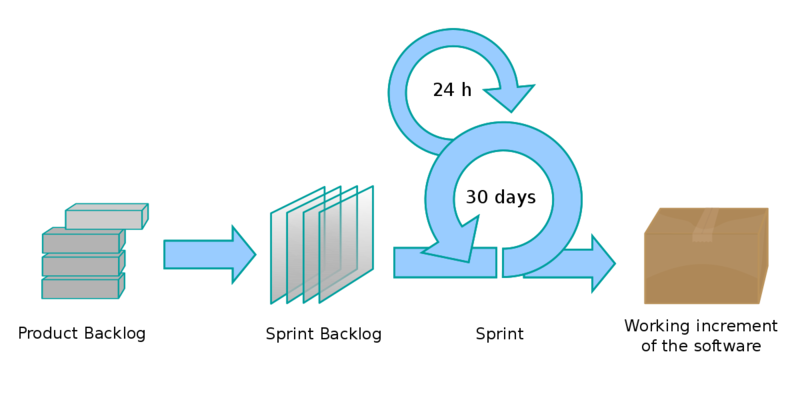

# Chapter 1: General Context

## **Problem Statement:**

**1. Description of the Problem:**  

In the realm of web applications, ensuring a holistic and positive user experience is paramount. While the visual aesthetics of an application play a significant role, the true essence of user experience delves deeper. Users expect a seamless interaction with applications, characterized by:

- **Swift Response Times**: The application should be agile, minimizing wait times and ensuring users can navigate and interact without delays.
- **Real-time Notifications & Feedback**: Users should be promptly informed about any updates, changes, or actions within the application, fostering a sense of engagement and clarity.
- **Efficient Background Processing**: When users initiate tasks that demand substantial computational resources, these processes should run in the background, ensuring the user interface remains responsive and unblocked.
- **Optimized Database Interactions**: The underlying database queries should be efficient, ensuring data retrieval and storage are swift and do not become bottlenecks.

The challenge lies in integrating all these facets into a cohesive user experience, where each element complements the other.

**2. Impact of the Problem:**  

Failure to address these expectations can lead to user frustration, decreased engagement, and potential abandonment of the application. An unresponsive interface, delays in feedback, or a lagging application can erode trust and satisfaction among users.

**3. Benefits of Solving the Problem:**  
By ensuring a cohesive user experience where each element complements the other, applications can retain and grow their user base, increase user satisfaction, and potentially see a rise in positive word-of-mouth referrals. Furthermore, an optimized application can lead to reduced server costs and increased scalability.

---

## Main Requirements: 

### **Main Requirements for the Invoicing App:**

1. **User Management:**
    - Allow users to create a profile with essential details.
    - Implement login/logout functionality.
    - Provide an option for users to login using Google Authentication.
    - Ensure no obligatory registration is required for basic features.
    - Implement an admin login with enhanced features and controls.

2. **Business Profile:**
    - Allow users to enter their business information, including name and address.
    - Provide an option to upload a business logo that can be displayed on invoices.

3. **Invoicing:**
    - Implement a user-friendly interface for creating invoices.
    - Automatically calculate VAT based on the entered details.
    - Generate a PDF version of the invoice for easy sharing and printing.
    - Ensure the generated invoice adheres to legal standards.

4. **Admin Features:**
    - Monitor user activity and manage user accounts.

5. **Security & Privacy:**
    - Implement role-based access controls to ensure users can only access their data.
    - Regularly back up user data and provide recovery options.
    - Ensure compliance with relevant data protection regulations.
    - Implement measures to prevent unauthorized access, especially for admin features.

6. **User Experience & Interface:**
    - Design a responsive web interface that's accessible on various devices and screen sizes.
    - Ensure intuitive navigation and clear call-to-action buttons.

7. **Integration:**
    - Seamlessly integrate with Google Authentication for secure and quick logins.
    - Ensure compatibility with popular web browsers.

8. **Support & Help:**
    - Provide a help section or FAQ to assist users with common queries.
    - Implement a feedback mechanism for users to report issues or suggest improvements.

   
### **Main Requirements for the Messaging App:**

1. **User Management:**
    - Allow users to create a profile with essential details such as name, email, and profile picture.
    - Implement login/logout functionality.
    - Provide a feature to find and start a conversation with other users.

2. **Messaging:**
    - Implement a user-friendly interface for sending and receiving messages in real-time.
    - Ensure messages are persisted in each conversation, allowing users to view chat history.
    - Provide real-time user status to indicate if the other user is online or offline.

3. **User Experience & Interface:**
    - Design a responsive web interface that's accessible on various devices and screen sizes.
    - Ensure intuitive navigation with clear indicators for unread messages.
    - Implement a notification system for new messages.

4. **Security & Privacy:**
    - Implement role-based access controls to ensure users can only access their conversations.
    - Implement measures to prevent unauthorized access.

## Analysing The Problem:

### **Problem Analysis for the Invoicing App:**

1. **Problem Definition:**  
   Small businesses and individuals require a simple, quick, and legally compliant invoicing tool that offers both free and premium features.

2. **Challenges & Constraints:**
   - Ensuring legal compliance in generated invoices.
   - Handling varying VAT calculations.
   - Ensuring data security, especially when handling business-sensitive information.

3. **Stakeholders:**
   - Small business owners
   - Freelancers or individual professionals
   - Admin or platform managers

4. **Desired Outcomes:**
   - A user-friendly platform that simplifies the invoicing process.
   - Increased user trust due to legal compliance and data security.
   - A scalable model.

### **Problem Analysis for the Messaging App:**

1. **Problem Definition:**  
   Users need a straightforward and secure platform to communicate in real-time, similar to popular messaging apps but with a focus on simplicity and privacy.

2. **Challenges & Constraints:**
   - Ensuring real-time communication with minimal latency.
   - Maintaining user privacy and ensuring end-to-end encryption.
   - Handling large volumes of concurrent users without performance degradation.
   - Managing message persistence and storage efficiently.

3. **Stakeholders:**
   - Regular users looking for simple communication tools.

4. **Desired Outcomes:**
   - A responsive web-based messaging platform that ensures real-time communication.
   - High user trust due to robust security and privacy measures.
   - A scalable infrastructure that can handle growth in user numbers.

---

## Proposed Solutions:

### **Proposed Solutions for the Freemium Invoicing App:**

1. **Background Jobs for Invoice Generation:**
   - **Description:** Implement background processing to handle the generation of invoice PDFs. This ensures that the user's UI remains responsive and unblocked, even when generating complex invoices.
   - **Benefits:**
      - Improved user experience due to non-blocking UI.
      - Scalability, as multiple invoices can be processed simultaneously in the background.
      - Reduced chances of timeouts or server overloads during peak usage times.

2. **Web Servers & Database Storage:**
   - **Description:** Utilize robust web servers to deliver the app to users efficiently. Implement a relational or NoSQL database system to ensure user data persistence, including their profiles, business details, and generated invoices.
   - **Benefits:**
      - Reliable and fast access to the app.
      - Secure and structured storage of user data.
      - Easy retrieval and backup of user information and invoices.

### **Proposed Solutions for the Simple Messaging App:**

1. **WebSockets for Real-time Communication:**
   - **Description:** Implement WebSockets to provide a real-time data feed to users. This allows for instantaneous message delivery and real-time status updates (e.g., online/offline status).
   - **Benefits:**
      - Seamless and instant communication between users.
      - Reduced latency compared to traditional polling methods.
      - Enhanced user experience due to real-time feedback and notifications.

2. **Web Servers & Database Storage:**
   - **Description:** Deploy the app using high-performance web servers to ensure smooth user access. Use a database system, preferably one optimized for real-time applications, to implement message and user data persistence.
   - **Benefits:**
      - Consistent and fast access to the messaging platform.
      - Secure storage of messages and user profiles.
      - Efficient retrieval of chat histories and user data.

## **Development Methodology: Agile Scrum**

**Introduction:**  

The Agile Scrum methodology was chosen as the primary development approach for both the invoicing app and the messaging app. Scrum, a subset of Agile, emphasizes collaboration, adaptability, and short, focused bursts of work known as sprints.

<figure>
  
  <figcaption style="text-align: center;">Scrum Process Model</figcaption>
</figure>

**Product Backlog for the Invoicing App:**

| Priority | User Story | Acceptance Criteria                                                           |
|----------|------------|-------------------------------------------------------------------------------|
| 1 | As a user, I want to create a profile so that I can personalize my invoicing experience. | User can sign up, add essential details, and upload a business logo.          |
| 2 | As a user, I want to generate an invoice without any delays. | Invoices are generated in the background, ensuring the UI remains responsive. |
| 3 | As a user, I want to see the calculated VAT automatically. | VAT is automatically calculated based on entered details.                     |
| 4 | As an admin, I want to monitor user activity. | Admin can log in and view users.                                              |
| 5 | As a user, I want to access the app without mandatory registration. | Users can access basic features without obligatory registration.              |

---

**Product Backlog for the Messaging App:**

| Priority | User Story                                                     | Acceptance Criteria                                                       |
|----------|----------------------------------------------------------------|---------------------------------------------------------------------------|
| 1 | As a user, I want to create a profile to start messaging.      | User can sign up and add essential details like name and profile picture. |
| 2 | As a user, I want to send and receive messages in real-time.   | Messages are sent and received instantly using WebSockets.                |
| 3 | As a user, I want to know the online status of my contacts.    | Users can see real-time status (online/offline) of their contacts.        |
| 4 | As a user, I want my messages to be private and secure.        | Messages are end-to-end encrypted, ensuring privacy.                      |
| 5 | As a user, I want to find and start conversations other users. | Users can find other users and initiate conversations.                    |

**Roles:**
   - **Product Owner:** Dhia Nabli
   - **Scrum Master:** Mr. Slah Bouhari
   - **Development Team:** Dhia Nabli

