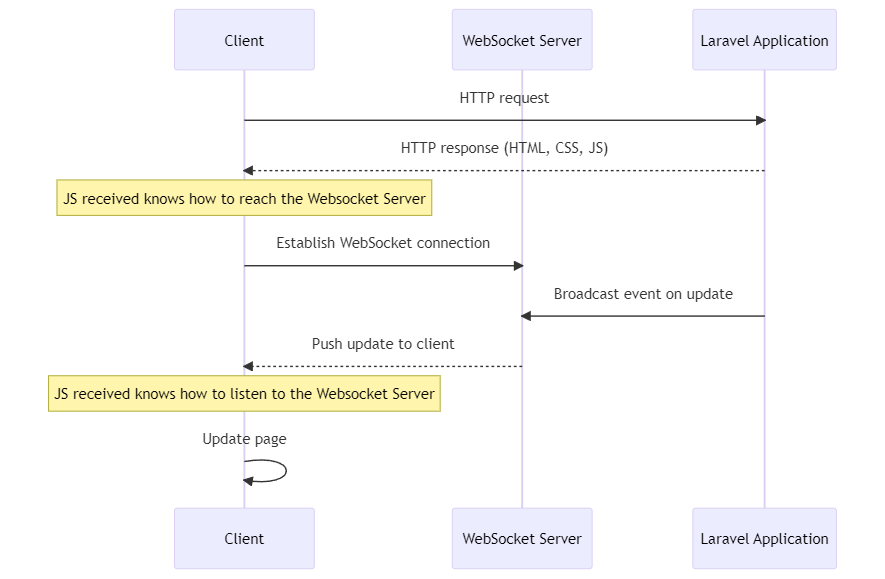

## 2.1.2: Websocket Client

In a Laravel application providing real-time updates (like live sports scores), you would typically use a mix of HTTP and WebSocket connections.

Here's a general breakdown:

1. When the user first visits your website, their browser makes an HTTP request to your Laravel application. The Laravel application processes this request, generates an HTTP response (containing HTML, CSS, JavaScript, etc.), and sends it back to the client. This is the normal request-response cycle of a web application, and once the response is sent, the Laravel application's work for that request is done.
2. The HTML and JavaScript sent to the client includes code to establish a WebSocket connection back to your server. This connection is made to the WebSocket server, which could be a separate service like Pusher, or your own WebSocket server provided by the Laravel Websockets package. Once this connection is established, it remains open, allowing for real-time communication between the server and the client.
3. When an update happens (like a change in the sports score), the Laravel application broadcasts an event. If you're using the Laravel Websockets package, this might be done via the `broadcast` function in Laravel, which sends the event to the WebSocket server.
4. The WebSocket server then pushes this update to all connected clients in real time.
5. The JavaScript running in the user's browser receives this update from the WebSocket server, and updates the page accordingly.

During this process, the Laravel application does not stay running in between HTTP requests. It simply handles each request (whether that's an initial page load, or a task to update a sports score), sends a response (or broadcasts an event), and then its work for that request is done.

The WebSocket server is responsible for maintaining the long-lived connections with each client, and for pushing updates to those clients as they happen. But the Laravel application itself still works on a per-request basis, processing each request and then terminating. It doesn't stay running in between requests, even though the client maintains a long-lived connection to the WebSocket server.

<figure>
  
  <figcaption style="text-align: center;">Figure 14: Client knows how to reach back websocket server</figcaption>
</figure>

### Client and Websocket Server

#### Step 1: The Client connects to the Websocket Server

for that the client can use **Pusher.js**:

Pusher.js is a JavaScript library provided by Pusher to facilitate communication with a Pusher WebSocket server. This includes establishing a connection with the server, subscribing to channels, and receiving real-time updates.

Example of initializing **Echo.js** using **Pusher.js**

```javascript
import Echo from 'laravel-echo';
import Pusher from 'pusher-js';
 
window.Pusher = Pusher;
 
window.Echo = new Echo({
    broadcaster: 'pusher',
    key: import.meta.env.VITE_PUSHER_APP_KEY,
    cluster: import.meta.env.VITE_PUSHER_APP_CLUSTER,
    forceTLS: true
});
```

#### Step 2: The Client listens to the Websocket Server 

For that the client can use Laravel **Echo.js**:

Laravel Echo, on the other hand, is a JavaScript library provided by Laravel that simplifies subscribing to channels and listening for event broadcasts in your Laravel application. It can use several drivers for this, one of which is Pusher.

When used with the Pusher driver, Laravel Echo uses the Pusher.js library under the hood to communicate with the Pusher server. Therefore, Laravel Echo is an abstraction over Pusher.js (or other real-time libraries, depending on the driver you choose), providing a consistent API for subscribing to channels and handling event broadcasts, regardless of the underlying driver being used.

Example of using **Echo.js**

```javascript
Echo.private(`chat.${roomId}`)
    .whisper('typing', {
        name: this.user.name
    });
```