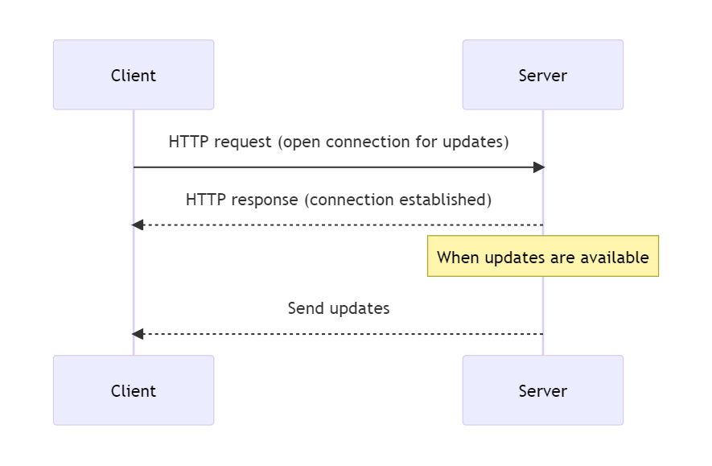
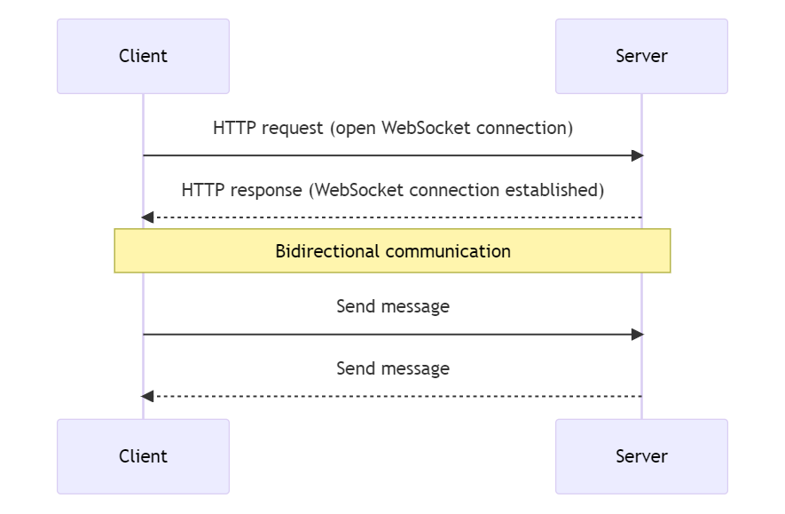
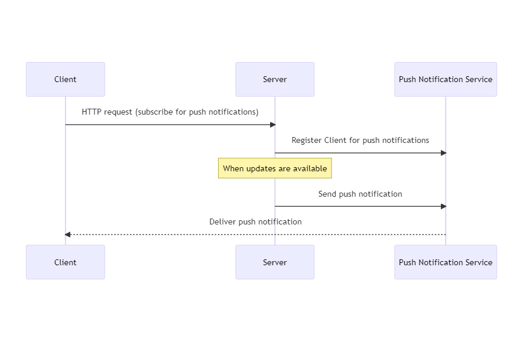

## 2.1.3: Real-Time Communication Techniques

The following are common techniques used to facilitate real-time communication between a client (such as a web browser) and a server. 

### 1. Polling

- **How it Works**: The client repeatedly sends HTTP requests to the server at regular intervals to check for new data.
- **Pros**: Simple to implement.
- **Cons**: Inefficient, as it can lead to unnecessary requests when there's no new data, and latency in receiving updates if the polling interval is too long.

<figure style="text-align: center">
  
  <figcaption style="text-align: center;">Figure 15: Polling</figcaption>
</figure>

### 2. Server-Sent Events (SSE)

- **How it Works**: The client opens a single HTTP connection to the server, and the server sends updates to the client over that connection as they become available.
- **Pros**: More efficient than polling, as updates are sent as soon as they're available.
- **Cons**: Unidirectional (server to client only), and not supported by all browsers.

<figure style="text-align: center">
  
  <figcaption style="text-align: center;">Figure 16: SSE</figcaption>
</figure>

### 3. WebSockets

- **How it Works**: The client and server establish a full-duplex, persistent connection over which they can send messages to each other.
- **Pros**: Bidirectional, allowing both the client and server to send messages at any time; more efficient than polling or SSE.
- **Cons**: More complex to implement; requires a specific protocol (though many libraries are available to simplify this).

<figure style="text-align: center">
  
  <figcaption style="text-align: center;">Figure 17: Websockets</figcaption>
</figure>

### 4. Push Notifications

- **How it Works**: The server sends notifications to the client via a third-party service (such as Apple's Push Notification Service for iOS or Google's Firebase Cloud Messaging for Android).
- **Pros**: Allows the server to send notifications to the client even when the client's app is not running or the web page is not open.
- **Cons**: Requires integration with platform-specific services; may have privacy implications.

<figure style="text-align: center">
  
  <figcaption style="text-align: center;">Figure 18: Push notifications</figcaption>
</figure>