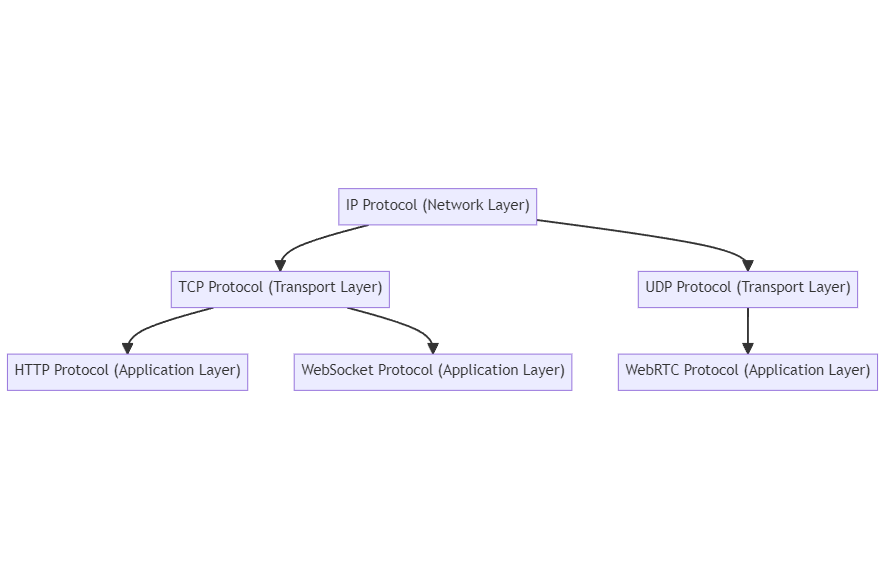
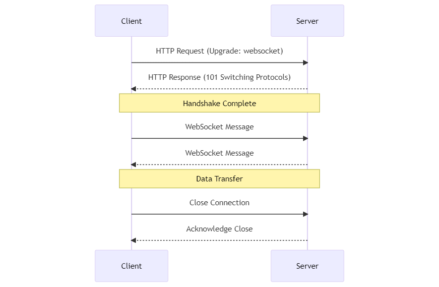
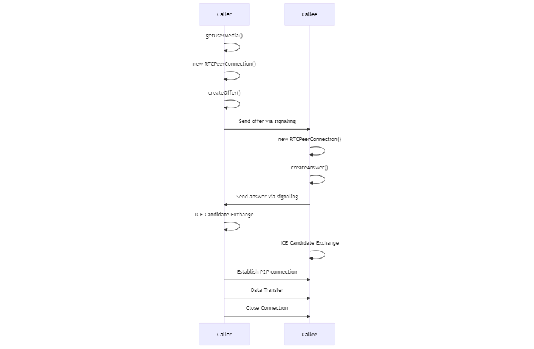
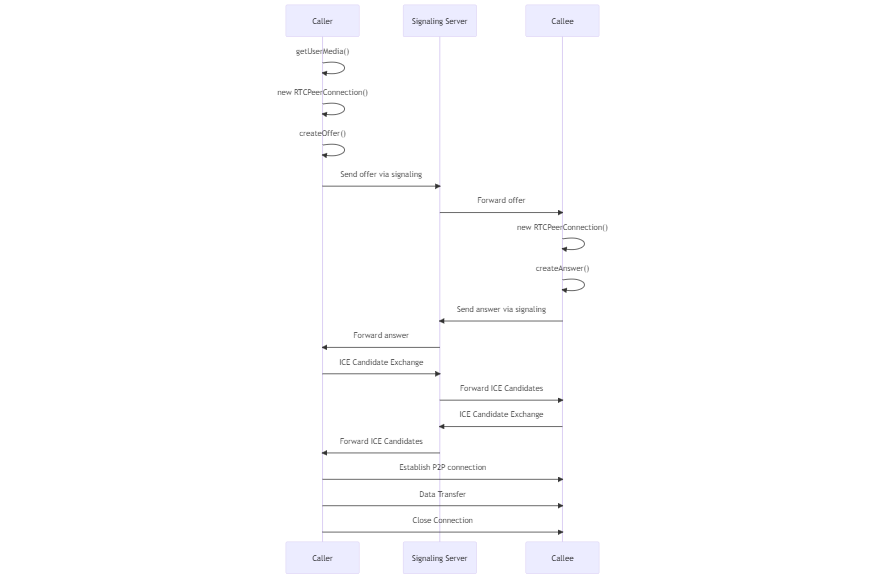

# Section 2.1: Real-time Protocols And Techniques

The following is an overview of the WebSocket and WebRTC protocols in the "protocols tree": 

<figure>
  
  <figcaption style="text-align: center;">Web protocols tree</figcaption>
</figure>

## 1. Websockets

WebSockets is a communication protocol that provides **full-duplex** communication between a client and a server over a **long-lived connection**. It's commonly used in web applications to enable **real-time** features like chat, live updates, and interactive games. 

The following steps are how a Websockets connection is made:

1. **Opening Handshake**: The client initiates the connection by sending an HTTP request to the server with an "Upgrade: websocket" header. This is a request to switch from HTTP to the WebSocket protocol.

2. **Server Response**: If the server supports the WebSocket protocol, it will agree to the upgrade by sending back an HTTP response with a "101 Switching Protocols" status code and an "Upgrade: websocket" header.

3. **Data Transfer**: Once the handshake is complete, the client and server can send messages back and forth in real-time. Unlike HTTP, the connection remains open, allowing for low-latency communication. Messages can be sent in both directions at any time, until the connection is closed.

4. **Closing the Connection**: Either the client or the server can choose to close the WebSocket connection at any time. This is typically done by sending a close frame across the connection.



WebSockets is a protocol **separate** from HTTP, but it's designed to work over the same ports (80 and 443) and be compatible with existing network infrastructure.



<figure>
  
  <figcaption style="text-align: center;">Websocket protocol</figcaption>
</figure>

## 2. WebRTC

WebRTC (Web Real-Time Communication) is a technology that enables real-time communication between web browsers and mobile applications via simple APIs. It supports video, voice, and generic data to be sent between peers, allowing developers to build powerful voice- and video-communication solutions.

Here's a simplified explanation of how it works:

1. **Getting Local Media**: The first step in a WebRTC session is to get access to the user's camera and microphone. This is done using the `getUserMedia` API.

2. **Creating an Offer**: Once media access is obtained, a peer connection is created using the `RTCPeerConnection` API. This peer connection will generate an "offer" which includes information about the media tracks (audio, video), and any data channels it would like to open.

3. **Signaling**: The offer is then sent to the other peer (the "callee") using a process called signaling. Signaling is not part of the WebRTC protocol itself; you can use any method of message passing you like, such as WebSockets or XHR.

4. **Creating an Answer**: The callee receives the offer and generates an "answer", which, like the offer, describes the media tracks and data channels it would like to open.

5. **ICE Candidates**: Both peers also exchange information about network connections, known as ICE candidates, which are used to establish the best path for the data to travel.

6. **Establishing a Connection**: Once the offer and answer have been exchanged, and ICE candidates have been gathered, a direct peer-to-peer connection is established. This connection is used to send video, audio, and data streams.

7. **Data Transfer**: Data can now be transferred directly between the peers. This can include video and audio streams from the user's camera and microphone, as well as arbitrary data.

8. **Closing the Connection**: Either peer can choose to close the connection at any time.

<figure>
  
  <figcaption style="text-align: center;">WebRTC protocol</figcaption>
</figure>



Because WebRTC is a peer to peer protocol. Usually the caller doesn't know enough information about the callee in order to be able to signal it and vise-versa.

For this reason, in real-world applications, there is typically a signaling server involved that helps to exchange information between the caller and callee.



The following diagram illustrates a more practical use-case where a signaling server is involved to help exchange information between the caller and callee.

<figure>
  
  <figcaption style="text-align: center;">WebRTC practical use-case</figcaption>
</figure>