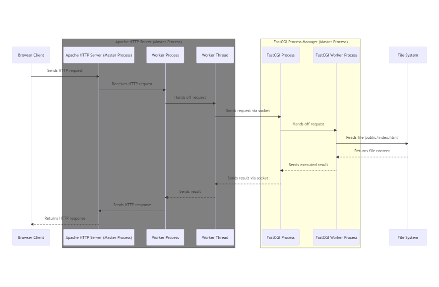

## 3.1.2: Web Server

Now let's break down what actually happens inside the server. From now on we are going to omit the term server as it is a broad term, and we are going to use more specific terms like: **physical server**, **web server**, **application server** ...

The part that is actually responsible for listening to the incoming HTTP Requests and generating HTTP Responses is the **Web Server**.

A **Web Server** is a computer software that accepts HTTP requests and is able to serve back HTTP responses. So more specifically a **Web Server** is a **Process** that operates on top of an **Operating System**.
The **OS** is installed on a **Physical Server**.

So a **browser** requesting a **web application** is more accurately represented like the following:

<figure>
  
  <figcaption style="text-align: center;">Figure 3.1.2.1: Browser interacting with a web server</figcaption>
</figure>

---

**A Web Server's Primary Function**: is to handle HTTP requests and responses. It serves **static** content like HTML, CSS, Javascript and images to the client's browser.

So an even more accurate representation of a **browser** requesting a **Web Server** is the following:

<figure>
  
  <figcaption style="text-align: center;">Figure 3.1.2.2: Web server and application source code</figcaption>
</figure>

---



Web Servers allow you to specify the location of the **Application Source Code** in their configuration. 

Example:

in **Apache HTTP Server** you specify the location using the `DocumentRoot` directive inside the `httpd.conf` file. 

Like the following example: `DocumentRoot /var/www/html`

It's important to note that Web Servers like Apache require appropriate file system permissions to access the files it serves.





### Web Server Modules

Web Server **modules** are extensions that add functionality to the Web Server. They allow you to customize and extend the capabilities of the server without modifying the core code.





Apache HTTP Server has a modular architecture, which means that features are separated into individual modules that can be loaded or unloaded as needed. This makes Apache highly flexible and adaptable to various use cases.

Apache modules can be classified as the following: **Core Modules**, **Shared Modules**, **MPMs (Multi-Processing Modules)**, **Handler Modules**, **Filter Modules**, **Security Modules**, **Rewrite and Alias Modules**, **Proxy Modules**, **Logging and Monitoring Modules**, **Authentication and Authorization Modules**.

To enable or disable modules, you can use the `a2enmod` and `a2dismod` commands (on Debian-based systems) or edit the Apache configuration files directly.



### MPM Multi-Processing Module

A web application must be able to handle multiple requests simultaneously. Therefore, Apache HTTP Server version 2.0 introduced the **MPM (Multi-Processing Module)**

Prior to Apache 2.0, the Apache server used a single process model called the `mpm_prefork` module.

#### MPMs

There are different MPMs available in Apache, each implementing different strategies for managing concurrency. Some commonly used MPMs include:

* **Prefork MPM**: This MPM follows a non-threaded approach and creates multiple worker processes, each capable of handling a single connection at a time. It provides excellent stability and isolation between processes but can consume more memory due to the overhead of separate processes.

* **Worker MPM**: The Worker MPM is a hybrid model that combines processes and threads. It creates multiple worker processes, each containing multiple threads. Each thread handles an individual connection, allowing for higher concurrency and reduced memory usage compared to the Prefork MPM.

* **Event MPM**: The Event MPM is similar to the Worker MPM but introduces a more efficient event-driven architecture. It utilizes a small number of threads to handle a large number of connections, using event notifications to efficiently manage concurrency and reduce resource usage.

---

The following is a diagram that represents different implementations of the MPM and how they differ.

<figure>
  
  <figcaption style="text-align: center;">Figure 3.1.2.3: Different MPM implementations</figcaption>
</figure>

---



For Apache 2.2 and earlier versions, the default MPM is **mpm_prefork**.

Starting from Apache 2.4, the default MPM is **mpm_event**.



---

### mpm_prefork

The following diagram illustrates the flow of HTTP requests and responses in the Apache HTTP Server. It shows that the "httpd Apache Listener" functionality receives HTTP requests from browser clients, forwards them to the "Request Queue", and then the worker processes handle these requests. Once a worker process generates a response, it forwards it back to the "httpd Apache Listener", which then sends the HTTP response back to the browser client.

This diagram visually represents the interaction between browser clients, the Apache HTTP Server, and its components, including the Master Process, Multi-Processing Module (MPM), Request Queue, and Worker Processes. The red links indicate the path of HTTP requests and responses.

<figure>
  
  <figcaption style="text-align: center;">Figure 3.1.2.4: Apache HTTP Server configured to use MPM prefork</figcaption>
</figure>

### mpm_worker

<figure style="text-align: center">
  
  <figcaption style="text-align: center;">Figure 3.1.2.5: Apache HTTP Server configured to use MPM worker</figcaption>
</figure>

The `mpm_worker` module uses multiple worker processes, each of which can handle many threads, with each thread handling one connection at a time. This model allows the server to handle multiple requests concurrently with fewer resources than a process-based model.

---

### FastCGI

#### Why to use FastCGI over CGI?

`mod_cgi` creates a new process for each request that requires script execution. This can be resource-intensive, especially under heavy load. In contrast, `mod_fastcgi` uses a pool of persistent processes (or threads, depending on the configuration) that can handle multiple requests over their lifetime. This can lead to significant performance improvements, as the overhead of process creation and destruction is avoided for each request.



**Communication Protocol**: `mod_cgi` uses the standard CGI (Common Gateway Interface) protocol to communicate between the Apache server and the CGI process. This involves setting environment variables and using standard input and output. `mod_fastcgi`, on the other hand, uses the FastCGI protocol, which is a binary protocol designed for efficiency. FastCGI processes can also communicate with the server over a network, which is not possible with standard CGI.

Because the FastCGI communication protocol uses sockets, the FastCGI application could be running on the same server or on a different server, depending on the configuration.

**Compatibility**: `mod_cgi` can be used with any scripting language that can read from standard input, write to standard output, and access environment variables. `mod_fastcgi` requires the scripting language to have FastCGI support, which is common but not universal.





Even if the FastCGI service is running on the same server as the Apache web server, they still communicate via sockets.

In the context of web servers and FastCGI, a socket is a method for inter-process communication (IPC). It's a way for different processes to send data back and forth, even if they're running on the same machine.

If the FastCGI service is running on the same machine as the Apache server, they would typically use Unix domain sockets for communication. Unix domain sockets are a feature of Unix-like operating systems that allow for high-performance communication between processes on the same machine.

If the FastCGI service is running on a different machine, they would use network sockets (typically TCP/IP sockets) for communication. Network sockets allow for communication between processes on different machines over a network.

So, regardless of whether the FastCGI service is on the same machine or a different machine, the Apache server and the FastCGI service communicate via sockets. The type of socket (Unix domain socket or network socket) depends on where the FastCGI service is running.



The following diagram illustrates **mod_worker** with **mod_fastcgi**

<figure>
  
  <figcaption style="text-align: center;">Figure 3.1.2.6: Apache configured to use mod_fastcgi with mod_worker</figcaption>
</figure>

1. The Apache master process spawns worker processes as per the configuration of the `mpm_worker` module.
2. Each of these worker processes can spawn multiple threads to handle incoming requests.
3. When a worker thread receives a request that involves executing a PHP script, it communicates with the FastCGI Process Manager (FPM) using the FastCGI protocol. This communication is facilitated by the `mod_fastcgi` module.
4. The FPM assigns a FastCGI process (which has an embedded PHP interpreter) to handle the request. The PHP script is executed within this FastCGI process, and the result is sent back to the worker thread.
5. The worker thread then sends the result back to the client.



The number of FastCGI processes that are created and how they are managed can be configured in the FPM configuration file. This allows for fine-tuning based on the expected load and available resources of the server.



The following diagram is a simplified version, that illustrates the interaction between the Apache Web Server and the FastCGI Process Manager (FPM):

<figure>
  
  <figcaption style="text-align: center;">Figure 3.1.2.7: Interaction between apache web server and FPM</figcaption>
</figure>

---

### PHP-FPM

PHP-FPM, which stands for "PHP FastCGI Process Manager", is an alternative PHP FastCGI implementation with some additional features useful for sites of any size, especially busier sites. It's designed to handle some of the shortcomings of other FastCGI implementations with respect to PHP.

The following are some key points about PHP-FPM:

1. **Process Management**: PHP-FPM maintains a pool of worker processes ready to serve PHP scripts. This pool can be dynamically managed, meaning PHP-FPM can create or kill worker processes based on demand. This is more efficient than creating a new process for each request, as some other models do.
2. **Adaptive Process Spawning**: PHP-FPM can adjust the number of worker processes it spawns based on the load on the server. This helps optimize resource usage.
3. **Performance**: PHP-FPM is designed to be high performance, and it can serve PHP scripts faster than traditional CGI-based methods.
4. **Compatibility**: PHP-FPM works well with popular web servers like Nginx and Apache.
5. **Emergency Restart**: PHP-FPM can automatically restart if it encounters an unrecoverable error, which can help maintain availability.



When running multiple PHP applications on a single Apache HTTP Server, you have a couple of options with PHP-FPM:

1. **Single PHP-FPM pool**: You can run all your applications through a single PHP-FPM pool. In this case, PHP-FPM manages all the applications. However, all applications would share the same pool of worker processes. This means they would also share the same user and group, and the same performance settings. This could potentially lead to security and resource allocation issues if one application is busier or requires different settings than the others.
2. **Multiple PHP-FPM pools**: You can create a separate PHP-FPM pool for each application. This is the more flexible and secure approach. Each application would have its own pool of worker processes, and you could set different performance settings and run each pool under a different user and group. This isolates the applications from each other, which can be beneficial for security and resource allocation.





Note here how the PHP-FPM as a separate process is responsible for processing business the business logic of the application. Which makes the Apache HTTP Server play the role of a load balancer and reverse proxy and delegates the role of processing the business logic to a separate process. This separation of concerns is what differentiates a Web Server from an Application Server    

