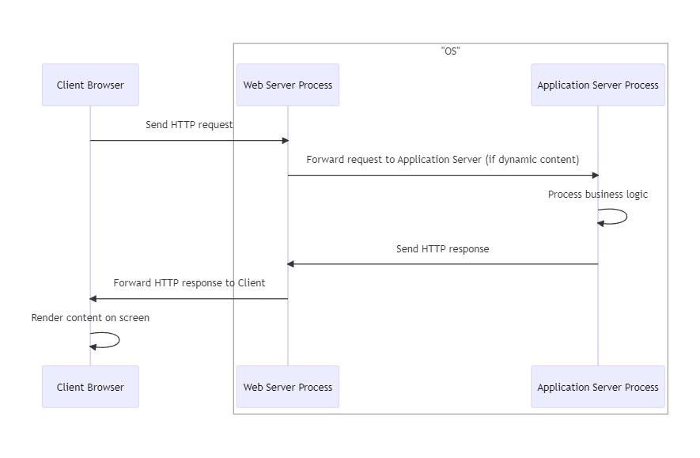
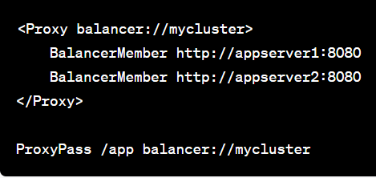
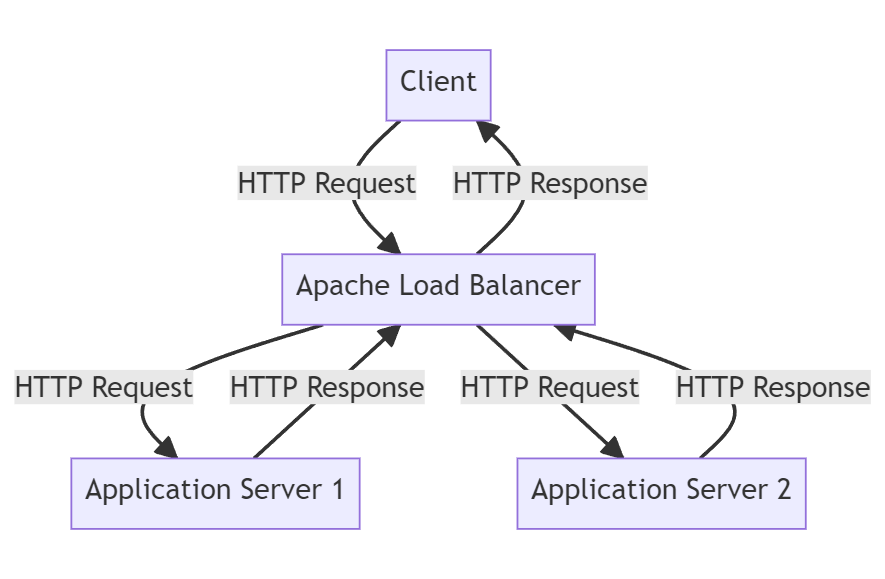

## 3.1.3: Application Server

**Application Server**: The term "application server" often refers to a server that can process business logic, not just serve static or dynamic content. While Apache and Nginx are not full-fledged application servers like some others (for example, Tomcat for Java or Unicorn for Ruby), they can handle some application server-like tasks. For example, with the right modules, Apache can process PHP, Perl, or Python code, and Nginx can process JavaScript or Lua code. However, for more complex tasks, they typically pass requests off to a separate application server or process manager (like PHP-FPM for PHP).

So, while Apache and Nginx are primarily web servers, they can take on some roles of an application server depending on the configuration and use case. However, they are not typically classified as full-fledged application servers.



Please note that an Application Server is broad term and its role depends on the framework or the script that is used on the server side.

Below are some examples of Application Servers for different programming languages

* For **Java**: Apache Tomcat is an Application Server that acts as a JAVA servlets container environment, and it manages concurrency through the use of thread workers from a thread pool.

* For **Python**: Gunicorn (Green Unicorn) is a WSGI Application Server that handles concurrency through a pre-fork worker model. It utilizes multiple worker processes to handle concurrent requests efficiently.

* For **PHP**: there is no standalone component known as an Application Server, However managing concurrency can be achieved with the use of a php process manager such as php-fpm (PHP FastCGI Process Manager)





* Please note that in some cases, a production-ready Application Server comes embedded in the framework. So it is a part of the executed code itself. An example of that is the **ASP.NET** framework that comes with the **Kestrel** embedded production-ready Application Server.





Please note that I am talking about production-ready Application Servers and not Development Servers that comes shipped with most frameworks but can't handle concurrency efficiently.



### Web Server vs Application Server

Web Server and Application Server are both components used in web applications, they work in conjunction but serve different purposes. Let's compare them:

### Web Server

- **Primary Function**: A Web Server is primarily responsible for handling HTTP requests and responses. It serves static content like HTML, CSS, Javascript and images to the client's browser.

- **Processing**: Web Servers do not execute any business logic. They mainly deal with the delivery of web pages to the client's browser.

- **Examples**: Apache HTTP Server, Nginx, Microsoft Internet Information Services (IIS).

- **Scalability**: Web Servers are generally more scalable and are used to handle the high volume of traffic.

- **Communication**:
    - Web Servers communicate directly with the client's browser
    - and can also act as a reverse proxy server for Application Servers.


* Different Application Servers can run behind a Web Server.
* Each Application Server will be mapped to a different port.
* Most Web Servers by default listen on the default HTTP port 80 or HTTPS port 443.
  

### Application Server

- **Primary Function**: An Application Server is designed to run web applications and execute business logic of the web application, such as processing form data, interacting with databases, and generating dynamic content.

- **Functionality**: When the Web Server forwards a request to the Application Server, the Application Server processes the request by running the appropriate scripts. It may interact with a database, perform calculations, or carry out other business logic.

- **Response Generation**: After processing, an Application Server generates an HTTP response, usually in the form of HTML or JSON, and sends it back to the Web Server, which in turn sends it to the client's browser.

- **Examples**:Apache Tomcat, WildFly, Unicorn, Gunicorn, Kestrel.

- **Scalability**: Application Servers are generally less scalable compared to web servers and are used for more resource-intensive operations.



Both Web Servers and Application Servers are typically two different processes that operate independently on top of a Physical Server's operating system



---

The following is a sequence diagram that visually represents the interactions between the client's browser, Web Server process, and Application Server process

<figure>
  
  <figcaption style="text-align: center;">Figure 3.1.3.1: Application server</figcaption>
</figure>



Please keep in mind that the above scenario represents the typical use-case. All the Processes including the browser can operate on the same OS (in the case of a local environment) or each Processes can operate on a different OS (in the case of a distributed system)



---

### More than one application server

It is possible for an Apache web server to act as both a reverse proxy and a load balancer for more than one application server.

As a reverse proxy, Apache can accept client requests and forward them to one or more backend servers. This can help to hide the existence and characteristics of an origin server or servers.

As a load balancer, Apache can distribute incoming requests across multiple backend servers to balance the load and ensure no single server becomes overwhelmed. This can help to increase the capacity and reliability of the applications.

The Apache HTTP Server Project offers modules like `mod_proxy` and `mod_proxy_balancer` which provide these functionalities. You can configure these modules to manage multiple application servers.

Here's an example configuration that balances load between two application servers

<figure style="text-align: center">
  
  <figcaption style="text-align: center;">Figure 3.1.3.2: More than one application server</figcaption>
</figure>

`http://appserver1:8080` and `http://appserver2:8080` are the addresses of your application servers. Any requests to `http://your-apache-server/app` will be balanced between these two servers.

---

Here is a diagram that illustrates the example:

<figure style="text-align: center">
  
  <figcaption style="text-align: center;">Figure 3.1.3.3: Apache Load Balancer + Reverse Proxy</figcaption>
</figure>

---

