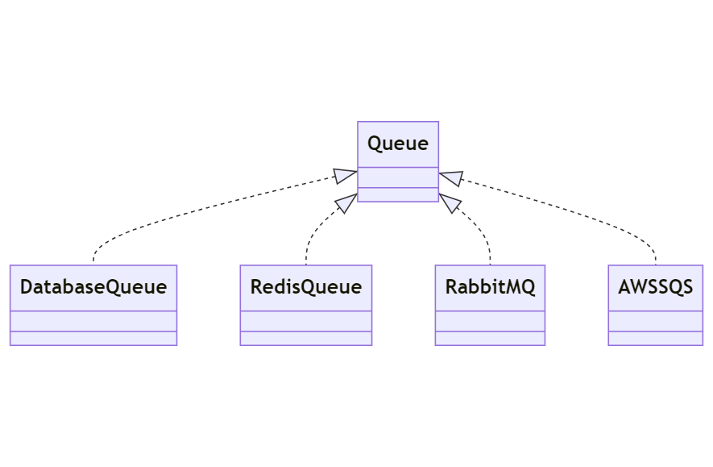

## 3.1.1: Background Jobs 

### Introduction to Background Jobs in Laravel

In any web application, there are tasks that require a significant amount of time to process and complete. These tasks, if executed during a normal request/response cycle, can lead to a poor user experience as they have to wait for these tasks to complete. This is where background jobs come in.

Background jobs in Laravel allow you to defer the processing of a time-consuming task, such as sending an email, until a later time. This significantly speeds up web requests to your application as the user doesn't have to wait for these tasks to complete. Instead, these tasks are handled in the background, allowing the application to continue processing other tasks.

<figure style="text-align: center">
  
  <figcaption style="text-align: center;">Figure 51: Laravel background jobs</figcaption>
</figure>

### Asynchronous Execution of Background Jobs

One of the key features of background jobs in Laravel is their ability to run asynchronously. But what does this mean?

When a job is dispatched in Laravel, it's stored in a jobs table and then added to a task queue. These queues are not part of the main application flow, meaning they can operate independently and don't block the user's interaction with the application.

Worker threads, which are separate processes, are responsible for picking up and executing jobs from this queue. These worker threads run in the background, hence the term "background jobs". This asynchronous processing allows the main application to continue processing other tasks without waiting for the job to complete.

<figure style="text-align: center">
  
  <figcaption style="text-align: center;">Figure 52: Asynchronous execution of background jobs</figcaption>
</figure>

### Job Queues 

In Laravel, a job queue is an abstract concept that can be implemented in various ways, including using a database or message queue services. Queues help manage and prioritize jobs, ensuring that each job is processed in the order it was received and that no job is processed more than once.

Message queues are services that implement a priority queue. They are designed to handle high traffic and to decouple your application, allowing for efficient management of jobs. Laravel supports different types of queues, including database, Redis, and various message queue services like RabbitMQ, AWS SQS, etc.

<figure style="text-align: center">
  
  <figcaption style="text-align: center;">Figure 53: Job queues</figcaption>
</figure>

### Job Events

Job events in Laravel provide hooks into the Laravel queue's job processing system. These events, such as `Queue::before`, `Queue::after`, and `Queue::failing`, allow you to perform actions before a job is processed, after it has processed, or when a job fails. This can be particularly useful for debugging or logging purposes.

<figure style="text-align: center">
  
  <figcaption style="text-align: center;">Figure 54: Job events</figcaption>
</figure>



Job Events in Laravel are a special type of Laravel Events that can persist between subsequent HTTP Requests.

This persistence is achieved by using a database table for recording the jobs and their metadata (including status) as a shared resource that can be queried to get notified about the changes.


