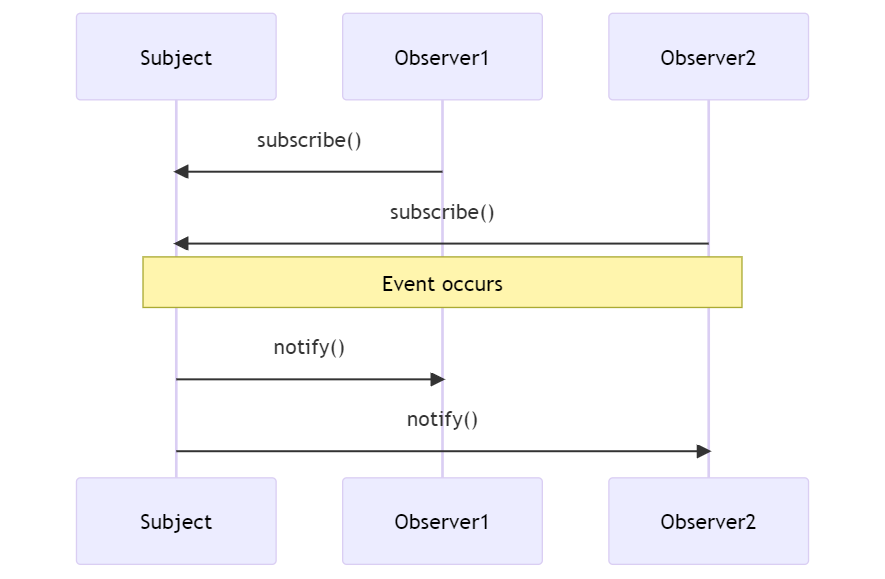

## 3.2.2: Events

In this section, we will provide an overview of what events are in the context of Laravel and why they are useful. 

+ Events provide a simple implementation of the observer design pattern, allowing you to subscribe and listen for various events in your application.

The following diagram represents how the Observer Pattern typically works:

<figure style="text-align: center">
  
  <figcaption style="text-align: center;">Figure 3.2.2.1: Observer pattern</figcaption>
</figure>


The following diagram shows how the Observer Pattern is implemented in the context of Laravel terminology:

<figure style="text-align: center">
  
  <figcaption style="text-align: center;">Figure 3.2.2.2: Observer pattern in laravel</figcaption>
</figure>

+ They serve as a great way to decouple various aspects of your application, as the event object can be used to share data between the event listeners.
 
+ They can be used for tasks like sending notifications, firing off jobs to queues, writing to logs and more.

### Understanding Laravel Events

+ Events in Laravel can be classified into two main categories: persistent events and request-specific events.

<figure style="text-align: center">
  
  <figcaption style="text-align: center;">Figure 3.2.2.3: Event types in laravel</figcaption>
</figure>


- Persistent events are those that persist between subsequent HTTP requests. A good example of these are job events, which may be processed in the background and not within the lifecycle of a single HTTP request.

The following diagram illustrates how Job Event use the Database shared resource to persist between subsequent HTTP Requests:

<figure style="text-align: center">
  
  <figcaption style="text-align: center;">Figure 3.2.2.4: Persistent events in laravel</figcaption>
</figure>

in the sequence diagram:

  1. The Client sends an HTTP request to start a job. This request is received by a new instance of the Laravel application on the Web Server.
  2. The Laravel application creates a Job record in the Database with a status of 'processing'.
  3. The Laravel application adds the job to the Message Queue.
  4. The Laravel application returns the Job id to the Client and then the instance is deactivated.
  5. The Client stores the Job id temporarily. This is important because the Client will need this id to check the status of the job later.
  6. The Message Queue dispatches the job to be processed.
  7. The Job updates its status in the Database. This could be 'started', 'error', or 'completed' depending on the progress of the job.
  8. The Client periodically polls for the job status by sending HTTP requests to the Web Server.
  9. A new instance of the Laravel application is activated to handle each of these requests. It listens to the Database for changes in the Job status.
  10. The Laravel application returns the Job status to the Client and then the instance is deactivated.


- Request-specific events are those that occur within the lifespan of a single HTTP request. They get fired and handled during a single HTTP request and do not persist across multiple requests.

The following is a sequence diagram for request-specific events that get listened to synchronously and do not persist between subsequent HTTP requests:

<figure style="text-align: center">
  
  <figcaption style="text-align: center;">Figure 3.2.2.5: Non persistent events in laravel</figcaption>
</figure>

Both the Event and the Listener are part of the Laravel Application instance.
 
+ Event classes are typically stored in the `app/Events` directory.

 
+ Events can be broadcast over websockets to provide real-time updates to your application's users.

 
+ Laravel's event broadcasting allows you to broadcast your server-side Laravel events to your client-side JavaScript application.


### Creating Events

In Laravel, we can create an Event using the artisan command `php artisan make:event EventName`.

Like the following example:

```
php artisan make:event OrderShipped
```
 
This would generate an `OrderShipped` Event where we can define data inside it and use it like the following:

```PHP
namespace App\Events;

use App\Models\Order;
use Illuminate\Foundation\Events\Dispatchable;
use Illuminate\Queue\SerializesModels;

class OrderShipped
{
    use Dispatchable, SerializesModels;

    public $order;

    /**
     * Create a new event instance.
     *
     * @param  Order  $order
     * @return void
     */
    public function __construct(Order $order)
    {
        $this->order = $order;
    }
}
```

To dispatch the created event we can use the `event` helper function like the following:

```PHP
event(new OrderShipped($order));
```

or the `dispatch` method on the Event itself like the following:

```PHP
OrderShipped::dispatch($order);
```

### Event Listeners

An Event Listeners listens to a particular event and performs an action when that event is fired.


+ To create an Event Listener for an already defined Event we can use the artisan command `php artisan make:listener ListenerName --event=EventName`.

Like the following example:

```
php artisan make:listener SendShipmentNotification --event=OrderShipped
```

This will create a `SendShipmentNotification` class with a `handle` method where we can define how to handle the fired Event.

Like the following:

```PHP
class SendShipmentNotification 
{
    public function handle(OrderShipped $event)
    {
        // Access the order using $event->order...
    }
}
```

+ next you need to register the Event Listener. This typically can be achieved using the `$listen` array in the `EventServiceProvider`, like the following:

```PHP
use App\Events\OrderShipped;
use App\Listeners\SendShipmentNotification;
 
/**
 * The event listener mappings for the application.
 *
 * @var array<class-string, array<int, class-string>>
 */
protected $listen = [
    OrderShipped::class => [
        SendShipmentNotification::class,
    ],
];
```

### Event Subscribers


An event subscriber is a class that may subscribe to multiple events from within the class itself, allowing you to define several event handlers within a single class. Subscribers classes have a `subscribe` method, which is passed an event dispatcher instance, allowing the subscriber to register multiple event listeners.

The following is a basic example of an event subscriber:


```PHP
namespace App\Listeners;

class UserEventSubscriber
{
    /**
     * Handle user login events.
     */
    public function handleUserLogin($event) {}

    /**
     * Handle user logout events.
     */
    public function handleUserLogout($event) {}

    /**
     * Register the listeners for the subscriber.
     *
     * @param  Illuminate\Events\Dispatcher  $events
     */
    public function subscribe($events)
    {
        $events->listen(
            'Illuminate\Auth\Events\Login',
            'App\Listeners\UserEventSubscriber@handleUserLogin'
        );

        $events->listen(
            'Illuminate\Auth\Events\Logout',
            'App\Listeners\UserEventSubscriber@handleUserLogout'
        );
    }
}
```


In this example, the `UserEventSubscriber` is subscribing to the `Login` and `Logout` events. When these events are dispatched, the `handleUserLogin` and `handleUserLogout` methods are called, respectively.


**Why use an event subscriber over an event listener?**


1. **Organization**: If you have a lot of related events, it can be more organized to group their listeners into a single class, rather than having many different listener classes.
2. **Flexibility**: Subscribers can listen for multiple events, whereas a single event listener class listens for a single event. This can reduce the amount of code you need to write if multiple events should trigger similar functionality.
3. **Dynamic Listener Registration**: Subscribers can programmatically determine whether to listen to an event or not, or even which method to call, since the subscribing is done in the subscriber's `subscribe` method at runtime. This is not possible with static event listeners, which are registered in the `EventServiceProvider`.

Just like an Event Listener you need to register the Event Subscriber in the `EventServiceProvider`:

```php
protected $subscribe = [
    'App\Listeners\UserEventSubscriber',
];
```


### Broadcasting Events


To broadcast events using Laravel, we need to: 


1. Firstly to configure Laravel to use a broadcasting service like Pusher or Laravel Websockets in the `.env` file and the `config/broadcasting.php` file.
2. Secondly to mark an event as "broadcastable" by implementing the `ShouldBroadcast` or `ShouldBroadcastNow` interfaces. Like the following:

```PHP
class OrderShipmentStatusUpdated implements ShouldBroadcast
{
    use Dispatchable, InteractsWithSockets, SerializesModels;

    public $order;

    public function __construct($order)
    {
        $this->order = $order;
    }

    public function broadcastOn()
    {
        return new Channel('orders');
    }
}
```


This takes us to the next chapter where we talk about websockets and the websocket server.


