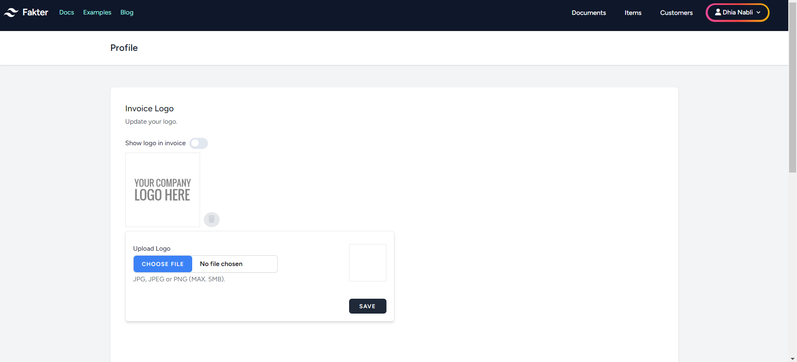

# Section 4.1: Invoicing App

## 4.1.1: **Use-Case Diagram:**

<figure style="text-align: center">
  
  <figcaption style="text-align: center;">Figure 4.1.1.1: Use-Case Diagram for Invoicing App</figcaption>
</figure>

## 4.1.2: **Class Diagram:**

<figure style="text-align: center">
  
  <figcaption style="text-align: center;">Figure 4.1.2.1: Invoicing app class diagram</figcaption>
</figure>

---

   

## 4.1.3: Sprints

**Sprint 1 Backlog for the Invoicing App:**

| Priority | User Story | Acceptance Criteria                                                           | Estimated Time |
|----------|------------|-------------------------------------------------------------------------------|----------------|
| 1 | As a user, I want to create a profile so that I can personalize my invoicing experience. | User can sign up, add essential details, and upload a business logo.          | 6 days         |
| 2 | As a user, I want to generate an invoice without any delays. | Invoices are generated in the background, ensuring the UI remains responsive. | 6 days         |
| 3 | As a user, I want to see the calculated VAT automatically. | VAT is automatically calculated based on entered details.                     | 2 days         |

**Total Estimated Time for Sprint 1:** 14 days

---

**Sprint 2 Backlog for the Invoicing App:**

| Priority | User Story | Acceptance Criteria                                                           | Estimated Time |
|----------|------------|-------------------------------------------------------------------------------|----------------|
| 4 | As an admin, I want to monitor user activity. | Admin can log in and view users.                                              | 7 days         |
| 5 | As a user, I want to access the app without mandatory registration. | Users can access basic features without obligatory registration.              | 7 days         |

**Total Estimated Time for Sprint 2:** 14 days

---

## 4.1.4: Tools Used:

- **Git**: A distributed version control system commonly used for tracking changes in source code during software development.

- **PhpStorm**: An integrated development environment (IDE) for PHP developed by JetBrains.

- **Laravel**: A free, open-source PHP web framework intended for the development of web applications.

- **Node.js**: A JavaScript runtime built on Chrome's V8 JavaScript engine. It's used for building scalable network applications.

- **WebSocket**: A communication protocol that provides full-duplex communication channels over a single TCP connection. Used for real-time web applications.

- **Apache2 Web Server**: Open-source and free web server software that provides a secure and efficient HTTP server in line with current HTTP standards.

- **MySQL**: An open-source relational database management system.

- **Linux**: A family of open-source Unix-like operating systems based on the Linux kernel.

- **GitHub**: A platform that provides hosting for software development and version control using Git.

## 4.1.5 Screenshots

<figure style="text-align: center">
  
  <figcaption style="text-align: center;">Figure 4.1.5.1: Login page</figcaption>
</figure>

The user is able to login to access his personal information and make the invoice creation quicker by using that saved information.

---

<figure style="text-align: center">
  
  <figcaption style="text-align: center;">Figure 4.1.5.2: Dashboard for non logged in users</figcaption>
</figure>

The default welcome page is the invoicing dashboard where the user can create an invoice without the need to create an account.

---

<figure style="text-align: center">
  
  <figcaption style="text-align: center;">Figure 4.1.5.3: Dashboard for logged in users</figcaption>
</figure>

However, the user doesn't need to create an account and login in order to be able to create an account.

---

<figure style="text-align: center">
  
  <figcaption style="text-align: center;">Figure 4.1.5.4: Dashboard</figcaption>
</figure>

The VAT is calculated automatically for each added item

---

<figure style="text-align: center">
  
  <figcaption style="text-align: center;">Figure 4.1.5.5: Invoice logo settings</figcaption>
</figure>

If the user is logged in, he can upload and save a logo that will appear on every future generated invoice.

---

<figure style="text-align: center">
  
  <figcaption style="text-align: center;">Figure 4.1.5.6: Customer name autocomplete</figcaption>
</figure>

The user can add customers with their specific information. When creating an invoice the user will get customer name suggestions and its corresponding data autofilled based on the entered customer's name.

---

<figure style="text-align: center">
  
  <figcaption style="text-align: center;">Figure 4.1.5.7: My customer page</figcaption>
</figure>

In the "My Customers" section the user can manage his customers. The app will then use this information to help the user fill future invoices.

---

<figure style="text-align: center">
  
  <figcaption style="text-align: center;">Figure 4.1.5.8: Generated invoice example</figcaption>
</figure>

When the user finishes entering the required information and decides to generate an invoice. Then a PDF invoice will be generated accordingly that contains a revenue stamp tax.

---

