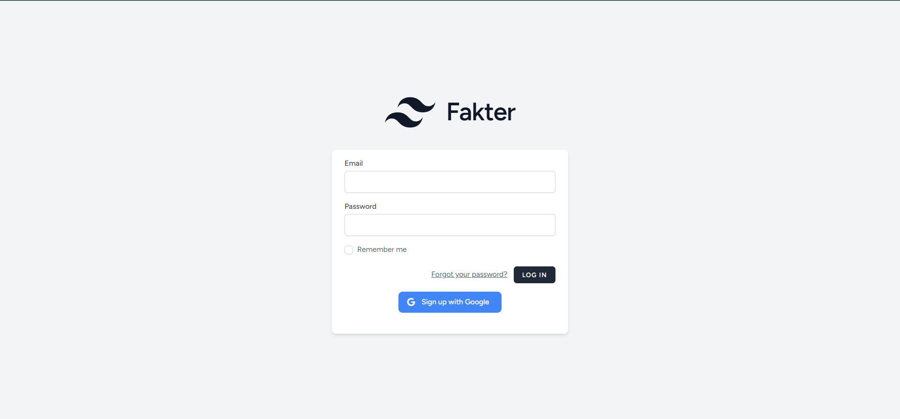
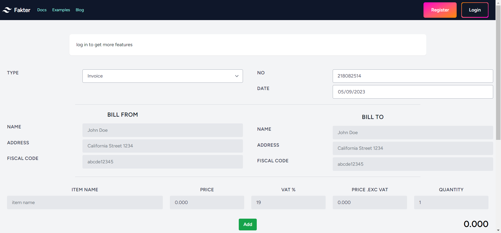
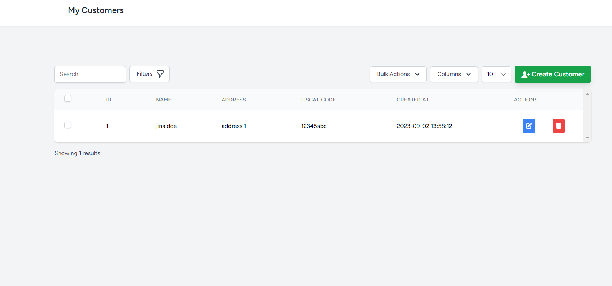
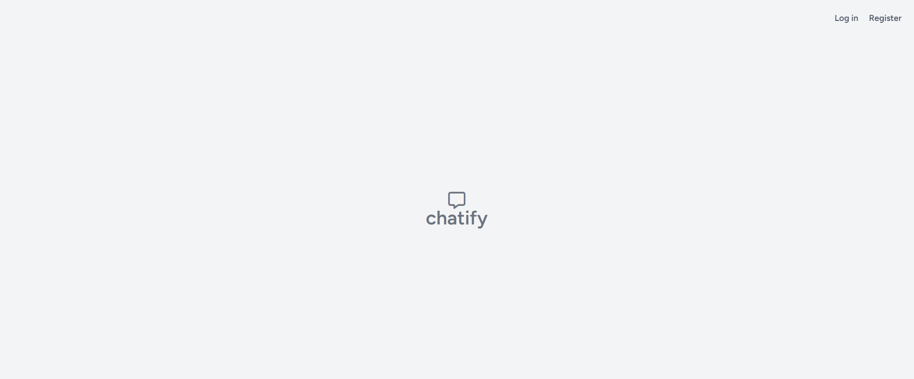

# Section 4.1: Project Structure

## Invoicing App

**Use-Case Diagram:**

<figure style="text-align: center">
  
  <figcaption style="text-align: center;">Use-Case Diagram for Invoicing App</figcaption>
</figure>

**Class Diagram:**

<figure style="text-align: center">
  
  <figcaption style="text-align: center;">Invoicing app class diagram</figcaption>
</figure>

---

**Screenshots:**

<figure style="text-align: center">
  
  <figcaption style="text-align: center;">Login page</figcaption>
</figure>

The user is able to login to access his personal information and make the invoice creation quicker by using that saved information. 

---

<figure style="text-align: center">
  
  <figcaption style="text-align: center;">Dashboard for non logged in users</figcaption>
</figure>

The default welcome page is the invoicing dashboard where the user can create an invoice without the need to create an account.

---

<figure style="text-align: center">
  
  <figcaption style="text-align: center;">Dashboard for logged in users</figcaption>
</figure>

However, the user doesn't need to create an account and login in order to be able to create an account.

---

<figure style="text-align: center">
  
  <figcaption style="text-align: center;">Dashboard</figcaption>
</figure>

The VAT is calculated automatically for each added item

---

<figure style="text-align: center">
  
  <figcaption style="text-align: center;">Invoice logo settings</figcaption>
</figure>

If the user is logged in, he can upload and save a logo that will appear on every future generated invoice. 

---

<figure style="text-align: center">
  
  <figcaption style="text-align: center;">Customer name autocomplete</figcaption>
</figure>

The user can add customers with their specific information. When creating an invoice the user will get customer name suggestions and its corresponding data autofilled based on the entered customer's name.

---

<figure style="text-align: center">
  
  <figcaption style="text-align: center;">My customer page</figcaption>
</figure>

In the "My Customers" section the user can manage his customers. The app will then use this information to help the user fill future invoices. 

---

<figure style="text-align: center">
  
  <figcaption style="text-align: center;">Generated invoice example</figcaption>
</figure>

When the user finishes entering the required information and decides to generate an invoice. Then a PDF invoice will be generated accordingly that contains a revenue stamp tax.

---

   

**Sprint 1 Backlog for the Invoicing App:**

| Priority | User Story | Acceptance Criteria                                                           | Estimated Time |
|----------|------------|-------------------------------------------------------------------------------|----------------|
| 1 | As a user, I want to create a profile so that I can personalize my invoicing experience. | User can sign up, add essential details, and upload a business logo.          | 6 days         |
| 2 | As a user, I want to generate an invoice without any delays. | Invoices are generated in the background, ensuring the UI remains responsive. | 6 days         |
| 3 | As a user, I want to see the calculated VAT automatically. | VAT is automatically calculated based on entered details.                     | 2 days         |

**Total Estimated Time for Sprint 1:** 14 days

---

**Sprint 2 Backlog for the Invoicing App:**

| Priority | User Story | Acceptance Criteria                                                           | Estimated Time |
|----------|------------|-------------------------------------------------------------------------------|----------------|
| 4 | As an admin, I want to monitor user activity. | Admin can log in and view users.                                              | 7 days         |
| 5 | As a user, I want to access the app without mandatory registration. | Users can access basic features without obligatory registration.              | 7 days         |

**Total Estimated Time for Sprint 2:** 14 days

---

## Messaging App:

**Use-Case Diagram:**

<figure style="text-align: center">
  
  <figcaption style="text-align: center;">Use-Case Diagram for Messaging App</figcaption>
</figure>

**Class Diagram:**

<figure style="text-align: center">
  
  <figcaption style="text-align: center;">Messaging app class diagram</figcaption>
</figure>

---

**Screenshots:**

<figure style="text-align: center">
  
  <figcaption style="text-align: center;">Welcome page</figcaption>
</figure>

The welcome page is the first page in the app that the user interacts with.

---

<figure style="text-align: center">
  
  <figcaption style="text-align: center;">Login page</figcaption>
</figure>

If the needs to sign in, in order to use the app. If the user doesn't have an account he can create one. 

---

<figure style="text-align: center">
  
  <figcaption style="text-align: center;">Find users</figcaption>
</figure>

In the dashboard the user finds other users and is able to see their profiles and start a chat with any other user.

---

<figure style="text-align: center">
  
  <figcaption style="text-align: center;">Online user</figcaption>
</figure>

Every user's online state is updated in real-time, so if another user is online, then all other users will see the update in real-time. The same is when a user goes offline.

---

<figure style="text-align: center">
  
  <figcaption style="text-align: center;">Chats page</figcaption>
</figure>

In the chats section the user is able to see all his chats with the other users and see if he got new messages from other users through the notifications that represent new non-read messages.

---

<figure style="text-align: center">
  
  <figcaption style="text-align: center;">Chat page</figcaption>
</figure>

When a user starts a chat with another user they can exchange messages back and forth in real-time. The messages do persist after the user leaves the conversation.

---

**Sprint 1 Backlog for the Messaging App:**

| Priority | User Story                                                     | Acceptance Criteria                                                       | Estimated Time |
|----------|----------------------------------------------------------------|---------------------------------------------------------------------------|----------------|
| 1 | As a user, I want to create a profile to start messaging.      | User can sign up and add essential details like name and profile picture. | 6 days         |
| 2 | As a user, I want to send and receive messages in real-time.   | Messages are sent and received instantly using WebSockets.                | 4 days         |
| 3 | As a user, I want to know the online status of my contacts.    | Users can see real-time status (online/offline) of their contacts.        | 4 days         |

**Total Estimated Time for Sprint 1:** 14 days

---

**Sprint 2 Backlog for the Messaging App:**

| Priority | User Story                                                     | Acceptance Criteria                                    | Estimated Time |
|----------|----------------------------------------------------------------|--------------------------------------------------------|----------------|
| 4 | As a user, I want my messages to be private and secure.        | Messaging channels are secure ensuring privacy.        | 10 days        |
| 5 | As a user, I want to find and start conversations with other users. | Users can find other users and initiate conversations. | 4 days         |

**Total Estimated Time for Sprint 2:** 14 days

