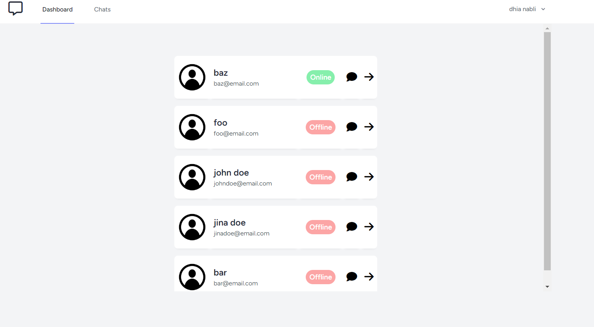
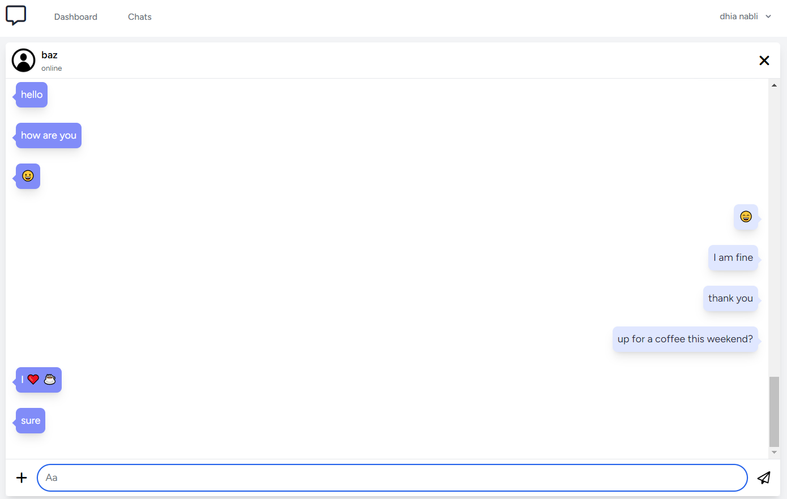

# Section 4.2: Messaging App

## 4.2.1: **Use-Case Diagram:**

<figure style="text-align: center">
  
  <figcaption style="text-align: center;">Figure 4.2.1.1: Use-Case Diagram for Messaging App</figcaption>
</figure>

## 4.2.2: **Class Diagram:**

<figure style="text-align: center">
  
  <figcaption style="text-align: center;">Figure 4.2.2.1: Messaging app class diagram</figcaption>
</figure>

---

**Sprint 1 Backlog for the Messaging App:**

| Priority | User Story                                                     | Acceptance Criteria                                                       | Estimated Time |
|----------|----------------------------------------------------------------|---------------------------------------------------------------------------|----------------|
| 1 | As a user, I want to create a profile to start messaging.      | User can sign up and add essential details like name and profile picture. | 6 days         |
| 2 | As a user, I want to send and receive messages in real-time.   | Messages are sent and received instantly using WebSockets.                | 4 days         |
| 3 | As a user, I want to know the online status of my contacts.    | Users can see real-time status (online/offline) of their contacts.        | 4 days         |

**Total Estimated Time for Sprint 1:** 14 days

---

**Sprint 2 Backlog for the Messaging App:**

| Priority | User Story                                                     | Acceptance Criteria                                    | Estimated Time |
|----------|----------------------------------------------------------------|--------------------------------------------------------|----------------|
| 4 | As a user, I want my messages to be private and secure.        | Messaging channels are secure ensuring privacy.        | 10 days        |
| 5 | As a user, I want to find and start conversations with other users. | Users can find other users and initiate conversations. | 4 days         |

**Total Estimated Time for Sprint 2:** 14 days

## 4.2.3: Tools Used:

- **Git**: A distributed version control system commonly used for tracking changes in source code during software development.

- **PhpStorm**: An integrated development environment (IDE) for PHP developed by JetBrains.

- **Laravel**: A free, open-source PHP web framework intended for the development of web applications.

- **Node.js**: A JavaScript runtime built on Chrome's V8 JavaScript engine. It's used for building scalable network applications.

- **WebSocket**: A communication protocol that provides full-duplex communication channels over a single TCP connection. Used for real-time web applications.

- **Apache2 Web Server**: Open-source and free web server software that provides a secure and efficient HTTP server in line with current HTTP standards.

- **SQLite3**: A C-language library that implements a small, fast, self-contained, high-reliability, full-featured, SQL database engine.

- **Linux**: A family of open-source Unix-like operating systems based on the Linux kernel.

- **GitHub**: A platform that provides hosting for software development and version control using Git.

## 4.2.5: **Screenshots:**

<figure style="text-align: center">
  
  <figcaption style="text-align: center;">Figure 4.2.5.1: Welcome page</figcaption>
</figure>

The welcome page is the first page in the app that the user interacts with.

---

<figure style="text-align: center">
  
  <figcaption style="text-align: center;">Figure 4.2.5.2: Login page</figcaption>
</figure>

If the needs to sign in, in order to use the app. If the user doesn't have an account he can create one.

---

<figure style="text-align: center">
  
  <figcaption style="text-align: center;">Figure 4.2.5.3: Find users</figcaption>
</figure>

In the dashboard the user finds other users and is able to see their profiles and start a chat with any other user.

---

<figure style="text-align: center">
  
  <figcaption style="text-align: center;">Figure 4.2.5.4: Online user</figcaption>
</figure>

Every user's online state is updated in real-time, so if another user is online, then all other users will see the update in real-time. The same is when a user goes offline.

---

<figure style="text-align: center">
  
  <figcaption style="text-align: center;">Figure 4.2.5.5: Chats page</figcaption>
</figure>

In the chats section the user is able to see all his chats with the other users and see if he got new messages from other users through the notifications that represent new non-read messages.

---

<figure style="text-align: center">
  
  <figcaption style="text-align: center;">Figure 4.2.5.6: Chat page</figcaption>
</figure>

When a user starts a chat with another user they can exchange messages back and forth in real-time. The messages do persist after the user leaves the conversation.

---

