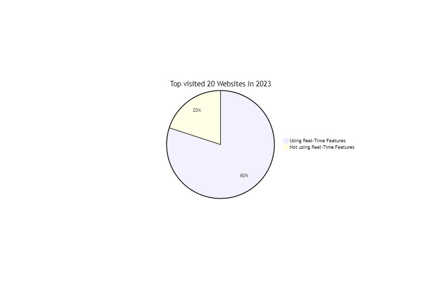

# Chapter 1: General Introduction

**Introduction**

In today's digital age, the demand for real-time web applications has surged, driven not only by the need for instant communication but also by the desire for efficient business processes. This shift is transforming the landscape of web applications, making real-time features such as instant messaging, push notifications, real-time updates, and live chat essential components. Equally important are features that streamline business operations, such as real-time invoice generation, automatic VAT calculations, and background processing, which enhance user experience in business-centric applications.

The advent of high-speed network technology has made cyberspace a hub for communication, information sharing, business transactions, and social relationships. A [survey](http://iisit.org/Vol6/IISITv6p113-126Chou651.pdf) [^1] in Taiwan revealed that the use of instant messaging (IM) has become the third most frequently accessed online activity. Simultaneously, the rise of e-commerce and digital business tools has emphasized the importance of efficient and user-friendly invoicing solutions.

Real-time web applications have found their place in various industries and use cases. For instance, real-time communication has become a staple in many applications, while real-time invoicing solutions are transforming how businesses operate, ensuring they can generate, send, and manage invoices with unparalleled efficiency.

However, the implementation of these features is not without its challenges. Serving multiple users instantly requires robust and efficient systems. Developers need to be well-versed in technologies such as Websockets for real-time communication and modern web frameworks for business applications.

Despite these challenges, the benefits of such applications are undeniable. They have the potential to significantly enhance user experience, improve communication, streamline business operations, and provide instant feedback, making them an essential part of the modern web landscape.

**Some Statistics**

From the top 20 most visited websites in 2023, 16 of them use real-time features. Those websites are:

[...List of Websites...]

These real-time features range from real-time video streaming on YouTube, to instant messaging and notifications on various platforms. Real-time updates are also crucial for e-commerce platforms and business tools.

---

In the following chapters, we will delve deeper into the specifics of real-time web applications and business-centric applications, exploring their features, benefits, challenges, and the technologies that make them possible.

---

[^1]: survey resource: http://iisit.org/Vol6/IISITv6p113-126Chou651.pdf

---

