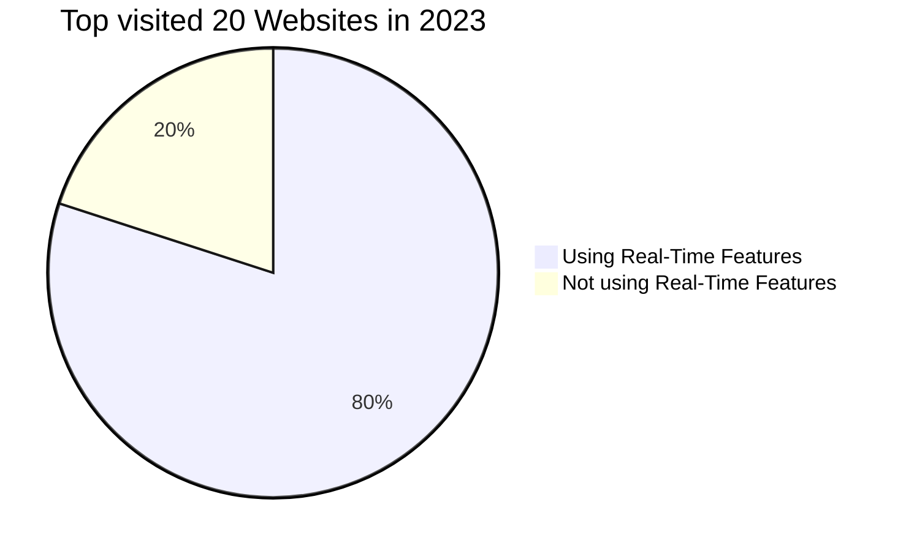

# Chapter 1: Overview

**Introduction**

In the digital age, the demand for real-time web applications has surged, driven by the need for instant communication and constant feedback. This shift is transforming the landscape of web applications, making real-time features such as real-time updates, push notifications, instant messaging, and live chat essential components of modern web applications.

The advent of high-speed network technology has made cyberspace a hub for communication, information sharing, education, business transactions, and social relationships. A [survey](http://iisit.org/Vol6/IISITv6p113-126Chou651.pdf) [^1] in Taiwan revealed that the use of instant messaging (IM) has become the third most frequently accessed online activity, with 66% of online users using at least one type of IM program for communication.

Real-time web applications have found their place in various industries and use cases. For instance, real-time communication has become a staple in many applications, providing users with instant feedback and enhancing their overall experience. In the field of robotics, real-time feedback from explorer robots has proven invaluable, allowing for immediate adjustments and improvements.

However, the implementation of real-time features is not without its challenges. Serving multiple users instantly requires robust and efficient systems. Developers need to be well-versed in technologies such as Websockets and WebRTC, which facilitate real-time communication.

Despite these challenges, the benefits of real-time web applications are undeniable. They have the potential to significantly enhance user experience, improve communication, and provide instant feedback, making them an essential part of the modern web landscape.

**Some Statistics**

From the top 20 most visited websites in 2023, 16 of them use real-time features. Those websites are:

1. youtube.com
2. facebook.com
3. twitter.com
4. instagram.com
5. reddit.com
6. tiktok.com
7. yahoo.com
8. amazon.com
9. vk.com
10. openai.com
11. whatsapp.com
12. live.com
13. linkedin.com
14. microsoft.com
15. office.com
16. discord.com

That's 16 out of the top 20 websites, or 80%. 

These real-time features range from real-time video streaming on YouTube, to instant messaging and notifications on Facebook, Twitter, Instagram, Reddit, TikTok, VK, WhatsApp, LinkedIn, and Discord. Real-time updates are also crucial for e-commerce platforms like Amazon, and for productivity tools like Office.com and Microsoft.com.

---

In the following chapters, we will delve deeper into the specifics of real-time web applications, exploring their features, benefits, challenges, and the technologies that make them possible.

---

[^1]: survey resource: http://iisit.org/Vol6/IISITv6p113-126Chou651.pdf

..
