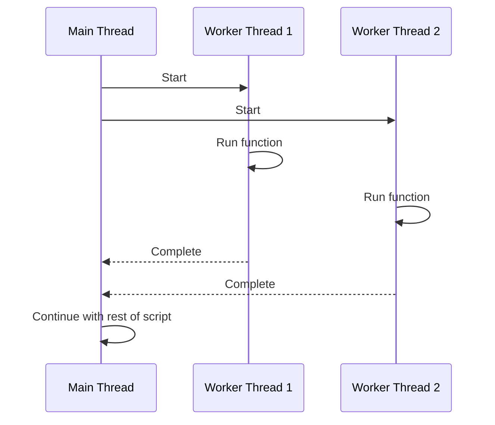

## 2.3 Concurrency in PHP

### How to implement concurrency in PHP?

Concurrency in PHP can be achieved in several ways:


1. **Child Processes**: PHP supports the creation of child processes using the `pcntl_fork()` function. This function creates a new process by duplicating the current process. The child process can then run concurrently with the parent process.

```php
 
<?php
    $pid = pcntl_fork();

    if ($pid == -1) {
         die('could not fork');
    } else if ($pid) {
         // we are the parent
         pcntl_wait($status); //Protect against Zombie children
         echo "Parent: The child process has exited.\n";
    } else {
         // we are the child
         echo "Child: I am the child process.\n";
    }
?>

```

2. **Multi-Threading**: PHP does not natively support multi-threading. However, the PHP extension pthreads provides a convenient and robust way of creating multi-threaded applications in PHP. It allows you to create, read, write, execute, and synchronize threads. The `parallel` extension in PHP provides a simple API for parallel computing, which is the simultaneous execution of multiple calculations or processes. It allows running a PHP code block asynchronously in a separate thread and then fetching the result when available.

The following is a multi-threading in PHP example using the **pthreads** extension

```php

<?php

class WorkerThread extends Thread
{
    private $workerId;

    public function __construct($id)
    {
        $this->workerId = $id;
    }

    public function run()
    {
        echo "Worker $this->workerId running\n";
        // Simulate some work being done
        sleep(2);
        echo "Worker $this->workerId completed\n";
    }
}

// Create two worker threads
$worker1 = new WorkerThread(1);
$worker2 = new WorkerThread(2);

// Start the threads
$worker1->start();
$worker2->start();

// Join the threads
$worker1->join();
$worker2->join();

?>


```



As of PHP 7.4, the **pthreads** extension is no longer maintained and has been superseded by the **parallel** extension for multi-threading in PHP



The following is a multi-threading in PHP example using the **parallel** extension

```php

<?php

// Check if the parallel extension is loaded
if (!extension_loaded('parallel')) {
    exit('The parallel extension is not installed');
}

// Define a simple function that will be run in parallel
$run = function () {
    echo "Hello from thread!\n";
};

// Create two runtime instances
$runtime1 = new \parallel\Runtime();
$runtime2 = new \parallel\Runtime();

// Create two futures
$future1 = $runtime1->run($run);
$future2 = $runtime2->run($run);

// Ensure both futures have completed before continuing
$future1->value();
$future2->value();

echo "All threads have completed.\n";

?>

```



3. **Generators and Coroutines**: PHP 5.5 introduced generators, which allow you to write code that uses `yield` to generate a sequence of values. This can be used to implement simple coroutines, which can be used to manage concurrency.



**definition:** a coroutine is a function which its execution can be paused and resumed

**coroutines** can be synchronous/single threaded or asynchronous/multi-threaded



The following example illustrates single threaded coroutines using the native php generators


```php
<?php

function integers() {
    $i = 0;
    while (true) {
        yield $i++;
    }
}

$generator = integers();

for ($i = 0; $i < 5; $i++) {
    echo $generator->current(), "\n";
    $generator->next();
}

?>
```

The following example illustrates concurrent coroutines using the swoole php extension

```php
<?php

Swoole\Coroutine::create(function () {
    $cid = Swoole\Coroutine::getCid();
    echo "Start coroutine $cid\n";

    Swoole\Coroutine::sleep(1);

    echo "End coroutine $cid\n";
});

Swoole\Coroutine::create(function () {
    $cid = Swoole\Coroutine::getCid();
    echo "Start coroutine $cid\n";

    Swoole\Coroutine::sleep(1);

    echo "End coroutine $cid\n";
});

echo "End of script\n";

?>
```

4. **Asynchronous Programming**: Asynchronous programming allows you to perform long-running tasks, such as I/O operations, without blocking the execution of the rest of your code. Libraries like ReactPHP, Amp, and Swoole provide tools for writing asynchronous code in PHP. Promises and futures are constructs used in concurrent programming to represent the result of a computation that may not have completed yet. Libraries like Guzzle's promises or ReactPHP's promises can be used to manage concurrency in PHP.

example of asynchronous operations using **reactPHP** extension

```php
<?php

require 'vendor/autoload.php';

use React\EventLoop\Factory;
use React\Promise\Timer;
use React\Promise\Coroutine;

$loop = Factory::create();

$asyncFunction = function ($time) use ($loop) {
    return Timer\resolve($time, $loop)->then(function() {
        echo "Hello, world!\n";
    });
};

$coroutine = Coroutine\create($asyncFunction(1.0));

echo "This will be output immediately.\n";

$loop->run();

?>
```

The following is the same example but using the **amphp** extension

```php
<?php

require 'vendor/autoload.php';

use Amp\Loop;
use function Amp\asyncCall;

Loop::run(function () {
    asyncCall(function () {
        // Simulate an async I/O operation with a delay
        yield Amp\delay(1000);
        echo "Hello, world!\n";
    });

    echo "This will be output immediately.\n";
});

?>
```



with you use of coroutines are just functions that can pause/resume their execution.

So technically you can achieve **concurrency in a single thread** using coroutines

Amphp uses this approach as it utilizes a single thread and non-blocking async calls using coroutines



