# Chapter 2: Project Structure

## Invoicing App

**Use-Case Diagram:**

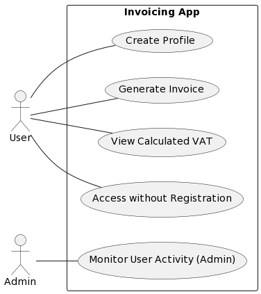

**Class Diagram:**

---
**Screenshots:**

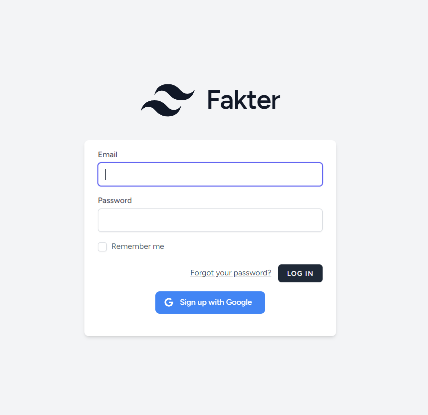
---
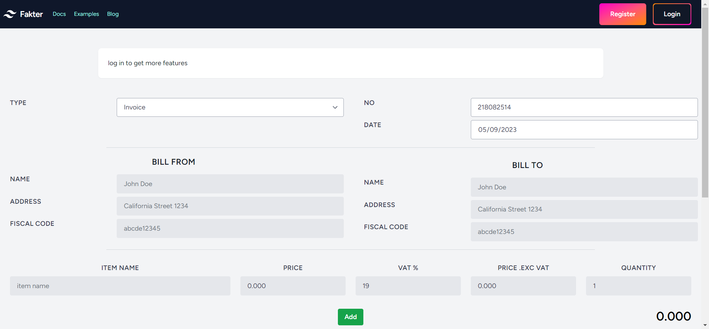
---
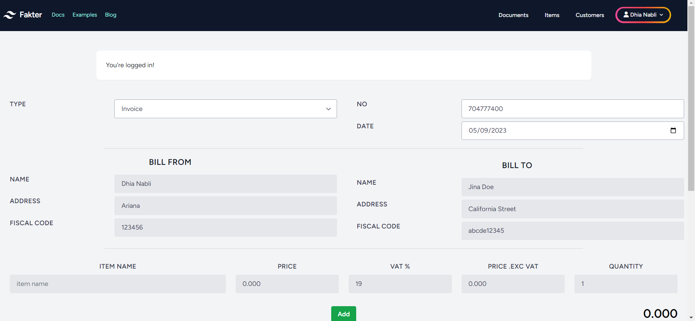
---
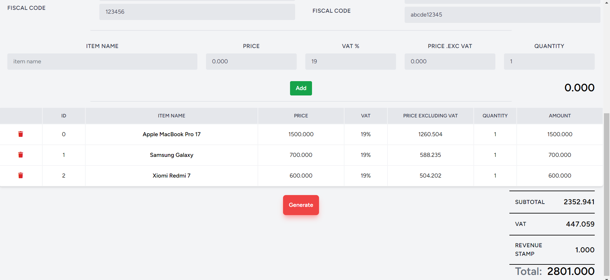
---
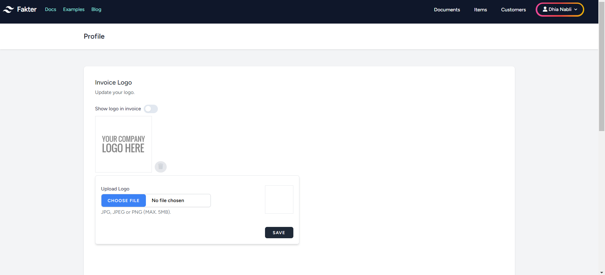
---

---
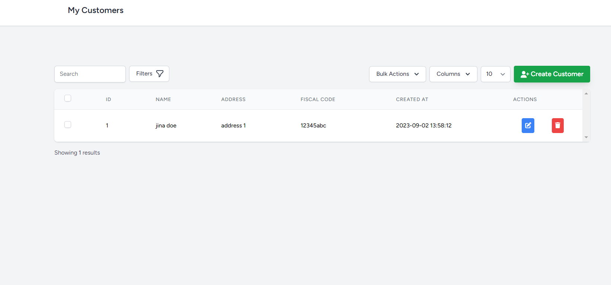
---

---

**Sprint 1 Backlog for the Invoicing App:**

| Priority | User Story | Acceptance Criteria                                                           | Estimated Time |
|----------|------------|-------------------------------------------------------------------------------|----------------|
| 1 | As a user, I want to create a profile so that I can personalize my invoicing experience. | User can sign up, add essential details, and upload a business logo.          | 6 days         |
| 2 | As a user, I want to generate an invoice without any delays. | Invoices are generated in the background, ensuring the UI remains responsive. | 6 days         |
| 3 | As a user, I want to see the calculated VAT automatically. | VAT is automatically calculated based on entered details.                     | 2 days         |

**Total Estimated Time for Sprint 1:** 14 days

---

**Sprint 2 Backlog for the Invoicing App:**

| Priority | User Story | Acceptance Criteria                                                           | Estimated Time |
|----------|------------|-------------------------------------------------------------------------------|----------------|
| 4 | As an admin, I want to monitor user activity. | Admin can log in and view users.                                              | 7 days         |
| 5 | As a user, I want to access the app without mandatory registration. | Users can access basic features without obligatory registration.              | 7 days         |

**Total Estimated Time for Sprint 2:** 14 days

---

## Messaging App:

**Use-Case Diagram:**

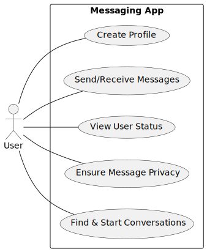

**Class Diagram:**

---

**Screenshots:**

---
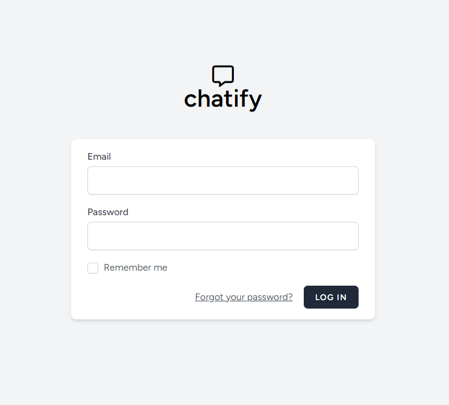
---
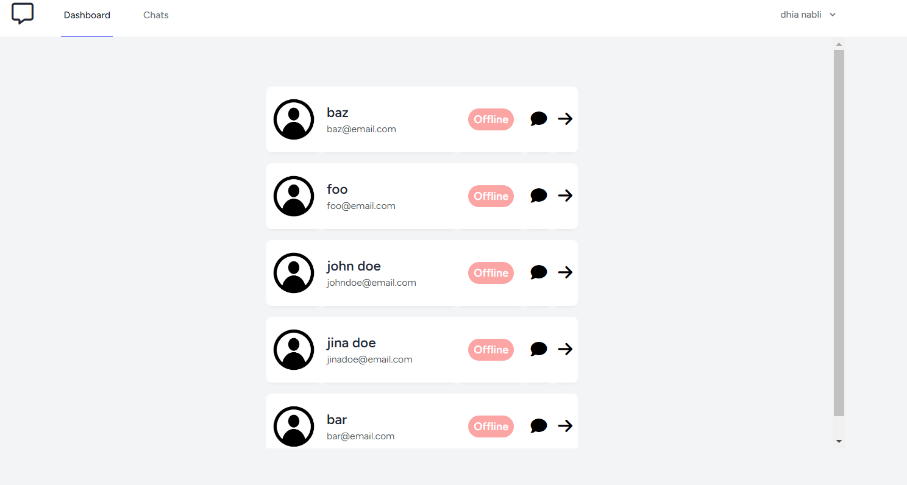
---

---
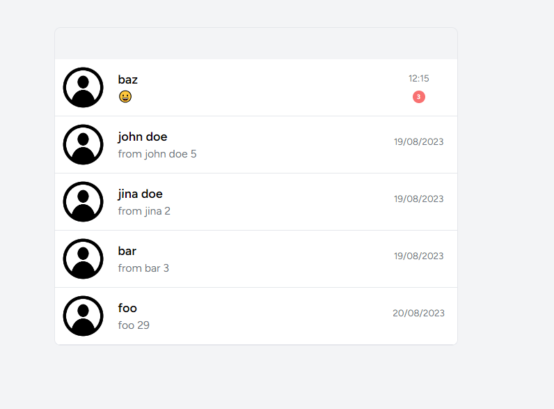
---

---

**Sprint 1 Backlog for the Messaging App:**

| Priority | User Story                                                     | Acceptance Criteria                                                       | Estimated Time |
|----------|----------------------------------------------------------------|---------------------------------------------------------------------------|----------------|
| 1 | As a user, I want to create a profile to start messaging.      | User can sign up and add essential details like name and profile picture. | 6 days         |
| 2 | As a user, I want to send and receive messages in real-time.   | Messages are sent and received instantly using WebSockets.                | 4 days         |
| 3 | As a user, I want to know the online status of my contacts.    | Users can see real-time status (online/offline) of their contacts.        | 4 days         |

**Total Estimated Time for Sprint 1:** 14 days

---

**Sprint 2 Backlog for the Messaging App:**

| Priority | User Story                                                     | Acceptance Criteria                                    | Estimated Time |
|----------|----------------------------------------------------------------|--------------------------------------------------------|----------------|
| 4 | As a user, I want my messages to be private and secure.        | Messaging channels are secure ensuring privacy.        | 10 days        |
| 5 | As a user, I want to find and start conversations with other users. | Users can find other users and initiate conversations. | 4 days         |

**Total Estimated Time for Sprint 2:** 14 days

