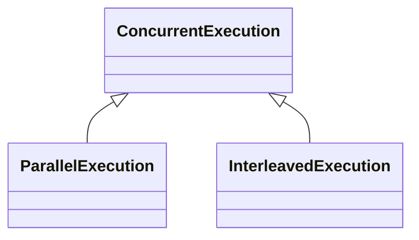
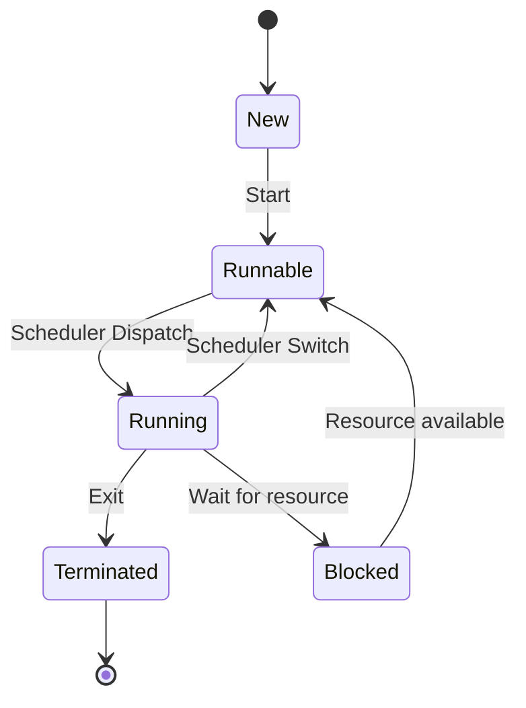

## 3.1 Concurrency

### Definition: 

In programming, concurrency is the ability of <ins>two or more</ins> **instruction sequences** to be run out of order (**asynchronously**).

### Types of concurrency:

Concurrency is an umbrella that covers exactly **two** types of concurrent execution:

1. **parallel** execution
2. **interleaved** execution

The following class diagram illustrates this concept:



#### difference between parallel and interleaved execution

* Two **instruction sequences** are said to be executed in **parallel** at a defined **time interval** if and only if this execution is **simultaneous**, meaning that during that time interval, each **instruction sequence** is assigned to a CPU's <ins>physical</ins> **core** and is being executed.


* Two **instruction sequences** are said to be **"Interleaving-ly"** executed at a defined **time interval** if and only if, at that time interval there is a moment where **not** both **instruction sequences** are assigned to a CPU's <ins>physical</ins>  **core**, instead their execution is **time-sliced**, meaning the execution of one or both call stacks is being **interrupted** and then **resumed** by **dis-allocating** and **reallocating** a CPU's <ins>physical</ins> **core** to that instruction sequence one or more times.   




You will often hear people misusing the term **parallel** and referring to **Interleaved execution** also as parallel and referring to parallel execution as **"truly parallel"** execution.



#### Threads

**definition**: A thread is the **smallest** and **only** unit of a program that can be **executed** **concurrently**



When a thread is created, the operating system allocates several resources that are unique for that specific thread, those resources are the deallocated when the thread is **terminated** :

1. **Thread ID**: Each thread is given a unique identifier by the operating system.

2. **Program Counter**: The program counter is a register that keeps track of the memory address of the instruction currently being executed by the thread.

3. **Registers**: Each thread has its own set of registers, including general-purpose registers and special-purpose registers. These are used to store intermediate data during execution.

4. **Stack**: Each thread has its own stack, which is used for storing local variables and function call information. The stack is crucial for tracking the thread's execution path through nested function calls and for providing a workspace for the thread.

5. **Thread Local Storage (TLS)**: This is a special area of memory that is unique for each thread and can be used to store thread-specific data.

6. **Priority or Scheduling Information**: Each thread may have associated scheduling information, such as priority level, which the operating system's scheduler uses to determine which threads to run and when.

7. **State**: The operating system keeps track of the state of each thread (new, runnable, running, blocked, or terminated).

When a thread starts **running** the OS allocates a:

8. **CPU core** for it in order to be able to run until it is **blocked**



The following is a state diagram that illustrates the life-cycle of a thread (pthread model) in a Linux operating system





A physical CPU **core** is the **smallest** and **only** hardware instance that is able to **run** a **thread**





the sequence of instructions that a thread will execute must be contained inside a function. The thread receives a pointer to that function when its created.







### Fibers

Fibers, also known as lightweight threads or user-level threads, are a tool for concurrent programming where the scheduling is typically managed at the application level, rather than by the operating system. This is in contrast to traditional threads (often called kernel threads), which are scheduled by the operating system.


### Coroutines

**definition**: a coroutine is an instance of suspendable computation. It is conceptually similar to a thread, in the sense that it takes a block of code to run that works concurrently with the rest of the code. However, a coroutine is not bound to any particular thread.



Coroutines are just functions in the main thread that are tagged to be assigned to any other thread in the pool to be executed. It is a way to abstract threads and reduce the complexity of handling them since you don't interact with a thread directly instead you use coroutines from the main thread.

**coroutines are mainly use in asynchronous programming**



### Examples of Coroutines

**a coroutine in javascript (in a javascript runtime)**

```
let promise = new Promise((resolve, reject) => {
    setTimeout(() => resolve("Promise resolved!"), 1000);
});

promise.then((value) => console.log(value));

async function coroutine() {
    let response = await fetch('https://api.github.com/users/octocat');
    let data = await response.json();
    console.log(data);
}

coroutine();
```

**a coroutine in php using the swoole extension**

```
<?php
use Swoole\Coroutine;

Coroutine\run(function () {
    $client = new Swoole\Coroutine\Http\Client('api.github.com', 443, true);
    $client->set(['timeout' => 1]);
    $client->setHeaders([
        'Host' => "api.github.com",
        "User-Agent" => 'Chrome/49.0.2587.3',
        'Accept' => 'application/json',
        'Accept-Encoding' => 'gzip',
    ]);
    $client->get('/users/octocat');

    echo $client->body;
});
?>
```

### Hyper-Threading

Hyper-Threading is a technology developed by Intel that allows a single physical processor core to behave like two logical processors. Essentially, it enables the processor to execute two threads (or sets of instructions) simultaneously, rather than just one.

Here's how it works:

A single processor core is typically equipped with various resources. In a non-hyper-threaded core, all these resources are dedicated to executing a single thread at a time. However, not all instructions use all parts of the processor core at the same time. Some parts of the core might be idle while waiting for other parts to finish their work.

Hyper-Threading takes advantage of this by duplicating certain sections of the processor—those that store architectural state—but not duplicating the main execution resources. This allows a hyper-threading core to appear as two logical cores to the operating system. The OS can schedule two processes at once, and the processor can run instructions from both threads simultaneously.

When one thread is waiting to use a part of the processor that's busy, the other thread can use the idle parts. This can lead to better utilization of the processor's resources, improving overall performance for certain types of workloads.

However, the performance improvement from hyper-threading is not the same as you'd get from adding additional cores, because the two threads are still sharing a single core's resources. The exact performance gain from hyper-threading depends on the workload and how well it can take advantage of the additional parallelism that hyper-threading provides.


### Process

**definition**: a process is an instance of a computer program that is being executed. A process is made up of **at least one** thread. 

Processes provide a way to encapsulate resources and functionality, and they form the basis of modern multitasking, multi-user, and multi-processing systems. They can communicate with each other through various forms of inter-process communication (IPC), such as pipes, signals, sockets, shared memory, and others.

When a program is loaded from a storage device (like a hard drive or SSD) into system memory, a process is created by the operating system. The OS then manages the resources for that process, which can include things like memory allocation, file handles, and security attributes.

### Processes and Threads

Each process has a process ID (PID) and at least one thread. The process's threads share the code, data, and other resources, but each thread has its own instruction sequence, stack, and variables.

The following diagram taken from wikipedia illustrates the interaction between the OS, processes, and threads


[source](https://upload.wikimedia.org/wikipedia/commons/thumb/2/25/Concepts-_Program_vs._Process_vs._Thread.jpg/1280px-Concepts-_Program_vs._Process_vs._Thread.jpg)

### Process Life-Cycle

Here are the typical states in a process life-cycle:

1. **New**: The process is being created. This is the stage where the process is loaded from the secondary memory (like a hard drive) into the main memory.

2. **Ready**: The process is loaded into main memory and is waiting to be executed by the CPU. It's in the queue and ready to run as soon as the CPU becomes available.

3. **Running**: The process is currently being executed. Instructions are being executed by one or more of the CPUs.

4. **Waiting (Blocked)**: The process is in main memory but cannot run due to a dependency, such as waiting for user input or for a file to become available.

5. **Terminated (Completed)**: The process has finished execution and is removed from memory. It's either completed successfully or stopped due to an error.

The following diagram shows the different process states and how each state maps to a different location of the process in terms of memory level   


[source](https://upload.wikimedia.org/wikipedia/commons/thumb/8/83/Process_states.svg/800px-Process_states.svg.png)


### types of processes

Sure, these are specific types of processes in Unix-like operating systems:

1. **Child Process**: A child process is a process that is created by another process, which is known as the parent process. This is typically done through a system call such as `fork()` in Unix-like operating systems. The child process can further create its own child processes, forming a tree of processes.

2. **Orphan Process**: An orphan process is a child process whose parent process has finished or terminated. Though its parent process has ended, the orphan process remains running in the system. In Unix-like operating systems, when a parent process ends, the `init` process automatically becomes the new parent process (PPID becomes 1) for any child processes, which are now called orphan processes. The `init` process periodically checks for orphan processes and reaps (cleans up) them.

3. **Daemon Process**: A daemon process is a background process that is designed to run autonomously, with little or no user intervention. Daemon processes are often used for server processes, listening for incoming requests or performing system tasks. They are usually created by the system, but can also be created by applications. Daemon processes are detached from the terminal and run independently, often waiting for events to occur.

4. **Zombie Process**: A zombie process, or defunct process, is a process that has completed execution but still has an entry in the process table. This is a result of the parent process not having read the completed process's exit status. Essentially, it's a process that is done working but hasn't been properly cleaned up by its parent. The operating system retains the process's exit status in the process table until the parent process reads it. Once the exit status is read via the `wait()` system call, the zombie process is removed from the process table. This is known as reaping the zombie process. If a parent process doesn't read its child's exit status, the zombie process will remain in the process table, taking up system resources.

