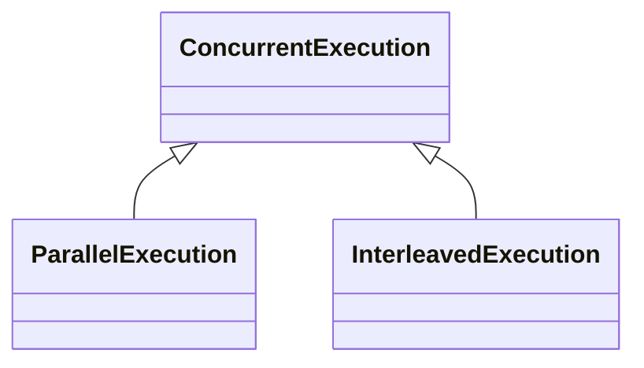

## 2.4 Concurrency

### Definition: 

In programming, concurrency is the ability of <ins>two or more</ins> **call stacks** to be run out of order (**asynchronously**).

### Types of concurrency:

Concurrency is an umbrella that covers exactly **two** types of concurrent execution:

1. **parallel** execution
2. **interleaved** execution

The following class diagram illustrates this concept:

#### difference between parallel and interleaved execution

* Two **call stacks** are said to be executed in **parallel** at a defined **time interval** if and only if this execution is **simultaneous**, meaning that during that time interval, each **call stack** is assigned to a CPU's <ins>physical</ins> **core** and is being executed.

* Two **call stacks** are said to be **"Interleaving-ly"** executed at a defined **time interval** if and only if, at that time interval there is a moment where **not** both call stacks are assigned to a CPU's <ins>physical</ins>  **core**, instead their execution is **time-sliced**, meaning the execution of one or both call stacks is being **interrupted** and then **resumed** by **dis-allocating** and **reallocating** a CPU's <ins>physical</ins> **core** to that call stack one or more times.   



You will often hear people misusing the term **parallel** and referring to **Interleaved execution** also as parallel and referring to parallel execution as **"truly parallel"** execution.



#### Threads

**definition**: A thread is a **call stack** that is running **concurrently**. 



A thread is the **smallest** and **unique** instance of a **concurrently** **running** program

This instance gets allocated to a physical CPU **core**





A physical CPU **core** the **smallest** and **unique** hardware instance that is able to **run** a **call stack**





A **call stack** is the **smallest** program that 





Each **call stack** has an **entry function** in order for it to be able to start executing.





//todo: define process | explain that threads in the same process share memory

//todo: define child, orphan, deamon and zombie process

//talk about hyper threading and fibers



#### 