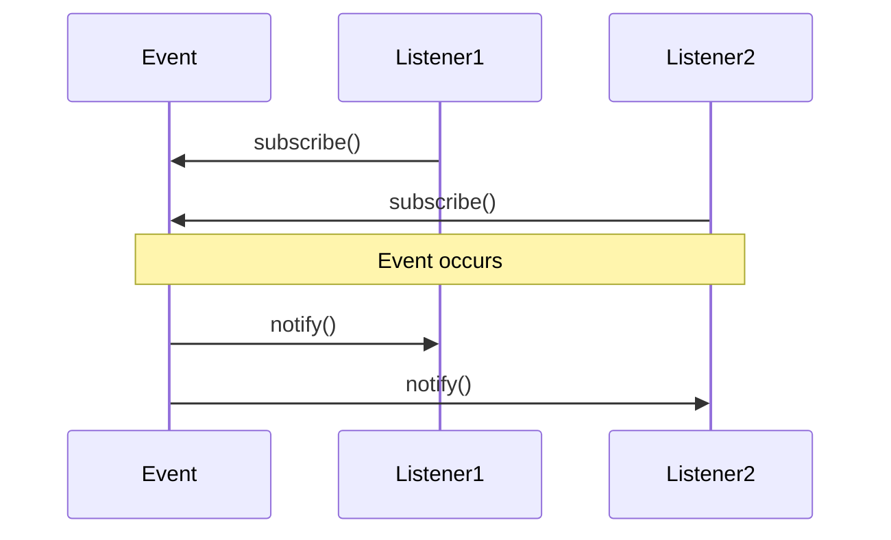
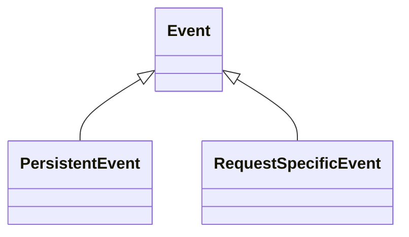

## 5.2 Events

In this section, we will provide an overview of what events are in the context of Laravel and why they are useful. 


1. Events provide a simple implementation of the observer design pattern, allowing you to subscribe and listen for various events in your application.

The following diagram represents how the Observer Pattern typically works:


The following diagram shows how the Observer Pattern is implemented in the context of Laravel terminology:



2. They serve as a great way to decouple various aspects of your application, as the event object can be used to share data between the event listeners.

 
3. They can be used for tasks like sending notifications, firing off jobs to queues, writing to logs and more.


### Understanding Laravel Events
 

1. Events in Laravel can be classified into two main categories: persistent events and request-specific events.



- Persistent events are those that persist between subsequent HTTP requests. A good example of these are job events, which may be processed in the background and not within the lifecycle of a single HTTP request.


- Request-specific events are those that occur within the lifespan of a single HTTP request. They get fired and handled during a single HTTP request and do not persist across multiple requests.

 
2. Event classes are typically stored in the `app/Events` directory.

 
3. Events can be broadcast over websockets to provide real-time updates to your application's users.

 
4. Laravel's event broadcasting allows you to broadcast your server-side Laravel events to your client-side JavaScript application.


### Creating Events

In Laravel we can create an Event using the artisan command `php artisan make:event EventName`.

Like the following example:

```
php artisan make:event OrderShipped
```
 
This would generate an `OrderShipped` Event where we can define data inside it and use it like the following:

```mermaid
namespace App\Events;

use App\Models\Order;
use Illuminate\Foundation\Events\Dispatchable;
use Illuminate\Queue\SerializesModels;

class OrderShipped
{
    use Dispatchable, SerializesModels;

    public $order;

    /**
     * Create a new event instance.
     *
     * @param  Order  $order
     * @return void
     */
    public function __construct(Order $order)
    {
        $this->order = $order;
    }
}
```

To dispatch the created event we can use the `event` helper function like the following:

```
event(new OrderShipped($order));
```

or the `dispatch` method on the Event itself like the following:

```
OrderShipped::dispatch($order);
```

### Event Listeners

An Event Listeners listens to a particular event and performs an action when that event is fired.


To create an Event Listener for an already defined Event we can use the artisan command `php artisan make:listener ListenerName --event=EventName`.

Like the following example:

```
php artisan make:listener SendShipmentNotification --event=OrderShipped
```

This will create a `SendShipmentNotification` class with a `handle` method where we can define how to handle the fired Event.

Like the following:

```
class SendShipmentNotification 
{
    public function handle(OrderShipped $event)
    {
        // Access the order using $event->order...
    }
}
```


### Event Subscribers


Event Subscribers are classes that may subscribe to multiple events from within the class itself.


This can provide a way to keep related listener logic grouped together.


To use an Event Subscriber we need to:


1. Firstly create an event subscriber.
 

2. Secondly register the event subscriber.


Todo: Give examples of when using an event subscriber might be preferable to individual listeners.


### Broadcasting Events


To broadcast events using Laravel, we need to: 


1. Firstly to configure Laravel to use a broadcasting service like Pusher or Laravel Websockets in the `.env` file and the `config/broadcasting.php` file.


2. Secondly to mark an event as "broadcastable" by implementing the `ShouldBroadcast` or `ShouldBroadcastNow` interfaces. Like the following:

```
class OrderShipmentStatusUpdated implements ShouldBroadcastNow
{
    // ...
}
```


This takes us to the next chapter where we talk about websockets and the websocket server.


