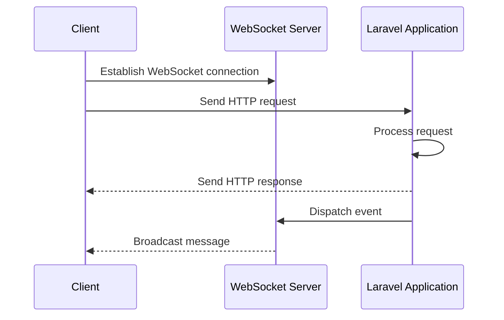
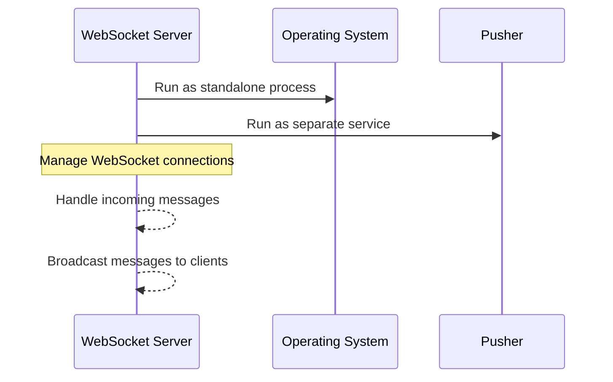
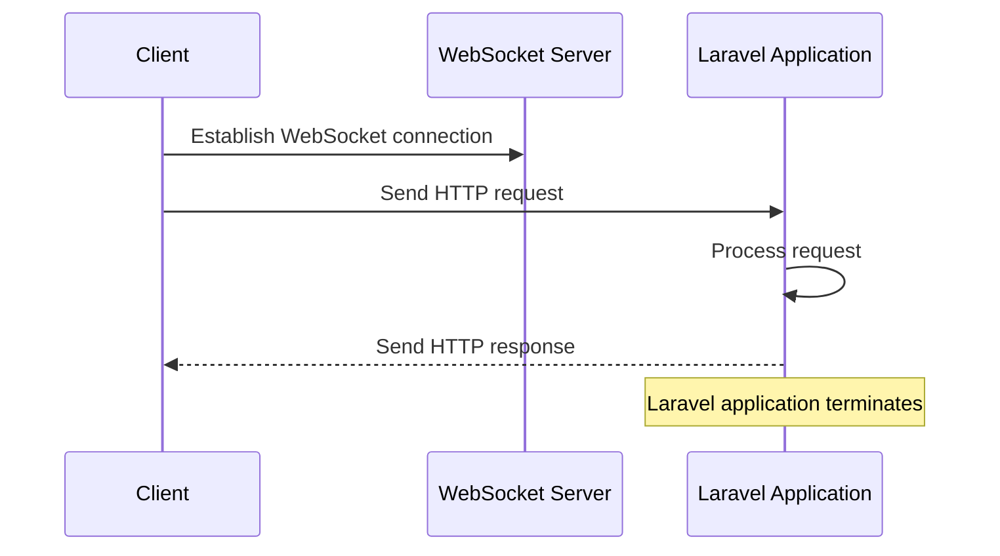
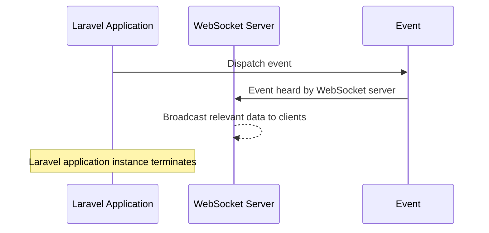
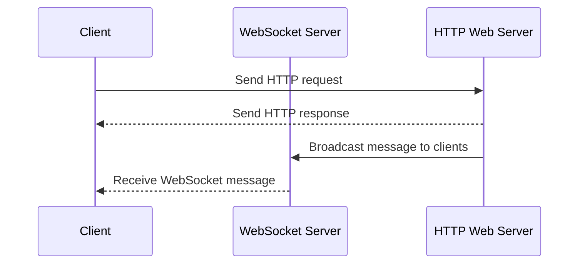
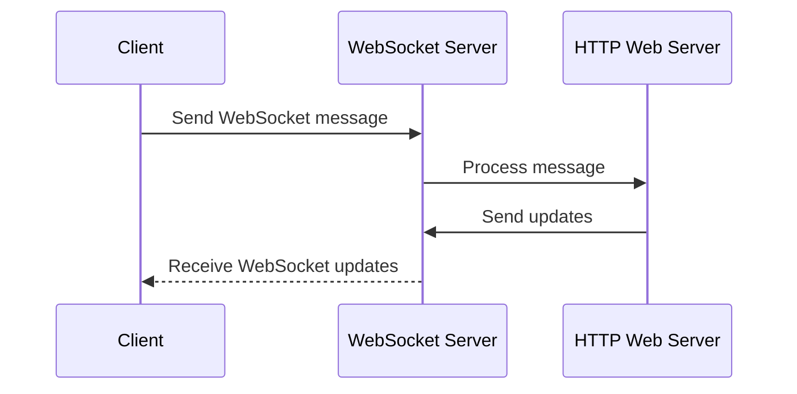

## 6.1 Websocket Server

WebSocket servers provide a powerful tool for building real-time, interactive web applications. While they operate alongside traditional web servers, they serve a distinctly different role and enable new kinds of user experiences.

They do so while maintaining the fundamental principles of server-side web development, like the request-response cycle of HTTP and the short-lived nature of individual application instances.

1. **The Need of WebSocket Servers and Their Role**:

   WebSockets provide a protocol for real-time, bidirectional communication between a client (typically a web browser) and a server. This is in contrast to the HTTP protocol, which is unidirectional - the client sends a request and the server sends back a response. WebSockets, on the other hand, keep the connection open, allowing data to be sent back and forth as needed. This is crucial for applications that require real-time updates, such as chat apps, live sports updates, and collaborative editing tools.

2. **WebSocket Server Process**:

    
   A WebSocket server can either be a standalone process running on the same operating system as the web server (like the Laravel Websockets package) or it could be a separate service running elsewhere (like Pusher). The WebSocket server's role is to manage these long-lived WebSocket connections, handling incoming messages and broadcasting messages to clients.

3. **Laravel Applications and WebSocket Connections**:

   
   While a WebSocket connection between a client and the WebSocket server is long-lived, a Laravel application still adheres to its typical lifecycle: it receives an HTTP request, sends back an HTTP response, and then terminates. The presence of a WebSocket server doesn't change this fundamental aspect of the Laravel application.

4. **Laravel Application Communication with WebSocket Server**:

   
   In a typical scenario, the Laravel application doesn't communicate directly with the WebSocket server, but rather communicates through events. When something happens in a Laravel application that should be broadcast to clients (for example, a new message is added in a chat app), the application dispatches an event. This event is heard by the WebSocket server, which then broadcasts the relevant data to all connected clients. All of this is done while maintaining the short-lived nature of the Laravel application instance.

5. **WebSocket Servers and Clients**:

   In most scenarios, it's the WebSocket server that is actively pushing messages to the clients. The clients typically interact with the server via standard HTTP requests to access and modify resources. For example, in a chat application, a new message is sent to the server via an HTTP request. The server then broadcasts this message to other connected clients using the WebSocket connection.

6. **Clients Sending Messages to WebSocket Server**:

   There are scenarios where the client might also send messages to the WebSocket server. A notable example is Google Docs. As users type and make changes to a document, those changes are sent to the server over the WebSocket connection, allowing other users to see the changes in real time. The server then processes these changes and sends updates to other connected clients.

