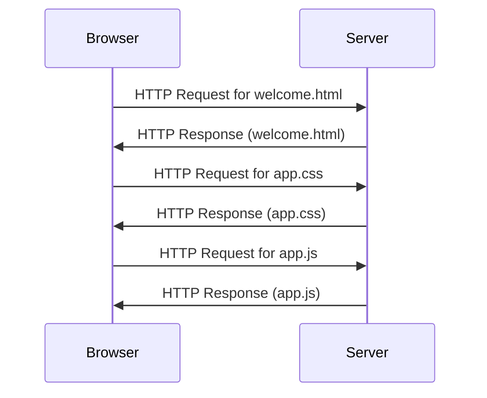

## 2.1: Request-Response Cycle

Web applications work through a series of interactions between the client's **browser** and the application's **server**.

We can abstract a single user interaction as a single **request-response cycle**

Let's study the scenario of the following interaction: a user visits a static web application through the browser.

### Step 1: User Interaction
The user interacts with the web application through a web browser. This could be by entering a URL or clicking on a link

### Step 2: Sending a Request
The browser sends an HTTP request to the server. 


#### 3 common ways of send requests are supported in Laravel

//todo: move this hint to the laravel setion

1. query parameters
2. route parameters (maybe those two are sent in the HTTP header! I have to verify!)
3. forms -> in the HTTP PACKET (not header)



### Step 3: Generating a Response
The server generates an HTTP response. This response typically contains the status code, content type, and the actual content (HTML, JSON, etc.).

### Step 4: Sending the Response
The server sends the HTTP response back to the client's browser.

### Step 5: Rendering the Content
The browser receives the response and renders the content on the screen. If the response contains references to additional resources like images, CSS, or JavaScript files, the browser may send additional requests to fetch them.

### Step 6: User Interaction with the Loaded Page
The user can now interact with the loaded page. Any further interactions will generally follow the same steps.

---

This process is sometimes referred to as the **request-response cycle**. It's the fundamental mechanism that underlies the functioning of web applications.

The following sequence diagram describes the interaction between the browser and the server in case of a user visiting a web application for the first time.

---