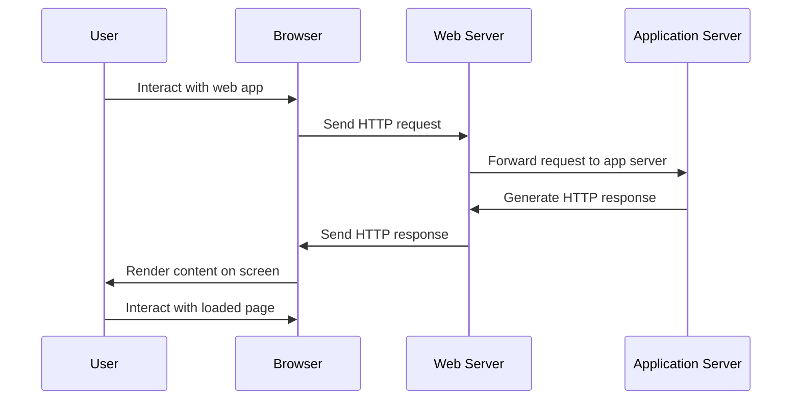

## 2.1 Request-Response Cycle

Web applications work through a series of interactions between the client's **browser** and the application's **server**. Below is a step-by-step description of how a web application works:

We can abstract a single user interaction as a single **request-response cycle**

### Step 1: User Interaction
The user interacts with the web application through a web browser. This could be by entering a URL, clicking on a link, or submitting a form.

### Step 2: Sending a Request
The browser sends an HTTP request to the web server. This request includes the method (GET, POST, etc.), the URL, and any additional data if needed (such as form data).


### 3 common ways of send requests are supported in Laravel

1. query parameters
2. route parameters (maybe those two are sent in the HTTP header! I have to verify!)
3. forms -> in the HTTP PACKET (not header)



### Step 3: Web Server Processing
The web server receives the request and forwards it to the appropriate web application server if necessary. The application server runs the application logic, which may involve querying a database, processing the data, etc.

### Step 4: Generating a Response
The application server generates an HTTP response. This response typically contains the status code, content type, and the actual content (HTML, JSON, etc.).

### Step 5: Sending the Response
The web server sends the HTTP response back to the client's browser.

### Step 6: Rendering the Content
The browser receives the response and renders the content on the screen. If the response contains references to additional resources like images, CSS, or JavaScript files, the browser may send additional requests to fetch them.

### Step 7: User Interaction with the Loaded Page
The user can now interact with the loaded page. Any further interactions that require server processing will generally follow the same steps.

This process is sometimes referred to as the request-response cycle. It's the fundamental mechanism that underlies the functioning of web applications.

---

The following is a sequence diagram that visually represents the interactions between the user, browser, web server, and application server during the request-response cycle of a web application.

---

