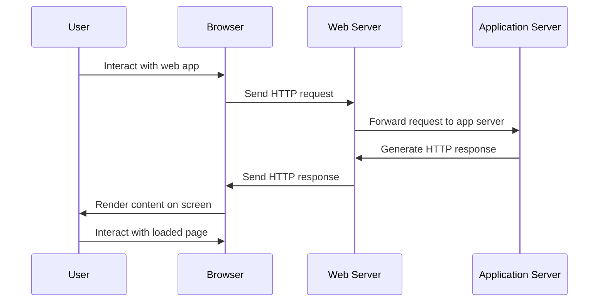

## 2.2 Request-Response Cycle

The following is a sequence diagram that visually represents the interactions between the user, browser, web server, and application server during the request-response cycle of a web application.

---

