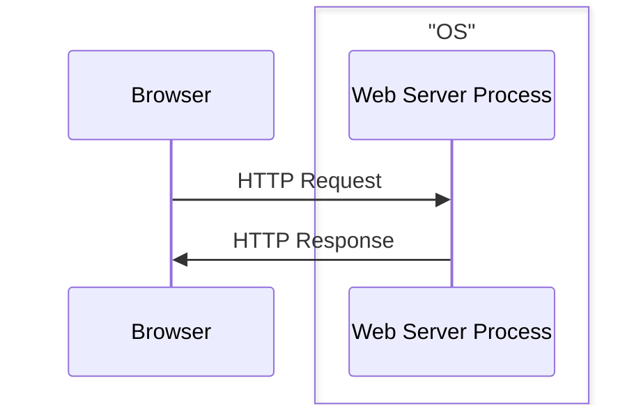
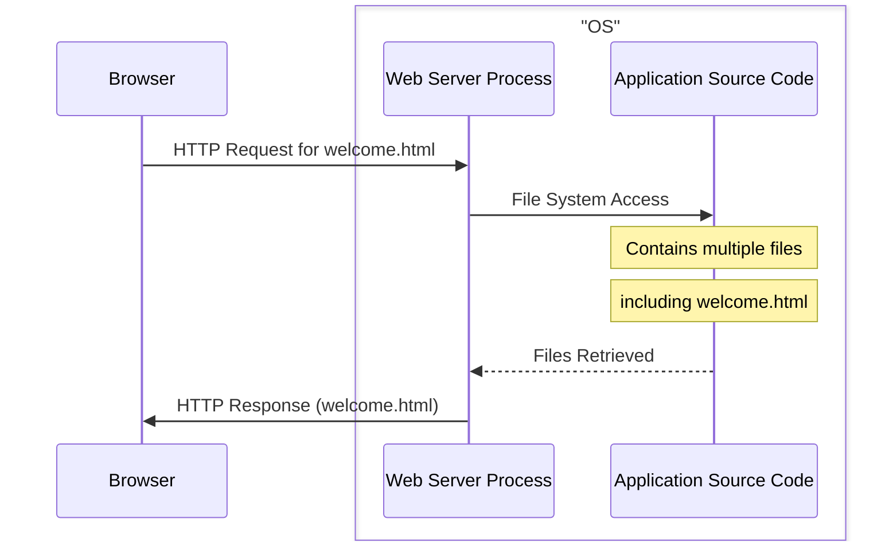
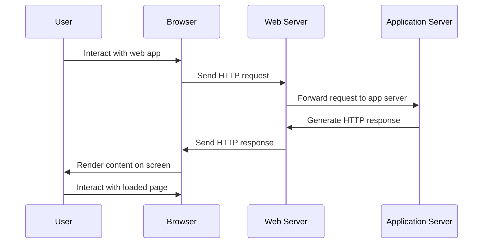

## 2.2 Web Server

Now let's break down what actually happens inside the server. From now on we are going to omit the term server as it is a broad term, and we are going to use more specific terms like: **physical server**, **web server**, **application server** ...

The part that is actually responsible for listening to the incoming HTTP Requests and generating HTTP Responses is the **Web Server**.

A **Web Server** is a computer software that accepts HTTP requests and is able to serve back HTTP responses. So more specifically a **Web Server** is a **Process** that operates on top of an **Operating System**.
The **OS** is installed on a **Physical Server**.

So a **browser** requesting a **web application** is more accurately represented like the following:

---

**A Web Server's Primary Function**: is to handle HTTP requests and responses. It serves **static** content like HTML, CSS, Javascript and images to the client's browser.

So an even more accurate representation of a **browser** requesting a **Web Server** is the following:

---



Web Servers allow you to specify the location of the **Application Source Code** in their configuration. 

Example:

in **Apache HTTP Server** you specify the location using the `DocumentRoot` directive inside the `httpd.conf` file. 

Like the following example: `DocumentRoot /var/www/html`



//todo: now talk about the execution of scripts through script execution modules in the case of dynamic content -> mod_php, mod_python, mod_JServ

The following is a sequence diagram that visually represents the interactions between the user, browser, web server, and application server during the request-response cycle of a web application.

---

