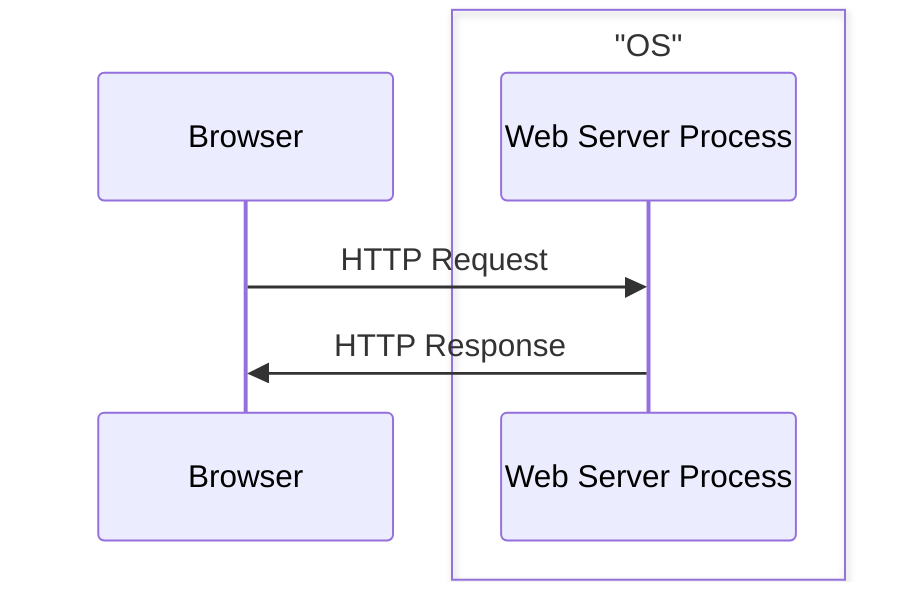
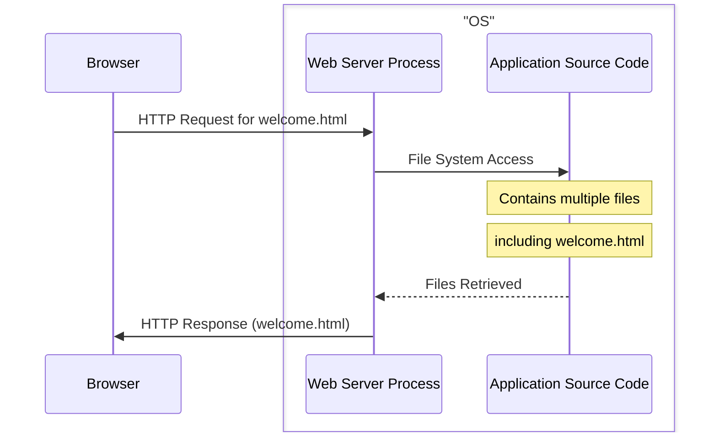
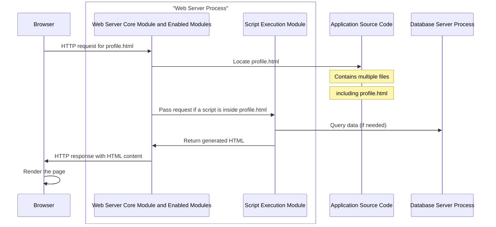
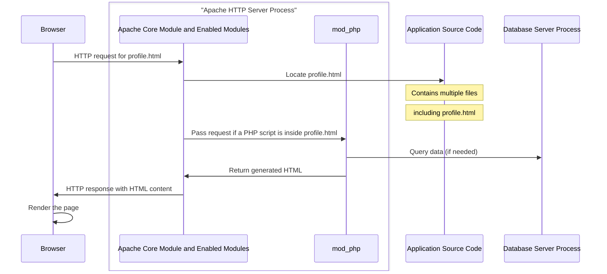

## 2.2 Web Server

Now let's break down what actually happens inside the server. From now on we are going to omit the term server as it is a broad term, and we are going to use more specific terms like: **physical server**, **web server**, **application server** ...

The part that is actually responsible for listening to the incoming HTTP Requests and generating HTTP Responses is the **Web Server**.

A **Web Server** is a computer software that accepts HTTP requests and is able to serve back HTTP responses. So more specifically a **Web Server** is a **Process** that operates on top of an **Operating System**.
The **OS** is installed on a **Physical Server**.

So a **browser** requesting a **web application** is more accurately represented like the following:

---

**A Web Server's Primary Function**: is to handle HTTP requests and responses. It serves **static** content like HTML, CSS, Javascript and images to the client's browser.

So an even more accurate representation of a **browser** requesting a **Web Server** is the following:

---



Web Servers allow you to specify the location of the **Application Source Code** in their configuration. 

Example:

in **Apache HTTP Server** you specify the location using the `DocumentRoot` directive inside the `httpd.conf` file. 

Like the following example: `DocumentRoot /var/www/html`

It's important to note that Web Servers like Apache require appropriate file system permissions to access the files it serves.





### Web Server Modules

Web Server **modules** are extensions that add functionality to the Web Server. They allow you to customize and extend the capabilities of the server without modifying the core code.





Apache HTTP Server has a modular architecture, which means that features are separated into individual modules that can be loaded or unloaded as needed. This makes Apache highly flexible and adaptable to various use cases.

Apache modules can be classified as the following: **Core Modules**, **Shared Modules**, **MPMs (Multi-Processing Modules)**, **Handler Modules**, **Filter Modules**, **Security Modules**, **Rewrite and Alias Modules**, **Proxy Modules**, **Logging and Monitoring Modules**, **Authentication and Authorization Modules**.

To enable or disable modules, you can use the `a2enmod` and `a2dismod` commands (on Debian-based systems) or edit the Apache configuration files directly.



### MPM Multi-Processing Module

A web application must be able to handle multiple requests simultaneously. Therefore, Apache HTTP Server version 2.0 introduced the **MPM (Multi-Processing Module)**

Prior to Apache 2.0, the Apache server used a single process model called the `mpm_prefork` module.

#### MPMs

There are different MPMs available in Apache, each implementing different strategies for managing concurrency. Some commonly used MPMs include:

**Prefork MPM**: This MPM follows a non-threaded approach and creates multiple worker processes, each capable of handling a single connection at a time. It provides excellent stability and isolation between processes but can consume more memory due to the overhead of separate processes.

**Worker MPM**: The Worker MPM is a hybrid model that combines processes and threads. It creates multiple worker processes, each containing multiple threads. Each thread handles an individual connection, allowing for higher concurrency and reduced memory usage compared to the Prefork MPM.

**Event MPM**: The Event MPM is similar to the Worker MPM but introduces a more efficient event-driven architecture. It utilizes a small number of threads to handle a large number of connections, using event notifications to efficiently manage concurrency and reduce resource usage.



For Apache 2.2 and earlier versions, the default MPM is **mpm_prefork**.

Starting from Apache 2.4, the default MPM is **mpm_event**.



### Dynamic Content

More than often we need our web application to provide content based on the specific user's provided data.

It is impossible to store all possible combinations of all the possible users that may interact with our application as static content since this would result in an infinite amount of static files.

To solve this problem we need to **generate** the file (for example a html page) based on data that the user provided. If this data changes the generated content will change accordingly and hence the name **dynamic content** as opposed to **static content** that never changes.

To perform the **generation** of a **dynamic content** a **script** needs to be executed. This **script** specifies how this content is going to be generated.

As said before the **primary function** of a **Web Server** is to serve **static** assets. But **Web Servers**' functionality can be extended through the use of **modules**.



**Handler Modules**: These modules handle specific types of content. For example, **mod_php** handles **PHP scripts**, `mod_cgi` handles CGI scripts, and `mod_dav` handles `WebDAV` publishing.





**mod_php**: is a module for the Apache HTTP server that enables the server to process PHP scripts. It is one of the ways to run PHP scripts on a web server.





Other than **mod_php** there is also:

**mod_python**: is an Apache HTTP Server module that allows the execution of Python code within the Apache web server process. The **mod_python** is deprecated and now replaced with **mod_wsgi**

**mod_jserv**: also known as Apache JServ Protocol (AJP), is an Apache module designed to enable communication between the Apache HTTP Server and Java applications running in a separate Java Virtual Machine (JVM). However, **mod_jserv** is an older technology and has been largely replaced by the Apache Tomcat Connector (mod_jk) and the Apache Tomcat Native Connector (mod_proxy_ajp) for integrating Apache with Java applications



----

The following diagram shows how a Web Server uses a **script execution module** to generate a **dynamic** profile web page.

---

The following diagram describes the same interaction with Apache HTTP Server as a Web Server, PHP as the script language and mod_php as the Script Execution Module.

---

### Aftermath

The approach of using a **Script Execution Module** has its **Pros** and **Cons**. Let us analyse them in the case of **Apache HTTP Server** and **mod_php**.

#### Pros:

* **Ease Of Integration**: mod_php integrates tightly with Apache. Once enabled, PHP scripts can be executed without additional setup, making it convenient for developers.

* **Performance**: mod_php is highly optimized for performance because it runs PHP code directly within the Apache server process. This eliminates the need for launching separate PHP processes for each request, resulting in faster execution compared to CGI or FastCGI approaches.

#### Cons:

* **Limited scalability**: mod_php is not ideal for high-traffic websites or applications with a heavy load. As each Apache worker process handles both serving static files and executing PHP scripts, scaling PHP applications may require scaling the entire Apache server, which can be resource-intensive.

* **Lack of process isolation**: Since mod_php runs PHP code within the Apache process, there is no strict process isolation. If a PHP script crashes or consumes excessive resources, it can affect the stability and performance of the entire server.

* **Security risks**: Running PHP within the Apache process raises potential security concerns. If a PHP script has a vulnerability, it could potentially affect the entire server and compromise its security. Careful consideration and security measures are necessary to mitigate these risks.
