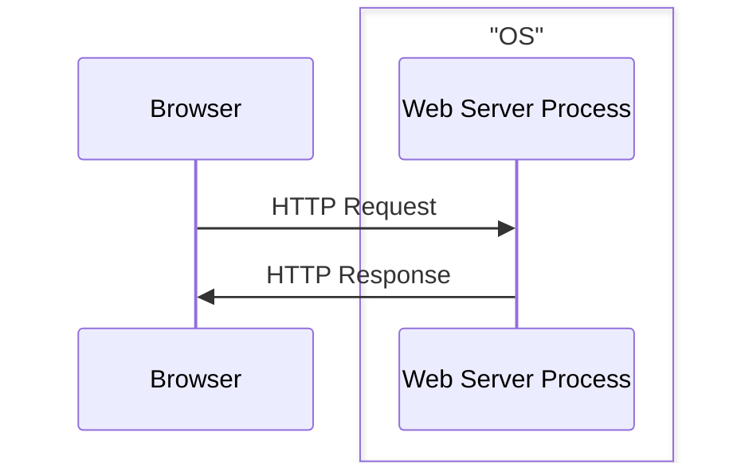
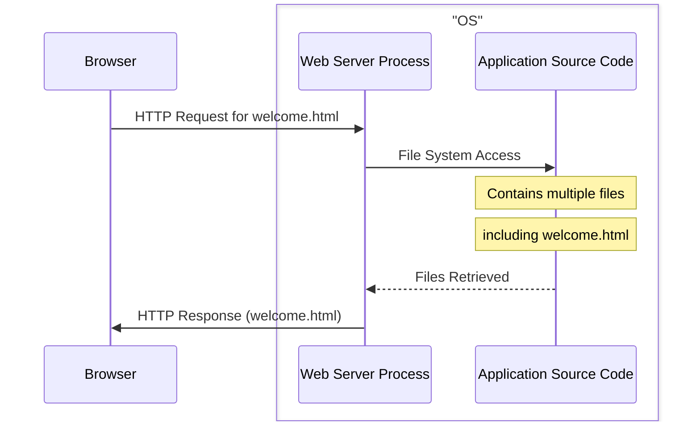
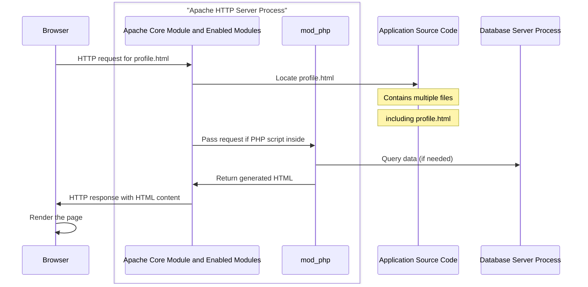
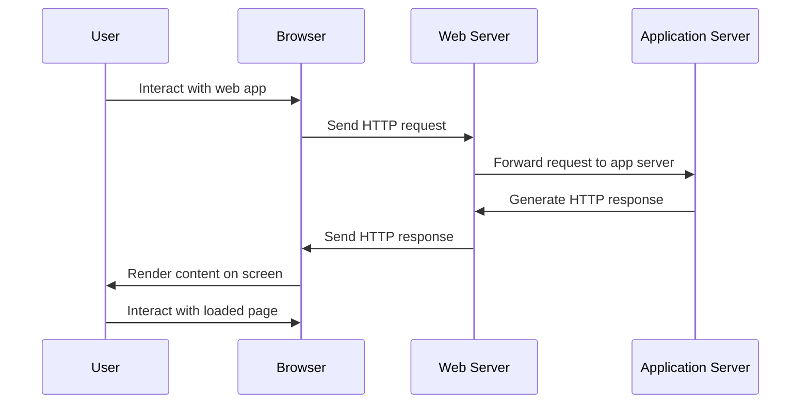

## 2.2 Web Server

Now let's break down what actually happens inside the server. From now on we are going to omit the term server as it is a broad term, and we are going to use more specific terms like: **physical server**, **web server**, **application server** ...

The part that is actually responsible for listening to the incoming HTTP Requests and generating HTTP Responses is the **Web Server**.

A **Web Server** is a computer software that accepts HTTP requests and is able to serve back HTTP responses. So more specifically a **Web Server** is a **Process** that operates on top of an **Operating System**.
The **OS** is installed on a **Physical Server**.

So a **browser** requesting a **web application** is more accurately represented like the following:

---

**A Web Server's Primary Function**: is to handle HTTP requests and responses. It serves **static** content like HTML, CSS, Javascript and images to the client's browser.

So an even more accurate representation of a **browser** requesting a **Web Server** is the following:

---



Web Servers allow you to specify the location of the **Application Source Code** in their configuration. 

Example:

in **Apache HTTP Server** you specify the location using the `DocumentRoot` directive inside the `httpd.conf` file. 

Like the following example: `DocumentRoot /var/www/html`

It's important to note that Web Servers like Apache require appropriate file system permissions to access the files it serves.



### Dynamic Content

//todo: now talk about the execution of scripts through script execution modules in the case of dynamic content -> mod_php, mod_python, mod_JServ

More than often we need our web application to provide content based on the specific user's provided data.

It is impossible to store all possible combinations of all the possible users that may interact with our application as static content since this would result in an infinite amount of static files.

To solve this problem we need to **generate** the file (for example a html page) based on data that the user provided. If this data changes the generated content will change accordingly and hence the name **dynamic content** as opposed to **static content** that never changes.

To perform the **generation** of a **dynamic content** a **script** needs to be executed. This **script** specifies how this content is going to be generated.

As said before the **primary function** of a **Web Server** is to serve **static** assets. But **Web Servers**' functionality can be extended through the use of **modules**.



Web Server **modules** are extensions that add functionality to the Web Server. They allow you to customize and extend the capabilities of the server without modifying the core code.





Apache HTTP Server has a modular architecture, which means that features are separated into individual modules that can be loaded or unloaded as needed. This makes Apache highly flexible and adaptable to various use cases.

Apache modules can be classified as the following: **Core Modules**, **Shared Modules**, **MPMs (Multi-Processing Modules)**, **Handler Modules**, **Filter Modules**, **Security Modules**, **Rewrite and Alias Modules**, **Proxy Modules**, **Logging and Monitoring Modules**, **Authentication and Authorization Modules**.

To enable or disable modules, you can use the `a2enmod` and `a2dismod` commands (on Debian-based systems) or edit the Apache configuration files directly.





**Handler Modules**: These modules handle specific types of content. For example, **mod_php** handles **PHP scripts**, `mod_cgi` handles CGI scripts, and `mod_dav` handles `WebDAV` publishing.





**mod_php**: is a module for the Apache HTTP server that enables the server to process PHP scripts. It is one of the ways to run PHP scripts on a web server.



---

---
The following is a sequence diagram that visually represents the interactions between the user, browser, web server, and application server during the request-response cycle of a web application.

---

