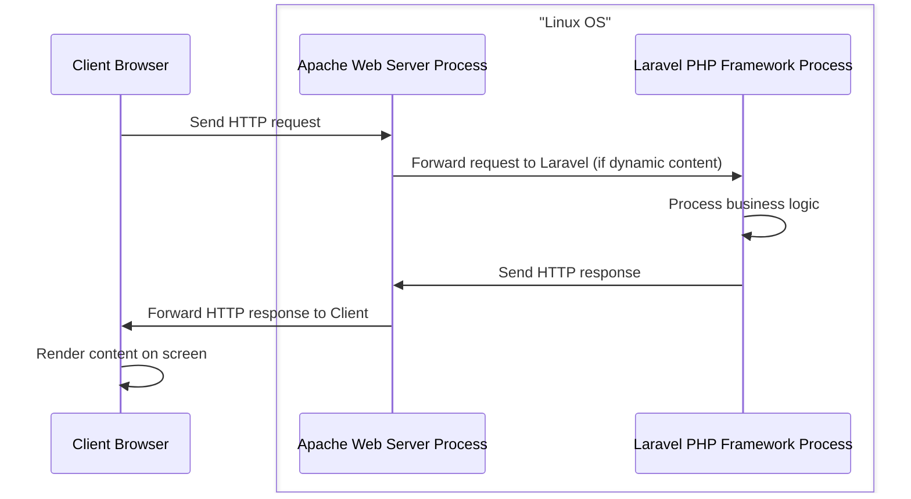

## 2.3 Apache as a Web Server and Laravel as an Application Server

Let's study a concrete real-life common scenario where, in a production environment, we have Apache as a Web Server and Laravel as an Application Server. Both operating on top of a Linux operating system.

### Web Server Process: Apache

- **Role**: Apache acts as the Web Server in this setup. Its primary role is to handle HTTP requests from clients (browsers) and serve static content such as images, CSS, and JavaScript files.

- **Functionality**: Apache listens for incoming HTTP requests on a specific port (usually port 80 for HTTP and 443 for HTTPS). When a request is received, Apache processes the request and sends the appropriate response back to the client.

- **Configuration**: Apache can be configured to act as a reverse proxy, forwarding requests to the Laravel application for processing.

### Application Server Process: Laravel PHP Framework

- **Role**: Laravel acts as the Application Server. It is responsible for executing the business logic of the web application, such as processing form data, interacting with databases, and generating dynamic content.

- **Functionality**: When Apache forwards a request to Laravel, Laravel processes the request by running the appropriate PHP scripts. It may interact with a database, perform calculations, or carry out other business logic.

- **Response Generation**: After processing, Laravel generates an HTTP response, usually in the form of HTML or JSON, and sends it back to Apache, which in turn sends it to the client's browser.



**Communication**: Apache and PHP (Laravel) communicate through a mechanism such as CGI, FastCGI, or mod_php. This allows Apache to pass requests to PHP and receive responses.



---
The following is a sequence diagram that visually represents the interactions between the client's browser, Apache Web Server process, and Laravel PHP Framework process



Please keep in mind that the above scenario represents the typical use-case. All the Processes including the browser can operate on the same OS (in the case of a local environment) or each Processes can operate on a different OS (in the case of a distributed system)



---