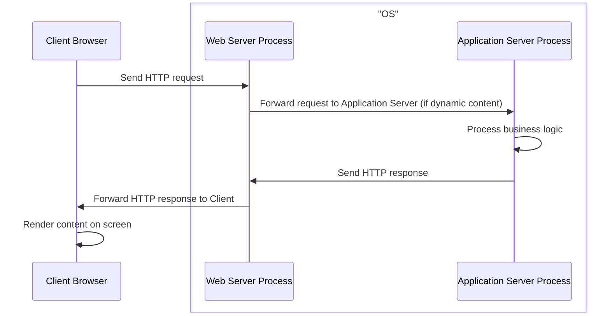
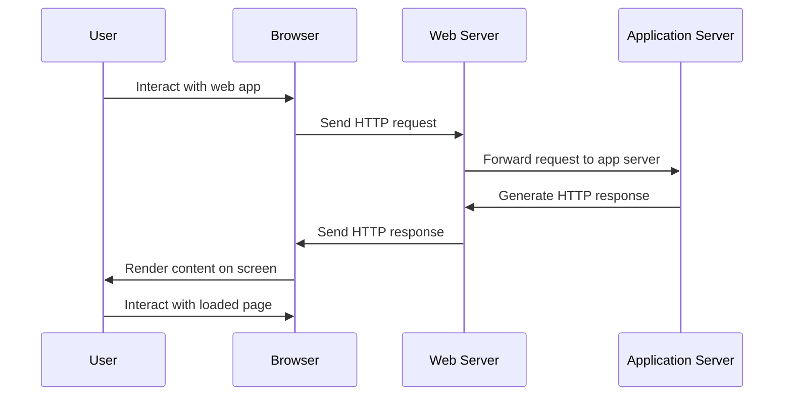

## 2.3 Web Server vs Application Server

Web Server and Application Server are both components used in web applications, they work in conjunction but serve different purposes. Let's compare them:

### Web Server

- **Primary Function**: A Web Server is primarily responsible for handling HTTP requests and responses. It serves static content like HTML, CSS, Javascript and images to the client's browser.

- **Processing**: Web Servers do not execute any business logic. They mainly deal with the delivery of web pages to the client's browser.

- **Examples**: Apache HTTP Server, Nginx, Microsoft Internet Information Services (IIS).

- **Scalability**: Web Servers are generally more scalable and are used to handle the high volume of traffic.

- **Communication**: 
  - Web Servers communicate directly with the client's browser
  - and can also act as a reverse proxy server for Application Servers.

 
  * Different Application Servers can run behind a Web Server. 
  * Each Application Server will be mapped to a different port. 
  * Most Web Servers by default listen on the default HTTP port 80 or HTTPS port 443.

    
### Application Server

- **Primary Function**: An Application Server is designed to run web applications and execute business logic of the web application, such as processing form data, interacting with databases, and generating dynamic content.

- **Functionality**: When the Web Server forwards a request to the Application Server, the Application Server processes the request by running the appropriate scripts. It may interact with a database, perform calculations, or carry out other business logic.

- **Response Generation**: After processing, an Application Server generates an HTTP response, usually in the form of HTML or JSON, and sends it back to the Web Server, which in turn sends it to the client's browser.

- **Examples**: Laravel PHP Framework, Apache Tomcat, WildFly, IBM WebSphere, Microsoft ASP.NET.

- **Scalability**: Application Servers are generally less scalable compared to web servers and are used for more resource-intensive operations.



Both Web Servers and Application Servers are typically two different processes that operate independently on top of a Physical Server's operating system



---
The following is a sequence diagram that visually represents the interactions between the client's browser, Web Server process, and Application Server process



Please keep in mind that the above scenario represents the typical use-case. All the Processes including the browser can operate on the same OS (in the case of a local environment) or each Processes can operate on a different OS (in the case of a distributed system)



---

The following is a sequence diagram that visually represents the interactions between the user, browser, web server, and application server during the request-response cycle of a web application.

---