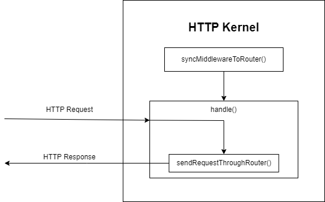

## 8.1 The Scaffolding of a Laravel App

### index.php

The following is the code of the Laravel 10.x **index.php** file.

```text

<?php

use Illuminate\Contracts\Http\Kernel;
use Illuminate\Http\Request;

define('LARAVEL_START', microtime(true));

/*
|--------------------------------------------------------------------------
| Check If The Application Is Under Maintenance
|--------------------------------------------------------------------------
|
| If the application is in maintenance / demo mode via the "down" command
| we will load this file so that any pre-rendered content can be shown
| instead of starting the framework, which could cause an exception.
|
*/

if (file_exists($maintenance = __DIR__.'/../storage/framework/maintenance.php')) {
    require $maintenance;
}

/*
|--------------------------------------------------------------------------
| Register The Auto Loader
|--------------------------------------------------------------------------
|
| Composer provides a convenient, automatically generated class loader for
| this application. We just need to utilize it! We'll simply require it
| into the script here so we don't need to manually load our classes.
|
*/

require __DIR__.'/../vendor/autoload.php';

/*
|--------------------------------------------------------------------------
| Run The Application
|--------------------------------------------------------------------------
|
| Once we have the application, we can handle the incoming request using
| the application's HTTP kernel. Then, we will send the response back
| to this client's browser, allowing them to enjoy our application.
|
*/

$app = require_once __DIR__.'/../bootstrap/app.php';

$kernel = $app->make(Kernel::class);

$response = $kernel->handle(
    $request = Request::capture()
)->send();

$kernel->terminate($request, $response);

```

### Analysing the index.php code:

Even if the comments weren't there, the Laravel's index.php file code is straightforward well written.

The banner comments make it even more understandable.



First observation: the length of each comment line in each comment block is **3 characters less** than its preceding comment line.



The following is a sequence diagram that describes the interaction between the client, the web server, and Laravel's `index.php`:


In this diagram:

1. The client sends an HTTP request to the web server.
2. The web server passes the HTTP request to `index.php`.
3. `index.php` performs the following steps:
    - Define LARAVEL_START
    - Check If The Application Is Under Maintenance
    - Register The Auto Loader
    - Run The Application
    - Sends an HTTP response back to the web server
    - Terminate The Application
4. The web server sends the HTTP response back to the client.

Let's break down the steps that `index.php` performs and see which section of the `index.php` code is responsible for which step:

1 Define LARAVEL_START

```
define('LARAVEL_START', microtime(true));
```

2 Check If The Application Is Under Maintenance

```
if (file_exists($maintenance = __DIR__.'/../storage/framework/maintenance.php')) {
    require $maintenance;
}
```
 
3 Register The Auto Loader

```
require __DIR__.'/../vendor/autoload.php';
```
 
4 Run The Application

```
$app = require_once __DIR__.'/../bootstrap/app.php';

$kernel = $app->make(Kernel::class);
```
 
5 Sends an HTTP response back to the web server

```
$response = $kernel->handle(
    $request = Request::capture()
)->send();
```
 
6 Terminate The Application

```
$kernel->terminate($request, $response);
```

### Explaining the index.php code sections

1. **Define LARAVEL_START**: This line sets a constant that holds the timestamp of when the script started. This can be used for profiling and debugging.
2. **Check If The Application Is Under Maintenance**: Laravel provides a maintenance mode that can be activated with the `php artisan down` command. When in maintenance mode, Laravel will display a custom view to all requests into your application. This can be used when you are updating your server or installing a new feature and you don't want users to see errors or experience downtime.
3. **Register The Auto Loader**: This part of the script loads Composer's autoloader. Composer is a tool for dependency management in PHP, and its autoloader automatically loads PHP classes when they're needed, so you don't have to manually include them.
4. **Run The Application**: This section does the actual work of handling the incoming HTTP request and sending a response.


- It starts by **bootstrapping the Laravel application**, which involves setting up error handling, configuring logging, loading configuration files, and more. 

```
$app = require_once __DIR__.'/../bootstrap/app.php';
```

- Then it creates an instance of Laravel's **HTTP kernel**, which is responsible for handling the request. The kernel handles the request and returns a response, which is then sent back to the client.

```
$kernel = $app->make(Kernel::class);
```

5 **Terminate The Application**: After the response has been sent to the client, the script calls the kernel's `terminate` method. This method is used to perform any final tasks after the response has been sent, such as committing database transactions or writing to log files.


### The HTTP Kernel

Ok, now let's try to reason backwards and try to understand the following lines of code:

```
$response = $kernel->handle(
    $request = Request::capture()
)->send();

$kernel->terminate($request, $response);
```

the Laravel's HTTP kernel is primarily responsible for handling incoming HTTP requests to the application. It is the central component that manages the request lifecycle in a Laravel application.

To understand how the Laravel HTTP kernel works, we need to firstly start by analysing the code that `index.php` is **using**, namely, `Illuminate\Contracts\Http\Kernel`.

### Analysing the `Illuminate\Contracts\Http\Kernel`:

The following is the code of the `Kernel.php` file which is namespaced as `Illuminate\Contracts\Http\Kernel`:

```
<?php

namespace Illuminate\Contracts\Http;

interface Kernel
{
    /**
     * Bootstrap the application for HTTP requests.
     *
     * @return void
     */
    public function bootstrap();

    /**
     * Handle an incoming HTTP request.
     *
     * @param  \Symfony\Component\HttpFoundation\Request  $request
     * @return \Symfony\Component\HttpFoundation\Response
     */
    public function handle($request);

    /**
     * Perform any final actions for the request lifecycle.
     *
     * @param  \Symfony\Component\HttpFoundation\Request  $request
     * @param  \Symfony\Component\HttpFoundation\Response  $response
     * @return void
     */
    public function terminate($request, $response);

    /**
     * Get the Laravel application instance.
     *
     * @return \Illuminate\Contracts\Foundation\Application
     */
    public function getApplication();
}
```


This code is the interface for the HTTP Kernel in Laravel. 

An interface in PHP is a contract or a blueprint for a class. 

It defines a set of methods that the class must implement. In this case, any class that implements the `Illuminate\Contracts\Http\Kernel` interface must define the methods `bootstrap()`, `handle()`, `terminate()`, and `getApplication()`.

Here's what each method is intended to do:

1. **`bootstrap()`**: This method is responsible for bootstrapping the application for HTTP requests. It doesn't take any parameters and doesn't return anything (`void`).
2. **`handle($request)`**: This method is responsible for handling an incoming HTTP request. It takes a `Symfony\Component\HttpFoundation\Request` object as a parameter and returns a `Symfony\Component\HttpFoundation\Response` object.
3. **`terminate($request, $response)`**: This method is responsible for performing any final actions for the request lifecycle. It takes a `Symfony\Component\HttpFoundation\Request` object and a `Symfony\Component\HttpFoundation\Response` object as parameters and doesn't return anything (`void`).
4. **`getApplication()`**: This method is responsible for getting the Laravel application instance. It doesn't take any parameters and returns an `Illuminate\Contracts\Foundation\Application` object.


### The <span style="color: red;">question</span> that begs itself:

How does the following line of code works?:

```
$kernel = $app->make(Kernel::class);
```

How is the `$app->make();` method able to instantiate the `Kernel` Interface using just its namespace as a string `Kernel::class`? 

In PHP, you can't instantiate an interface. In order to instantiate an Interface you need to create a non-abstract class that implements that interface.


### Short answer:

<div style="display:flex; align-items:center; justify-content:center; border:5px solid black;">
    <h1 style="color:red; margin-top: 0px;">Laravel Service Container</h1>
</div>

**Definition:** The **Laravel Service Container**, also known as the **IoC (Inversion of Control)** container, is a powerful **tool** that has a variety of **key features** that help managing a Laravel application.

The service container is essentially a <span style="color: red;">**box of objects (services)**</span> that the application needs to function. These services can be anything from database connections to mailer classes or custom-written services for your application. The container allows you to <span style="color: red; font-weight: bold">bind</span> these services into it, and then <span style="color: red; font-weight: bold">resolve</span> them out when you need them.


In Laravel, the `$app->make()` method is used to **resolve** a class out of the service container. 

When you call `$app->make(Kernel::class)`, Laravel is not trying to instantiate the `Kernel` interface. Instead, it's looking for a concrete implementation of that interface that has been bound into the service container.

Earlier in the `bootstrap/app.php` file, Laravel **binds** the `Kernel` interface to a concrete implementation:

```php
$app->singleton(
    Illuminate\Contracts\Http\Kernel::class,
    App\Http\Kernel::class
);
```

This code tells Laravel: "Whenever someone asks for the `Kernel` interface, give them an instance of `App\Http\Kernel`."

So, when you call `$app->make(Kernel::class)`, Laravel gives you an instance of `App\Http\Kernel`, which is a concrete class that implements the `Kernel` interface.

This is a fundamental part of Laravel's service container and is key to how Laravel handles dependency injection. It allows you to depend on abstractions (like interfaces) in your code, while Laravel takes care of providing the correct implementation.



In Laravel, the `$app` variable is not globally accessible in all PHP files by default. However, Laravel provides a variety of ways to access the application instance (and thus the service container) when you need it.

1 **Dependency Injection**: Laravel's service container is primarily intended to be used with dependency injection. This means that instead of trying to access the `$app` variable directly, you type-hint the dependencies your class needs in its constructor, and Laravel will automatically inject them for you. This is the recommended way to access services in Laravel.



Most of the time, when we talk about **Dependency Injection** in the context of Laravel, we're typically referring to the <span style="color: red;">**Automatic**</span> **Dependency Injection** feature provided by Laravel's Service Container.

**Dependency Injection** by **definition** is simply: a design pattern where an object's dependencies are provided to it, rather than the object having to create or find those dependencies itself. This can be done <span style="color: blue;">**Manually**</span>, by simply passing the dependencies to the object when it's **constructed**.

The following is a classic example of manually injecting the `$database` **dependency** to the `$userRepository` object instance of the `UserRepository` class through its constructor `new UserRepository($database);`:

```php
$database = new Database();
$userRepository = new UserRepository($database);

$user = $userRepository->findUserById(1);
```



The following is an example of using Laravel's service container dependency injection through type hinting:

```PHP

namespace App\Http\Controllers;

use App\Services\UserService;

class UserController extends Controller {
    protected $userService;

    public function __construct(UserService $userService) {
        $this->userService = $userService;
    }

    public function show($id) {
        $user = $this->userService->findUserById($id);

        // Return a view or JSON response with the user data
    }
}

```

In this example, the `UserController` depends on the `UserService`. By type-hinting the `UserService` dependency in the `UserController`'s constructor, Laravel's service container will automatically resolve and inject it.

---

2 **Facades**: Laravel's facades provide a "static" interface to classes that are available in the service container. Under the hood, facades use the service container to resolve the underlying class and proxy calls to it. For example, you can use the `App` facade to access the application instance anywhere in your code like this: `App::make('SomeClass')`.

---

3 **Helpers**: Laravel provides a number of global helper functions that can be used to access various services. For example, the `app()` function can be used to access the service container. If you call `app('SomeClass')`, it will resolve 'SomeClass' out of the container.




### Why use the Laravel Service Container ? 

Technically, there is no ultimate main reason why we must use the Laravel Service Container as it is a tool that represents a set of key features that allow us to manage our Laravel application.

That implies that every feature that the Laravel Service Container provides can also be achieved without the reliance on the Laravel Service Container.

However, as a software engineer, to push the Laravel Framework toward its **full potential** you must use its Service Container for the following reasons: 

 **1.** The Laravel Service Container is an integral component of the Laravel Framework. From its very start the Laravel Framework uses its Service Container to <span style="color: red; font-weight: bold">bootstrap</span> the entire application.
 **2.** The Laravel Service Container is an essential part of the Laravel framework, as many features of the Laravel Framework are <span style="color: red; font-weight: bold">built on top</span> of its Service Container.
 **3.** The Laravel Service Container provides a number of features that make its usage almost <span style="color: red; font-weight: bold;">indispensable</span>. 

The following are the most important features that the Laravel Service Container provides. The features are sorted from most important feature to less important feature by the criteria of frequent usage in common software engineering cases:


1 **Automatic Dependency Injection**: The service container can automatically resolve dependencies when you type-hint them in a class constructor or method, reducing the need for manual instantiation and making your code cleaner and more maintainable.

Example:

```PHP
// In your controller
class UserController extends Controller
{
    protected $userService;

    public function __construct(UserService $userService)
    {
        $this->userService = $userService;
    }

    public function index()
    {
        $users = $this->userService->getAllUsers();
        return view('users.index', ['users' => $users]);
    }
}
```

In this example, Laravel's service container will automatically resolve the `UserService` dependency when it instantiates the controller. This is useful in a real-world scenario where you need to fetch all users from a database and pass them to a view.

---

2 **Interface to Implementation Mapping**: The service container allows you to bind an interface to a specific implementation. This means you can type-hint an interface in your code, and Laravel will automatically inject the correct implementation.

Example:

```PHP
use App\Contracts\EventPusher;
use App\Services\RedisEventPusher;
 
$this->app->bind(EventPusher::class, RedisEventPusher::class);
```

This statement tells the container that it should inject the RedisEventPusher when a class needs an implementation of EventPusher. Now we can type-hint the EventPusher interface in the constructor of a class that is resolved by the container.

```PHP
use App\Contracts\EventPusher;
 
/**
 * Create a new class instance.
 */
public function __construct(protected EventPusher $pusher) {}
```

---

3 **Singletons and Instance Binding**: The service container allows you to bind a single instance of a service that will be returned on subsequent requests for that service. This is useful for services that maintain state or are expensive to create.

Example

```PHP
use App\Services\Transistor;
use App\Services\PodcastParser;
use Illuminate\Contracts\Foundation\Application;
 
$this->app->singleton(Transistor::class, function (Application $app) {
    return new Transistor($app->make(PodcastParser::class));
});
```

---

4 **Global Availability**: The service container is globally available, which can be useful for accessing services in places where dependency injection isn't possible.

Example:
```PHP

// In a route closure
Route::get('/users', function () {
    $userService = app('App\Services\UserService');

    $users = $userService->getAllUsers();
    return view('users.index', ['users' => $users]);
});

```

The `app()` helper function provides global access to the service container. This is useful in a real-world scenario where you need to resolve a service in a place where dependency injection is not available, like a route closure.

---

5 **Contextual Binding**: The service container allows you to specify different implementations of a service to be injected into different areas of your application.

Example

```PHP
$this->app->when(PhotoController::class)
          ->needs(Filesystem::class)
          ->give(function () {
              return Storage::disk('local');
          });
 
$this->app->when([VideoController::class, UploadController::class])
          ->needs(Filesystem::class)
          ->give(function () {
              return Storage::disk('s3');
          });
```

---

6 **Tagging**: The service container allows you to tag related services and then access all the services tagged with a particular tag.

Example

```PHP
$this->app->bind(CpuReport::class, function () {
    // ...
});
 
$this->app->bind(MemoryReport::class, function () {
    // ...
});
 
$this->app->tag([CpuReport::class, MemoryReport::class], 'reports');
```

Once the services have been tagged, you may easily resolve them all via the container's tagged method

```PHP
$this->app->bind(ReportAnalyzer::class, function (Application $app) {
    return new ReportAnalyzer($app->tagged('reports'));
});
```

---

7 **Extensibility**: The service container allows you to extend services that have been bound to the container, giving you an opportunity to add additional methods or wrap the service in a decorator.

```PHP

// In a service provider's boot method
$this->app->extend('App\Services\UserService', function ($service, $app) {
    // Wrap the $service in a decorator class
    return new \App\Decorators\UserServiceDecorator($service);
});

```

This wraps the `UserService` in a `UserServiceDecorator` whenever it is resolved out of the container. This is useful in a real-world scenario where you want to add behavior to a service without modifying its code. For example, you might want to add logging to all methods of a service.

---

### The app container

To get a grasp of how Laravel works we need to understand the main component of the Laravel framework. Which is the **app container**.

To understand what the following two lines of code do.

```
$app = require_once __DIR__.'/../bootstrap/app.php';

$kernel = $app->make(Kernel::class);
```

We take a look at the **./bootstrap/app.php** file:

```
<?php

/*
|--------------------------------------------------------------------------
| Create The Application
|--------------------------------------------------------------------------
|
| The first thing we will do is create a new Laravel application instance
| which serves as the "glue" for all the components of Laravel, and is
| the IoC container for the system binding all of the various parts.
|
*/

$app = new Illuminate\Foundation\Application(
    $_ENV['APP_BASE_PATH'] ?? dirname(__DIR__)
);

/*
|--------------------------------------------------------------------------
| Bind Important Interfaces
|--------------------------------------------------------------------------
|
| Next, we need to bind some important interfaces into the container so
| we will be able to resolve them when needed. The kernels serve the
| incoming requests to this application from both the web and CLI.
|
*/

$app->singleton(
    Illuminate\Contracts\Http\Kernel::class,
    App\Http\Kernel::class
);

$app->singleton(
    Illuminate\Contracts\Console\Kernel::class,
    App\Console\Kernel::class
);

$app->singleton(
    Illuminate\Contracts\Debug\ExceptionHandler::class,
    App\Exceptions\Handler::class
);

/*
|--------------------------------------------------------------------------
| Return The Application
|--------------------------------------------------------------------------
|
| This script returns the application instance. The instance is given to
| the calling script so we can separate the building of the instances
| from the actual running of the application and sending responses.
|
*/

return $app;
```

### Analysing the app.php code:

Here's a breakdown of what the `app.php` does:

1. **Create The Application**: The script starts by creating a new instance of `Illuminate\Foundation\Application`. This class is the main Laravel application instance and serves as the "glue" for all the components of Laravel. It's also the IoC container for the system, binding all of the various parts.
2. **Bind Important Interfaces**: Next, the script binds some important interfaces into the container. These interfaces are the contracts that define the core services of Laravel. The `singleton` method is used to bind a single instance of the service to the container. This means that the same instance will be returned on subsequent calls into the container. The interfaces and their implementations that are bound here are:

   - `Illuminate\Contracts\Http\Kernel` is bound to `App\Http\Kernel`. This is the HTTP kernel that handles incoming web requests.

   - `Illuminate\Contracts\Console\Kernel` is bound to `App\Console\Kernel`. This is the console kernel that handles CLI commands.

   - `Illuminate\Contracts\Debug\ExceptionHandler` is bound to `App\Exceptions\Handler`. This is the exception handler that handles exceptions thrown by the application.
3. **Return The Application**: Finally, the script returns the application instance. This instance is given to the calling script (which is usually `public/index.php`), so it can separate the building of the instances from the actual running of the application and sending responses.

The following is a diagram that illustrates how the `app.php` interacts with the different components in the initial bootstrapping of the application.  


The following, is a diagram that shows the structure of the Laravel Service Container after the `./bootstrap/app.php` script is run.


### Demystifying the HTTP Kernel:

According to the Laravel documentation, **Taylor Otwell** says:

> Think of the kernel as being a big black box that represents your entire application. Feed it HTTP requests and it will return HTTP responses.


Now let's take a deeper look of what the **HTTP Kernel** does:

1. The kernel is constructed, which calls `syncMiddlewareToRouter()`.
2. The `handle()` method is called, which calls `sendRequestThroughRouter()`.

The following is a more accurate diagram of what the HTTP Kernel does.



Ok, now let's take a look of what the `sendRequestThroughRouter()` does:

1. `sendRequestThroughRouter()` calls `bootstrap()`, which processes the <span style="color: red; font-weight: bold">array</span> of`$bootstrappers`.
2. `sendRequestThroughRouter()` creates a pipeline and sends the request through the <span style="color: red; font-weight: bold">global</span> `$middleware` **stack**.
3. The <span style="color: red; font-weight: bold;">router</span> dispatches the request to a route, which may use middleware from `$middlewareGroups`.


The following is an important and more accurate representation of what happens inside the `sendRequestThroughRouter()` method:




The middlewares in the `$middleware` stack are <span style="color: red;">**global**</span> middlewares, meaning they are run on <span style="color:red; font-weight:bold;">every</span> HTTP request that your application handles, regardless of the route that the request is targeting.

The middlewares in the `$middlewareGroups` are grouped middlewares, which can be **assigned to specific routes or groups of routes**. They are not applied globally to all requests, but <span style="color:red;">**only to the routes**</span> that specify that they should use that middleware group.



### Middleware

**Definition:** Middleware acts as a bridge or intermediary between a request and a response.

It is usually a function that encapsulates logic through which the HTTP request travels.

From the Laravel Documentation:

> Middleware provide a convenient mechanism for inspecting and filtering HTTP requests entering your application. For example, Laravel includes a middleware that verifies the user of your application is authenticated.

**In Laravel:** a middleware is a `class` that defines a `handle` method with the following signature:

```PHP
public function handle(Request $request, Closure $next): Response
{
    return $next($request);
}
```

**Note:** the `$next($request);` is mandatory at the end of the `handle` function call, so the `HTTP request` is passed to the **next** middleware. 

**Creation:** in Laravel, you can use artisan to create a middleware like the following: `php artisan make:middleware CustomMiddlewareName`

#### Global Middleware

The global middlewares are defined in the `$middleware` property of your HTTP kernel:

Here is an example:

```PHP
protected $middleware = [
    \App\Http\Middleware\CheckForMaintenanceMode::class,
    \Illuminate\Foundation\Http\Middleware\ValidatePostSize::class,
    \App\Http\Middleware\TrimStrings::class,
    \Illuminate\Foundation\Http\Middleware\ConvertEmptyStringsToNull::class,
];
```

#### Middleware Groups

In Laravel, you can define middleware groups in the HTTP Kernel. Here's an example:

```PHP
protected $middlewareGroups = [
    'web' => [
        \App\Http\Middleware\EncryptCookies::class,
        \Illuminate\Cookie\Middleware\AddQueuedCookiesToResponse::class,
        \Illuminate\Session\Middleware\StartSession::class,
        // ...
    ],

    'api' => [
        'throttle:60,1',
        'bindings',
    ],

    'admin' => [
        \App\Http\Middleware\Authenticate::class,
        \App\Http\Middleware\CheckAdmin::class,
    ],
];
```

You can then apply these middleware groups to different routes or groups of routes:

```PHP
Route::middleware('web')->get('/', function () {
    // This route uses the 'web' middleware group.
});

Route::middleware('api')->get('/api/items', function () {
    // This route uses the 'api' middleware group.
});

Route::middleware('admin')->get('/admin/dashboard', function () {
    // This route uses the 'admin' middleware group.
});
```

So, when a request comes in, it will go through the middleware of the group that is assigned to the route it's targeting. If it targets `/`, it will go through the `web` middleware. If it targets `/api/items`, it will go through the `api` middleware. If it targets `/admin/dashboard`, it will go through the `admin` middleware.



In Laravel, you can define the routes that use the `web` middleware Group in the `routes/web.php` file without the need to specify `middleware('web')` for each route.

Same with the routes that use the `api` middleware Group, they can be defined in the `routes/api.php` file without the need to specify `middleware('api')` for each route.

This simplification is achieved which the help of the <span style="color:red;">**RouteServiceProvider**</span>

In its `boot()` method the `RouterServiceProvider` groups the routes defined in both the `web.php` and `api.php` files. Prefixes them respectively with either `nothing` or the `api` path prefixes and then assigns to each group the group middleware `middleware('web')` or `middleware('api')` accordingly. Like the following:

```PHP
$this->routes(function () {
            Route::middleware('api')
                ->prefix('api')
                ->group(base_path('routes/api.php'));

            Route::middleware('web')
                ->group(base_path('routes/web.php'));
        });
```



#### Middleware for specific routes

Middleware can be also used for only specific routes like the following:

```PHP
Route::get('admin/profile', function () {
    // Your route logic here
})->middleware('custom-middleware-name');
```