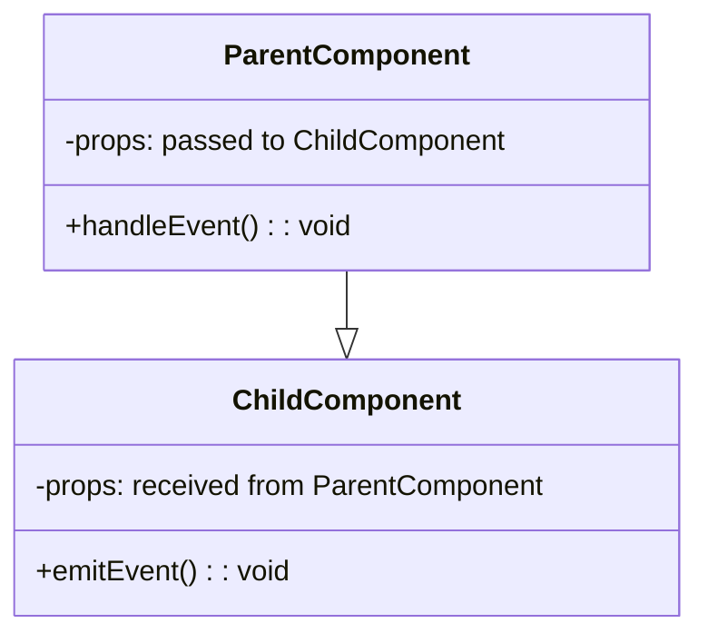
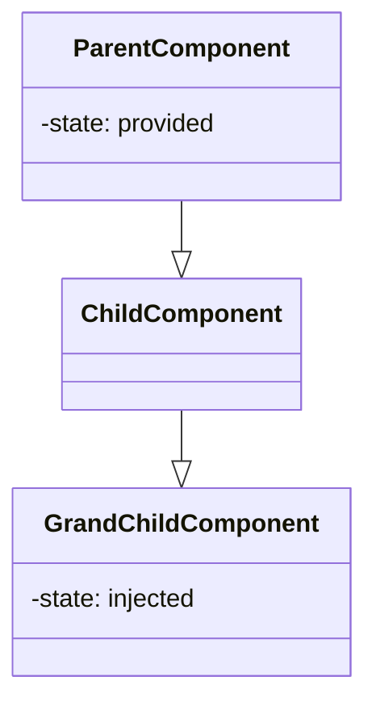
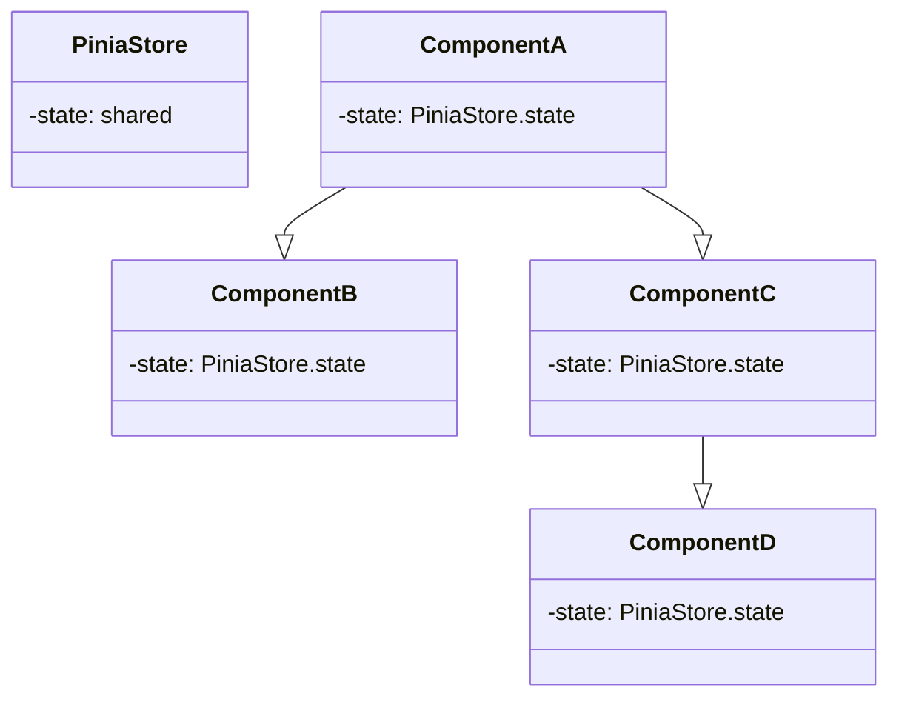

## 9.1 State Management in Vue.js 3

Vue.js 3 provides 6 essential state-management techniques/patterns that must be used in combination in order to unlock the full potential of the framework.

Each state-management technique/pattern must be carefully used where it mostly makes sense.

Assuming the usage of the **composition-api**, those 6 state-management techniques are:

1. the local state technique (using ref and reactive functions)
2. the props + events technique (props down + events up)
3. the provide + inject technique
4. the shared state store technique (with pinia)
5. the using composables technique 
6. the localStorage technique (to persist state in the user's browser)

### 1. **Local State**: 


This is the simplest form of state management in Vue.js. Each component has its own local state, managed with `ref` and `reactive` functions. The state is not shared with other components unless passed explicitly.



Only use this technique if you want to manage state in one component locally.



Example:

(inside script setup tags)

```
import { ref } from 'vue';
const count = ref(0);
const increment = () => { count.value++ };
```

### 2. **Props + Events**: 

This is a common pattern for parent-child component communication. The parent passes data to the child via props, and the child communicates changes to the parent via events.



Only use this technique if you want to communicate state between a parent, and it directly nested a child component.



Example:

(inside script setup tags)
```
<!-- Child Component -->
import { ref } from 'vue';
const props = defineProps(['value']);
const emit = defineEmits(['update:value']);
const updateValue = newValue => { emit('update:value', newValue) };
```

```
<!-- Parent Component -->
<ChildComponent :value="parentValue" @update:value="parentValue = $event" />
```

The following is a class diagram of a parent component and its direct child component communicating with props and events. The parent passes props **down** to the child component and the child component emits events **up** to the parent.



### 3. **Provide + Inject**: 

This is a way to pass data from a parent component to descendant components through a dependency injection mechanism, without going through intermediate components. This can be useful for avoiding prop drilling.



Only use this technique if you want to communicate state between a parent, and a **more than one** level nested child component. **In one occurrence**.



Example:

(inside script setup tags)
```
<!-- Parent Component -->
import { provide, ref } from 'vue';
const value = ref('Hello');
provide('key', value);
```

(inside script setup tags)
```
<!-- more than 1-level nested Child Component -->
import { inject } from 'vue';
const value = inject('key');
```

The following is a class diagram illustration of the Parent Component providing its state. The Grad Child Component gets the Parent's state injected without the need of it passing through the Child component. 




### 4. **Shared State Store (Pinia)**: 

Pinia is a state management library for Vue.js that provides a centralized store for shared state. It's an alternative to Vuex and is designed to be more intuitive and flexible.



Only use this technique if you want to **share** state between a parent, and a **more than one** level nested child component. **In multiple occurrences**.



(inside script setup tags)
```
<!-- Store -->
import { defineStore } from 'pinia';
export const useStore = defineStore({
  id: 'main',
  state: () => ({ count: 0 }),
  actions: {
    increment() { this.count++ }
  }
});
```

(inside script setup tags)
```
<!-- Component -->
import { useStore } from './store';
const store = useStore();
const count = store.count;
const increment = store.increment;
```

(inside script setup tags)
```
<!-- More than 1-level nested child Component -->
import { useStore } from './store';
const store = useStore();
const count = store.count;
const increment = store.increment;
```

The following is an example illustration of how different components nested in different levels can share a state defined in a Pinia store:



### 5. **Using Composables**: 

Composables are reusable logic functions in Vue.js Composition API. They can be used to share stateful logic between components.



Use this technique only if

> we want to reuse the same logic in multiple components. We can extract the logic into an external file, as a composable function



Example

(inside script setup tags)
```
<!-- Composable -->
import { ref } from 'vue';
export function useCounter() {
  const count = ref(0);
  const increment = () => { count.value++ };
  return { count, increment };
}
```

(inside script setup tags)
```
<!-- Component -->
import { useCounter } from './composables';
const { count, increment } = useCounter();
```



Composable can also be used in combination with a shared state store like Pinia:



Example:

```js
export const useAuthStore = defineStore('auth', {
  state: () => ({
    user: useLocalStorage('pinia/auth/login', 'bob'),
  }),
})
```

In this example **useAuthStore** is a **Pinia** store, while **useLocalStorage** is a separate **composable**.

### 6. **LocalStorage**: 

This is a way to persist state across browser sessions by storing it in the user's browser. This can be useful for things like remembering a user's preferences or saving the state of a form.



Use this technique whenever possible to improve the experience of the user. However, this technique should be carefully used since it writes directly to the user's browser database.



Example

(inside script setup tags)

```
import { ref, watch } from 'vue';
const count = ref(localStorage.getItem('count') || 0);
watch(count, newValue => { localStorage.setItem('count', newValue) });
const increment = () => { count.value++ };
```

