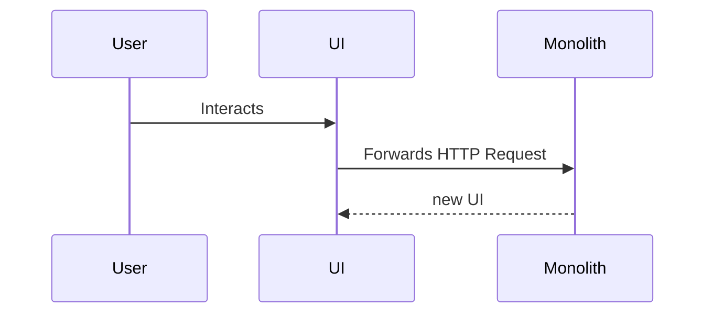
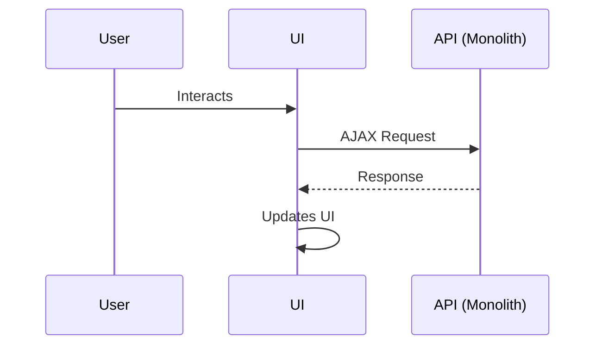

# Chapter 10: Monolithic Architecture

## Monolith vs Microservices

### Monolith

**Definition:** in software engineering, a monolithic architecture refers to a software design pattern where all the components of the software system are interconnected and interdependent, rather than being broken down into separate, loosely-coupled modules. In a monolithic architecture, the software is essentially built as one cohesive unit.



### Microservices

**Definition:** a microservices architecture breaks an application down into its individual components or services. Each service is a small, independent application that communicates with the others through well-defined APIs



Microservices involve breaking down the **server-side** application



### API as a Backend

It is true that an API as a backend architecture decouples the user-interface component and the business logic component.

However, this is not considered a microservices architecture since the server-side application is still a monolith.



The API as a backend is also referred to as a **separated client-server** model



The following is an illustration of an SPA built using an API as a backend architecture



## Inertia.js

What if we want an SPA experience without the need of creating a separate API?

**Inertia.js**: allows you to build an SPA without having to build a separate API. You can return Vue.js components directly from your Laravel routes, and Inertia.js takes care of updating the page without a full reload. 

The following diagram illustrates how inertia.js interacts with a Laravel monolith through Ajax to create the SPA experience.

```
sequenceDiagram
    participant User as User
    participant UI as UI
    participant Inertia as Inertia.js
    participant Backend as Monolith
    User ->> UI: Interacts
    UI->>Inertia: Triggers Ajax Request
    Inertia->>Backend: Sends Ajax Request
    Backend-->>Inertia: Returns JSON (Component + Data)
    Inertia-->>UI: Updates Page
```