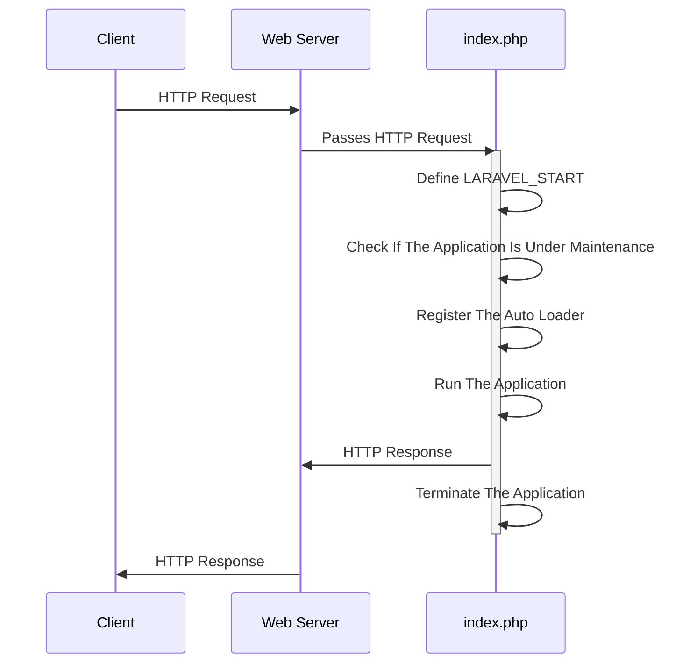

## 6.1 The Scaffolding of a Laravel App

### index.php

The following is the code of the Laravel 10.x **index.php** file.

```text

<?php

use Illuminate\Contracts\Http\Kernel;
use Illuminate\Http\Request;

define('LARAVEL_START', microtime(true));

/*
|--------------------------------------------------------------------------
| Check If The Application Is Under Maintenance
|--------------------------------------------------------------------------
|
| If the application is in maintenance / demo mode via the "down" command
| we will load this file so that any pre-rendered content can be shown
| instead of starting the framework, which could cause an exception.
|
*/

if (file_exists($maintenance = __DIR__.'/../storage/framework/maintenance.php')) {
    require $maintenance;
}

/*
|--------------------------------------------------------------------------
| Register The Auto Loader
|--------------------------------------------------------------------------
|
| Composer provides a convenient, automatically generated class loader for
| this application. We just need to utilize it! We'll simply require it
| into the script here so we don't need to manually load our classes.
|
*/

require __DIR__.'/../vendor/autoload.php';

/*
|--------------------------------------------------------------------------
| Run The Application
|--------------------------------------------------------------------------
|
| Once we have the application, we can handle the incoming request using
| the application's HTTP kernel. Then, we will send the response back
| to this client's browser, allowing them to enjoy our application.
|
*/

$app = require_once __DIR__.'/../bootstrap/app.php';

$kernel = $app->make(Kernel::class);

$response = $kernel->handle(
    $request = Request::capture()
)->send();

$kernel->terminate($request, $response);

```

### Analysing the index.php code:

Even if the comments weren't there, the Laravel's index.php file code is straightforward well written.

The banner comments make it even more understandable.



First observation: the length of each comment line in each comment block is **3 characters less** than its preceding comment line.



The following is a sequence diagram that describes the interaction between the client, the web server, and Laravel's `index.php`:



In this diagram:

1. The client sends an HTTP request to the web server.
2. The web server passes the HTTP request to `index.php`.
3. `index.php` performs the following steps:
    - Define LARAVEL_START
    - Check If The Application Is Under Maintenance
    - Register The Auto Loader
    - Run The Application
    - Sends an HTTP response back to the web server
    - Terminate The Application
4. The web server sends the HTTP response back to the client.

Let's break down the steps that `index.php` performs and see which section of the `index.php` code is responsible for which step:

1. Define LARAVEL_START

```
define('LARAVEL_START', microtime(true));
```

2. Check If The Application Is Under Maintenance

```
if (file_exists($maintenance = __DIR__.'/../storage/framework/maintenance.php')) {
    require $maintenance;
}
```
 
3. Register The Auto Loader

```
require __DIR__.'/../vendor/autoload.php';
```
 
4. Run The Application

```
$app = require_once __DIR__.'/../bootstrap/app.php';

$kernel = $app->make(Kernel::class);
```
 
5. Sends an HTTP response back to the web server

```
$response = $kernel->handle(
    $request = Request::capture()
)->send();
```
 
6. Terminate The Application

```
$kernel->terminate($request, $response);
```

### Explaining the index.php code sections

1. **Define LARAVEL_START**: This line sets a constant that holds the timestamp of when the script started. This can be used for profiling and debugging.


2. **Check If The Application Is Under Maintenance**: Laravel provides a maintenance mode that can be activated with the `php artisan down` command. When in maintenance mode, Laravel will display a custom view to all requests into your application. This can be used when you are updating your server or installing a new feature and you don't want users to see errors or experience downtime.


3. **Register The Auto Loader**: This part of the script loads Composer's autoloader. Composer is a tool for dependency management in PHP, and its autoloader automatically loads PHP classes when they're needed, so you don't have to manually include them.


4. **Run The Application**: This section does the actual work of handling the incoming HTTP request and sending a response.


- It starts by **bootstrapping the Laravel application**, which involves setting up error handling, configuring logging, loading configuration files, and more. 

```
$app = require_once __DIR__.'/../bootstrap/app.php';
```

- Then it creates an instance of Laravel's **HTTP kernel**, which is responsible for handling the request. The kernel handles the request and returns a response, which is then sent back to the client.

```
$kernel = $app->make(Kernel::class);
```

5. **Terminate The Application**: After the response has been sent to the client, the script calls the kernel's `terminate` method. This method is used to perform any final tasks after the response has been sent, such as committing database transactions or writing to log files.


### The HTTP Kernel

Ok, now let's try to reason backwards and try to understand the following lines of code:

```
$response = $kernel->handle(
    $request = Request::capture()
)->send();

$kernel->terminate($request, $response);
```

the Laravel's HTTP kernel is primarily responsible for handling incoming HTTP requests to the application. It is the central component that manages the request lifecycle in a Laravel application.

To understand how the Laravel HTTP kernel works, we need to firstly start by analysing the code that `index.php` is **using**, namely, `Illuminate\Contracts\Http\Kernel`.

### Analysing the `Illuminate\Contracts\Http\Kernel`:

The following is the code of the `Kernel.php` file which is namespaced as `Illuminate\Contracts\Http\Kernel`:

```
<?php

namespace Illuminate\Contracts\Http;

interface Kernel
{
    /**
     * Bootstrap the application for HTTP requests.
     *
     * @return void
     */
    public function bootstrap();

    /**
     * Handle an incoming HTTP request.
     *
     * @param  \Symfony\Component\HttpFoundation\Request  $request
     * @return \Symfony\Component\HttpFoundation\Response
     */
    public function handle($request);

    /**
     * Perform any final actions for the request lifecycle.
     *
     * @param  \Symfony\Component\HttpFoundation\Request  $request
     * @param  \Symfony\Component\HttpFoundation\Response  $response
     * @return void
     */
    public function terminate($request, $response);

    /**
     * Get the Laravel application instance.
     *
     * @return \Illuminate\Contracts\Foundation\Application
     */
    public function getApplication();
}
```


This code is the interface for the HTTP Kernel in Laravel. 

An interface in PHP is a contract or a blueprint for a class. 

It defines a set of methods that the class must implement. In this case, any class that implements the `Illuminate\Contracts\Http\Kernel` interface must define the methods `bootstrap()`, `handle()`, `terminate()`, and `getApplication()`.

Here's what each method is intended to do:


1. **`bootstrap()`**: This method is responsible for bootstrapping the application for HTTP requests. It doesn't take any parameters and doesn't return anything (`void`).

2. **`handle($request)`**: This method is responsible for handling an incoming HTTP request. It takes a `Symfony\Component\HttpFoundation\Request` object as a parameter and returns a `Symfony\Component\HttpFoundation\Response` object.

3. **`terminate($request, $response)`**: This method is responsible for performing any final actions for the request lifecycle. It takes a `Symfony\Component\HttpFoundation\Request` object and a `Symfony\Component\HttpFoundation\Response` object as parameters and doesn't return anything (`void`).

4. **`getApplication()`**: This method is responsible for getting the Laravel application instance. It doesn't take any parameters and returns an `Illuminate\Contracts\Foundation\Application` object.


### The <span style="color: red;">first question</span> that begs itself:

How does the following line of code works?:

```
$kernel = $app->make(Kernel::class);
```

How is the `$app->make();` method able to instantiate the `Kernel` Interface using just its namespace as a string `Kernel::class`? 

In PHP, you can't instantiate an interface. In order to instantiate an Interface you need to create a non-abstract class that implements that interface.


### Short answer:

Laravel's service container, a powerful tool for:

- managing class dependencies and 
- performing dependency injection.

In Laravel, the `$app->make()` method is used to **resolve** a class out of the service container. 

When you call `$app->make(Kernel::class)`, Laravel is not trying to instantiate the `Kernel` interface. Instead, it's looking for a concrete implementation of that interface that has been bound into the service container.

Earlier in the `bootstrap/app.php` file, Laravel **binds** the `Kernel` interface to a concrete implementation:

```php
$app->singleton(
    Illuminate\Contracts\Http\Kernel::class,
    App\Http\Kernel::class
);
```

This code tells Laravel: "Whenever someone asks for the `Kernel` interface, give them an instance of `App\Http\Kernel`."

So, when you call `$app->make(Kernel::class)`, Laravel gives you an instance of `App\Http\Kernel`, which is a concrete class that implements the `Kernel` interface.

This is a fundamental part of Laravel's service container and is key to how Laravel handles dependency injection. It allows you to depend on abstractions (like interfaces) in your code, while Laravel takes care of providing the correct implementation.



In Laravel, the `$app` variable is not globally accessible in all PHP files by default. However, Laravel provides a variety of ways to access the application instance (and thus the service container) when you need it.

1. **Dependency Injection**: Laravel's service container is primarily intended to be used with dependency injection. This means that instead of trying to access the `$app` variable directly, you type-hint the dependencies your class needs in its constructor, and Laravel will automatically inject them for you. This is the recommended way to access services in Laravel.

//todo: provide an example here of type hinting using laravel's service container.

//todo: maybe change the name of this . to type hinting + dependency injection... 

2. **Facades**: Laravel's facades provide a "static" interface to classes that are available in the service container. Under the hood, facades use the service container to resolve the underlying class and proxy calls to it. For example, you can use the `App` facade to access the application instance anywhere in your code like this: `App::make('SomeClass')`.

3. **Helpers**: Laravel provides a number of global helper functions that can be used to access various services. For example, the `app()` function can be used to access the service container. If you call `app('SomeClass')`, it will resolve 'SomeClass' out of the container.

While these methods can be used to access the service container from anywhere in your code, it's generally recommended to use dependency injection where possible, as it makes your code more testable and easier to manage.





Yes, that's correct! Laravel's facades provide a "static" interface to classes that are available in the service container. When you use `App::make('SomeClass')`, you're using the `App` facade to access the service container and resolve the `SomeClass` out of it.

Under the hood, Laravel's facades use the service container to resolve the underlying class and proxy static method calls to it. This means that when you call a static method on a facade, Laravel is actually resolving the underlying class from the service container and calling the method on that instance.

So in essence, when you use a facade, you're using the service container twice: once to resolve the facade itself, and once to resolve the class that the facade provides access to. This allows you to use complex services as if they were simple, static methods, while still benefiting from Laravel's powerful service container and dependency injection features.



### The <span style="color: red;">second question</span> that begs itself:

//todo: main reason why is the laravel service container is needed? global provider?
        second reason? automatic dependency injection?
        third reason? singleton if needed? 
        fourth reason? dependency management?


//todo: make sure all the info in the following section between --- is not needed anymore and then delete it 

---

In Laravel, the `App\Http\Kernel` class implements this interface and provides the actual implementation for these methods. This interface is a contract that ensures the HTTP Kernel has the necessary methods to handle and terminate HTTP requests, bootstrap the application, and provide access to the application instance.


The HTTP kernel extends the `Illuminate\Foundation\Http\Kernel` class and contains two primary methods: `handle()` and `terminate()`.


The HTTP kernel also defines a list of HTTP middleware that all requests through the application must pass through before being handled by a route or controller. Middleware provide a convenient mechanism for filtering HTTP requests entering your application, such as verifying the user of your application is authenticated.


reason backward and talk about the kernel's handle and terminate methods

explore the kernels code and see what terminate does?

what handle does?

why the kernel has only two methods?

talk about kernel and middlewares

why is the kernel created by the app instance? why not a standalone instance ?

maybe because we want it to always be a singleton in our laravel app? and the app container can provide this functionality?

if we want it to be always a singleton why not implement it using the singleton pattern and that's it?

Maybe we want to declare some services classes without implementing the singleton pattern and then make them behave as a singleton in our app ?

---

### The app container

To get a grasp of how Laravel works we need to understand the main component of the Laravel framework. Which is the **app container**.

To understand what the following two lines of code do.

```
$app = require_once __DIR__.'/../bootstrap/app.php';

$kernel = $app->make(Kernel::class);
```

We take a loot at the **./bootstrap/app.php** file:

```
<?php

/*
|--------------------------------------------------------------------------
| Create The Application
|--------------------------------------------------------------------------
|
| The first thing we will do is create a new Laravel application instance
| which serves as the "glue" for all the components of Laravel, and is
| the IoC container for the system binding all of the various parts.
|
*/

$app = new Illuminate\Foundation\Application(
    $_ENV['APP_BASE_PATH'] ?? dirname(__DIR__)
);

/*
|--------------------------------------------------------------------------
| Bind Important Interfaces
|--------------------------------------------------------------------------
|
| Next, we need to bind some important interfaces into the container so
| we will be able to resolve them when needed. The kernels serve the
| incoming requests to this application from both the web and CLI.
|
*/

$app->singleton(
    Illuminate\Contracts\Http\Kernel::class,
    App\Http\Kernel::class
);

$app->singleton(
    Illuminate\Contracts\Console\Kernel::class,
    App\Console\Kernel::class
);

$app->singleton(
    Illuminate\Contracts\Debug\ExceptionHandler::class,
    App\Exceptions\Handler::class
);

/*
|--------------------------------------------------------------------------
| Return The Application
|--------------------------------------------------------------------------
|
| This script returns the application instance. The instance is given to
| the calling script so we can separate the building of the instances
| from the actual running of the application and sending responses.
|
*/

return $app;
```

### Analysing the app.php code:
