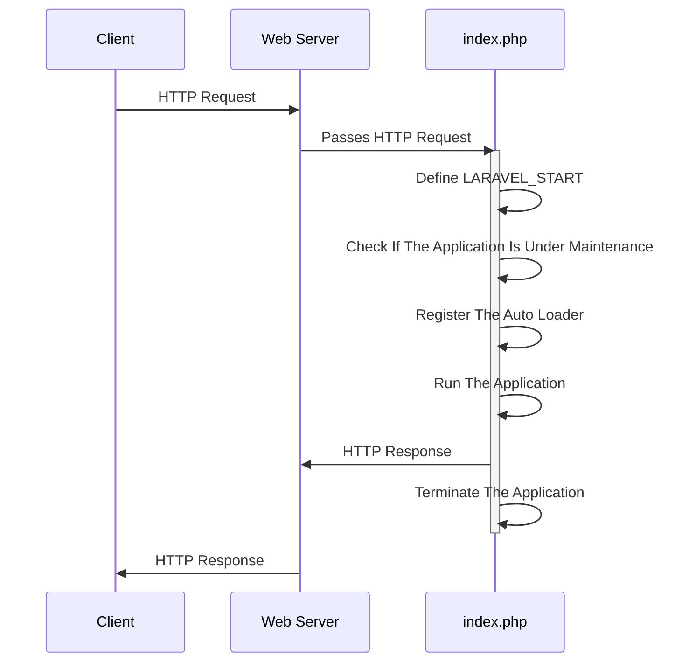

## 6.1 The Scaffolding of a Laravel App

### index.php

The following is the code of the Laravel 10.x **index.php** file.

```text

<?php

use Illuminate\Contracts\Http\Kernel;
use Illuminate\Http\Request;

define('LARAVEL_START', microtime(true));

/*
|--------------------------------------------------------------------------
| Check If The Application Is Under Maintenance
|--------------------------------------------------------------------------
|
| If the application is in maintenance / demo mode via the "down" command
| we will load this file so that any pre-rendered content can be shown
| instead of starting the framework, which could cause an exception.
|
*/

if (file_exists($maintenance = __DIR__.'/../storage/framework/maintenance.php')) {
    require $maintenance;
}

/*
|--------------------------------------------------------------------------
| Register The Auto Loader
|--------------------------------------------------------------------------
|
| Composer provides a convenient, automatically generated class loader for
| this application. We just need to utilize it! We'll simply require it
| into the script here so we don't need to manually load our classes.
|
*/

require __DIR__.'/../vendor/autoload.php';

/*
|--------------------------------------------------------------------------
| Run The Application
|--------------------------------------------------------------------------
|
| Once we have the application, we can handle the incoming request using
| the application's HTTP kernel. Then, we will send the response back
| to this client's browser, allowing them to enjoy our application.
|
*/

$app = require_once __DIR__.'/../bootstrap/app.php';

$kernel = $app->make(Kernel::class);

$response = $kernel->handle(
    $request = Request::capture()
)->send();

$kernel->terminate($request, $response);

```

### Analysing the index.php code:

Even if the comments weren't there, the Laravel's index.php file code is straightforward well written.

The banner comments make it even more understandable.



First observation: the length of each comment line in each comment block is **3 characters less** than its preceding comment line.



The following is a sequence diagram that describes the interaction between the client, the web server, and Laravel's `index.php`:



In this diagram:

1. The client sends an HTTP request to the web server.
2. The web server passes the HTTP request to `index.php`.
3. `index.php` performs the following steps:
    - Define LARAVEL_START
    - Check If The Application Is Under Maintenance
    - Register The Auto Loader
    - Run The Application
    - Sends an HTTP response back to the web server
    - Terminate The Application
4. The web server sends the HTTP response back to the client.

Let's break down the steps that `index.php` performs and see which section of the `index.php` code is responsible for which step:

1. Define LARAVEL_START

```
define('LARAVEL_START', microtime(true));
```

2. Check If The Application Is Under Maintenance

```
if (file_exists($maintenance = __DIR__.'/../storage/framework/maintenance.php')) {
    require $maintenance;
}
```
 
3. Register The Auto Loader

```
require __DIR__.'/../vendor/autoload.php';
```
 
4. Run The Application

```
$app = require_once __DIR__.'/../bootstrap/app.php';

$kernel = $app->make(Kernel::class);
```
 
5. Sends an HTTP response back to the web server

```
$response = $kernel->handle(
    $request = Request::capture()
)->send();
```
 
6. Terminate The Application

```
$kernel->terminate($request, $response);
```

### Explaining the index.php code sections

1. **Define LARAVEL_START**: This line sets a constant that holds the timestamp of when the script started. This can be used for profiling and debugging.


2. **Check If The Application Is Under Maintenance**: Laravel provides a maintenance mode that can be activated with the `php artisan down` command. When in maintenance mode, Laravel will display a custom view to all requests into your application. This can be used when you are updating your server or installing a new feature and you don't want users to see errors or experience downtime.


3. **Register The Auto Loader**: This part of the script loads Composer's autoloader. Composer is a tool for dependency management in PHP, and its autoloader automatically loads PHP classes when they're needed, so you don't have to manually include them.


4. **Run The Application**: This section does the actual work of handling the incoming HTTP request and sending a response.


- It starts by **bootstrapping the Laravel application**, which involves setting up error handling, configuring logging, loading configuration files, and more. 

```
$app = require_once __DIR__.'/../bootstrap/app.php';
```

- Then it creates an instance of Laravel's **HTTP kernel**, which is responsible for handling the request. The kernel handles the request and returns a response, which is then sent back to the client.

```
$kernel = $app->make(Kernel::class);
```

5. **Terminate The Application**: After the response has been sent to the client, the script calls the kernel's `terminate` method. This method is used to perform any final tasks after the response has been sent, such as committing database transactions or writing to log files.


### The HTTP Kernel?

to understand the following lines of code

```
$response = $kernel->handle(
    $request = Request::capture()
)->send();

$kernel->terminate($request, $response);
```

reason backward and talk about the kernel's handle and terminate methods

explore the kernels code and see what terminate does?

what handle does?

why the kernel has only two methods?

talk about kernel and middlewares

why is the kernel created by the app instance? why not a standalone instance ?

maybe because we want it to always be a singleton in our laravel app? and the app container can provide this functionality?

### The app container

To get a grasp of how Laravel works we need to understand the main component of the Laravel framework. Which is the **app container**.

To understand what the following two lines of code do.

```
$app = require_once __DIR__.'/../bootstrap/app.php';

$kernel = $app->make(Kernel::class);
```

We take a loot at the **./bootstrap/app.php** file:

```
<?php

/*
|--------------------------------------------------------------------------
| Create The Application
|--------------------------------------------------------------------------
|
| The first thing we will do is create a new Laravel application instance
| which serves as the "glue" for all the components of Laravel, and is
| the IoC container for the system binding all of the various parts.
|
*/

$app = new Illuminate\Foundation\Application(
    $_ENV['APP_BASE_PATH'] ?? dirname(__DIR__)
);

/*
|--------------------------------------------------------------------------
| Bind Important Interfaces
|--------------------------------------------------------------------------
|
| Next, we need to bind some important interfaces into the container so
| we will be able to resolve them when needed. The kernels serve the
| incoming requests to this application from both the web and CLI.
|
*/

$app->singleton(
    Illuminate\Contracts\Http\Kernel::class,
    App\Http\Kernel::class
);

$app->singleton(
    Illuminate\Contracts\Console\Kernel::class,
    App\Console\Kernel::class
);

$app->singleton(
    Illuminate\Contracts\Debug\ExceptionHandler::class,
    App\Exceptions\Handler::class
);

/*
|--------------------------------------------------------------------------
| Return The Application
|--------------------------------------------------------------------------
|
| This script returns the application instance. The instance is given to
| the calling script so we can separate the building of the instances
| from the actual running of the application and sending responses.
|
*/

return $app;
```

### Analysing the app.php code:
