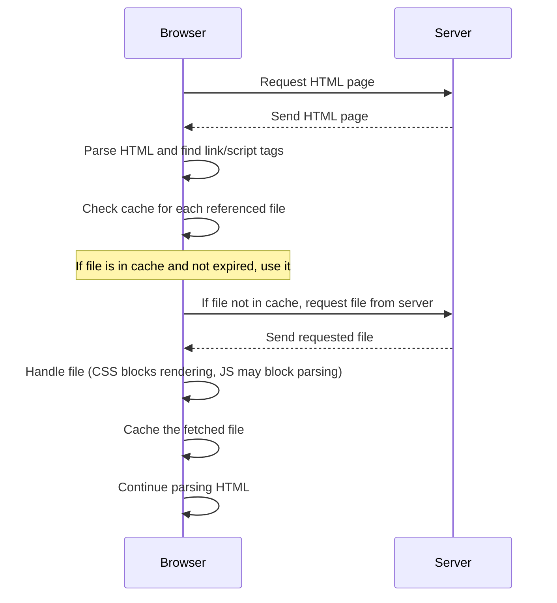
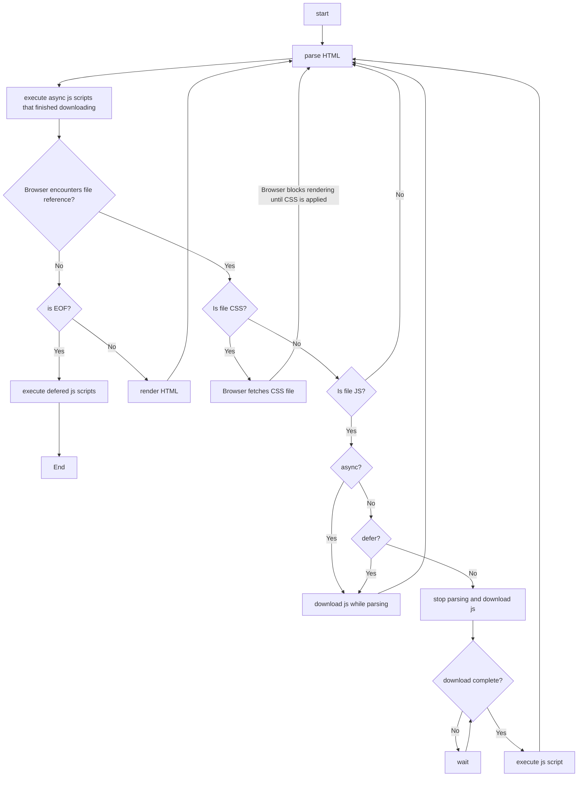

## 6.1 The Scaffolding of a Laravel App

### Let's start from the Web Server

The main role of a Web Server is to serve static files to which it has access.

Examples of static files include HTML, CSS, JavaScript, and image files.




To tell a web server which files it should serve, you need to configure it. The configuration process varies depending on the web server software you're using, but it generally involves the following steps:

1. **Specify the Document Root**: The document root is the directory where the web server looks for files to serve on your website. For example, if you're using Apache, you can set the document root in your `httpd.conf` file with the `DocumentRoot` directive.


2. **Public Directory**: The **public** directory in a web project is a convention used in many web development frameworks and platforms. It's the directory that is intended to hold all files that are directly accessible by clients (like web browsers). This includes static files such as HTML, CSS, JavaScript, and images.


3. **Set Directory Index**: The directory index is a file that the web server will serve if a client requests a directory. By default, this is usually a file like `index.html` or `index.php`. You can set the directory index in your web server's configuration file.





When you set the `document root` of your web server to point to the `public` directory, the web server will serve these static files directly. Any request for a file path that matches the path of a file in the `public` directory will result in that file being sent to the client.

The reason for this convention is **security** and organization. By segregating files that should be publicly accessible from those that shouldn't (like server-side scripts, configuration files, raw data files, etc.), you reduce the risk of accidentally exposing sensitive files. It also makes the project more organized and easier to manage.



For example, you have a project structured like this:

```text
/mywebsite
  /public
    index.html
    about.html
    contact.html
  /config
    config.txt
```

In the scenario of a user interacting with a Web App. The user will be requesting HTML pages from the browser. The Web Server will try to serve the requested HTML page.

Since the browser can interpret mainly **HTML**, **CSS**, **JavaScript**, each HTML page will have its own:
- CSS embedded in the HTML or in a separate section inside that same HTML file in a **style** tag
- Javascript defined inside a **script** tag

The following, is an example of a HTML page using the **style** and **script** tags. The example also show-cases the use of embedded css styling inside the p tag.

**index.html**
```text
<!DOCTYPE html>
<html>
<head>
    <title>My Simple Page</title>
    <style>
        body {
            background-color: lightblue;
            font-family: Arial, sans-serif;
        }

        h1 {
            color: navy;
        }
    </style>
</head>
<body>
    <h1>Click Me!</h1>
    <p style="color: red; font-size: 20px;">This is a paragraph.</p>

    <script>
        document.querySelector("h1").addEventListener("click", function() {
            alert("You clicked the heading!");
        });
    </script>
</body>
</html>

```



modern browsers can also handle other types of content like:
- **XML**, **JSON**, **SVG**, **WebP**, 
- and various **media formats** (audio, video). 

They also support 
- **WebAssembly**, a binary instruction format for a stack-based virtual machine.



In this case the Web Server will only serve one file per request. The browser will be able to understand the entire served file, and it will not send additional requests.

However, consider the following scenarios:
- when using javascript inside a **script** tag in an HTML page. There is a need to use predefined javascript libraries.
- when using css styling either **embedded** or in a **style** tag. There is a need to use predefined css.

For this reason, an HTML page can link external JS or CSS resources. CSS resources are linked using the **link** tag, and JS resources are linked using the **script** tag. These resources can be local or remote/in the cloud.

The following example refactors the previous example to use external JS and CSS resources.

**index.html**
```text
<!DOCTYPE html>
<html>
<head>
    <title>My Simple Page</title>
    <link rel="stylesheet" type="text/css" href="css/app.css">
</head>
<body>
    <h1>Click Me!</h1>
    <p>This is a paragraph.</p>

    <script src="js/app.js"></script>
</body>
</html>
```
**css/app.css**
```text
body {
    background-color: lightblue;
    font-family: Arial, sans-serif;
}

h1 {
    color: navy;
}

p {
    color: red;
    font-size: 20px;
}
```

**js/app.js**
```text
document.querySelector("h1").addEventListener("click", function() {
    alert("You clicked the heading!");
});
```

So, now your project structure looks more like this.

```text
/mywebsite
  /public
    index.html
    about.html
    contact.html
    /css
      app.css
    /js
      app.js    
  /config
    config.txt
```

#### Browser and linked resources

When a user requests an HTML page that references external files using the **link** or **script** tag:

1. **The browser parses the HTML**: When a user requests an HTML page, the browser begins by parsing the HTML. As it encounters **link** or **script** tags that reference external files, it prepares to fetch these resources.


2. **The browser checks its cache**: For each referenced file, the browser checks its cache to see if the file is already stored. If it is, and the cache is not expired, the browser uses the cached version. This saves the time and bandwidth that would be used in fetching the file from the server.


3. **The browser fetches the file**: If the file is not in the cache, or if the cached version is expired, the browser sends a request to fetch the file. This could be from the same server (for local resources) or a different server (for remote resources).


4. **The browser handles different types of files differently**:
    - For CSS files: The browser will block rendering until the CSS file is fetched and parsed. This is because CSS can affect the layout and appearance of the page, and the browser wants to avoid "flash of unstyled content".
    - For JavaScript files: The behavior depends on where the script is placed and whether the `async` or `defer` attributes are used. By default (if the script tag is in the head), the browser will block HTML parsing until the script is fetched and executed. If the `async` attribute is used, the script will be fetched in parallel to the HTML parsing and executed as soon as it's available. If the `defer` attribute is used, the script will be fetched in parallel and executed after the HTML is fully parsed.

5. **The browser caches the file**: After fetching the file, the browser stores it in its cache for future use. This makes subsequent requests for the same file faster.



The caching behavior can be controlled by various HTTP headers, such as `Cache-Control`, `ETag`, and `Last-Modified`.



6. **The browser continues parsing the HTML**: After the external file is handled, the browser continues parsing the rest of the HTML. If it encounters additional external files, it repeats the process for each one.

The following diagram shows the communication between the client and the server.



The following workflow shows how the browser handles referenced files depending on their **type** and **referencing tag attributes**





1. **no attribute**: block parsing and download js script. When finished downloading, execute the js script and resume parsing.


2. **async**: download js script asynchronously while parsing. When finished execute the js script and resume parsing.


3. **defer**: download js script asynchronously while parsing. But, don't execute js script until parsing is finished.


            
#### including HTML files

Technically each HTML page can use its specific resources css and js resources. And the browser will try to get those resources if the HTML page is requested and the browser doesn't have them.

However, because web apps are mostly structured in a way that takes advantage of reusing HTML components like the **navigation section** and the **footer**. Most web apps use a **main layout** HTML page from which the rest of HTML pages inherit the parent's layout (including the **header tags**).

//todo: show diagram of how a html web app is structured using layouts and anchor links



HTML doesn't support including external HTML files. For that you need to use javascript or PHP to be able to include the HTML programmatically.

Many modern front-end js frameworks and libraries (like React, Angular, Vue.js) build upon the ability to include HTML file using javascript to support component-based architecture.

//todo: talk about the equivalent in php such as blade 



//todo: talk how modern js frameworks minify the html skeleton to include just one root elements and then inject the html components as javascript (jsx)

//todo: talk about how the same is done using blade php 


#### Asset Bundling

The HTML pages that inherit from the main layout will automatically also reference/share the css and javascript file(s) that the main layout uses. This allows:

- all the installed js libraries/packages to be bundled into one js file usually called **app.js**
- all the css styling used across the app to be bundled into one css file usually called **app.css** 



A tools that helps bundle the app's:
- javascript packages into one or multiple js files 
- and the app's css into one or multiple css files 

is called an **asset bundler**.

An **asset bundler** is a tool that helps bundle the app's JavaScript packages into one or multiple JS files and the app's CSS into one or multiple CSS files. This process not only combines files but also minifies and optimizes them, improving load time and performance.

Examples of assset bundler are: **vite**, **webpack** and **gulp**.

Laravel actually uses **vite** by default.





**Reducing the number of HTTP Requests with bundling**

Each request for a resource (HTML, CSS, JS, images) is an HTTP request, and reducing these requests is one of the reasons bundling and minification are used.

Note that when the number of HTTP requests for resources are reduced, this is beneficial for both the client and server. Those benefits are barely noticeable on the client-side. However, this reduction takes more effect when it is considered in scale on the server-side.

Because, if you have thousands simultaneous users then using bundling will spare the server extra thousands simultaneous requests for resources.





Please note that an asset bundler will only bundle JavaScript or CSS libraries that are installed locally in your app's development project. It will not bundle remotely referenced JS or CSS libraries. 

Those remote JS/CSS libraries will still need to be fetched by the browser from their specified remote location(s), which is usually a **CDN** (Content Delivery Network).



### PHP for dynamically generated HTML

//todo: talk about how php is necessary and took over to generate HTML, and thus we have index.php entry point

//todo: talk about how the routing is no more resouce based but virtual



//todo:talk about file-based routing vs virtual routing... Please note here how the **file based** routing. The server serves files that match the requested



//todo: talk about the entry points / vendor / packages / build .. of a classic php app