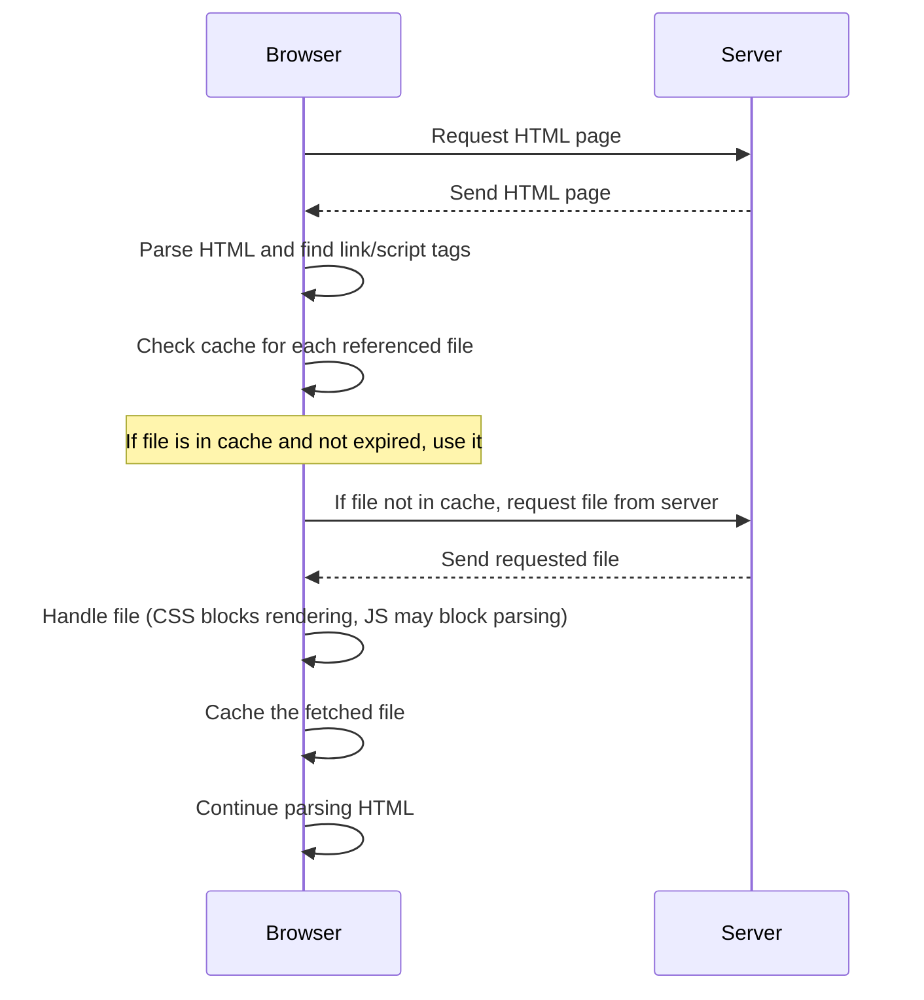
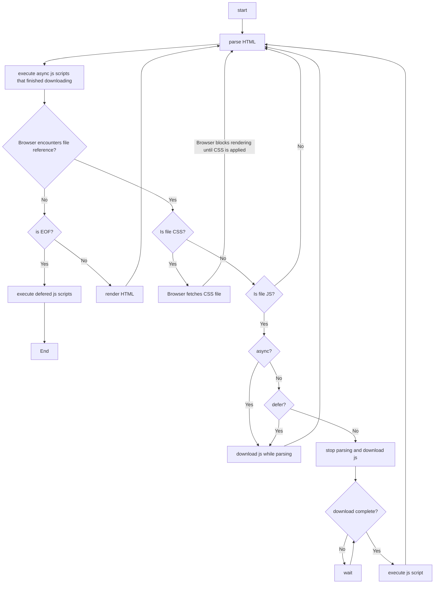
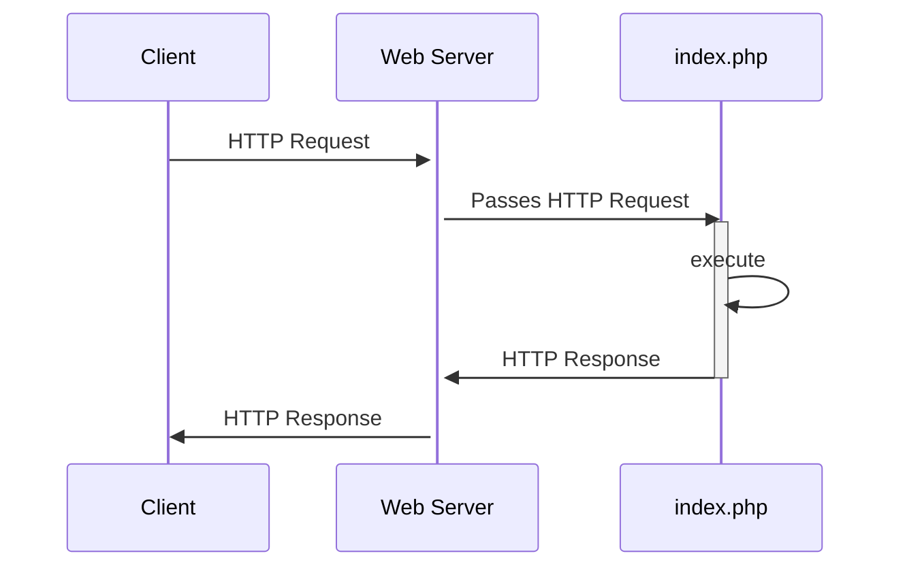

# Part 3: Overview on how to Build a Web App

### Let's start from the Web Server

The main role of a Web Server is to serve static files to which it has access.

Examples of static files include HTML, CSS, JavaScript, and image files.




To tell a web server which files it should serve, you need to configure it. The configuration process varies depending on the web server software you're using, but it generally involves the following steps:

1. **Specify the Document Root**: The document root is the directory where the web server looks for files to serve on your website. For example, if you're using Apache, you can set the document root in your `httpd.conf` file with the `DocumentRoot` directive.


2. **Public Directory**: The **public** directory in a web project is a convention used in many web development frameworks and platforms. It's the directory that is intended to hold all files that are directly accessible by clients (like web browsers). This includes static files such as HTML, CSS, JavaScript, and images.


3. **Set Directory Index**: The directory index is a file that the web server will serve if a client requests a directory. By default, this is usually a file like `index.html` or `index.php`. You can set the directory index in your web server's configuration file.





When you set the `document root` of your web server to point to the `public` directory, the web server will serve these static files directly. Any request for a file path that matches the path of a file in the `public` directory will result in that file being sent to the client.

The reason for this convention is **security** and organization. By segregating files that should be publicly accessible from those that shouldn't (like server-side scripts, configuration files, raw data files, etc.), you reduce the risk of accidentally exposing sensitive files. It also makes the project more organized and easier to manage.



For example, you have a project structured like this:

```text
/mywebsite
  /public
    index.html
    about.html
    contact.html
  /config
    config.txt
```

In the scenario of a user interacting with a Web App. The user will be requesting HTML pages from the browser. The Web Server will try to serve the requested HTML page.

Since the browser can interpret mainly **HTML**, **CSS**, **JavaScript**, each HTML page will have its own:
- CSS embedded in the HTML or in a separate section inside that same HTML file in a **style** tag
- Javascript defined inside a **script** tag

The following, is an example of a HTML page using the **style** and **script** tags. The example also show-cases the use of embedded css styling inside the p tag.

**index.html**
```text
<!DOCTYPE html>
<html>
<head>
    <title>My Website</title>
    <style>
        nav {
            background-color: #f8f9fa;
            padding: 10px;
        }
        footer {
            background-color: #f8f9fa;
            padding: 10px;
            position: fixed;
            width: 100%;
            bottom: 0;
        }
        body {
            background-color: lightblue;
            font-family: Arial, sans-serif;
        }
        h1 {
            color: navy;
        }
    </style>
</head>
<body>
    <nav>
        <a href="about.html">About</a> 
        <a href="contact.html">Contact</a> 
    </nav>
    
    <h1>Click Me!</h1>
    <p style="color: red; font-size: 20px;">This is a paragraph.</p>

    <footer>
        <p>Copyright &copy; My Website</p>
    </footer>
    
    <script>
        document.querySelector("h1").addEventListener("click", function() {
        alert("You clicked the heading!");
    </script>
});
</body>
</html>
```



modern browsers can also handle other types of content like:
- **XML**, **JSON**, **SVG**, **WebP**,
- and various **media formats** (audio, video).

They also support
- **WebAssembly**, a binary instruction format for a stack-based virtual machine.



In this case the Web Server will only serve one file per request. The browser will be able to understand the entire served file, and it will not send additional requests.

However, consider the following scenarios:
- when using javascript inside a **script** tag in an HTML page. There is a need to use predefined javascript libraries.
- when using css styling either **embedded** or in a **style** tag. There is a need to use predefined css.

For this reason, an HTML page can link external JS or CSS resources. CSS resources are linked using the **link** tag, and JS resources are linked using the **script** tag. These resources can be local or remote/in the cloud.

The following example refactors the previous example to use external JS and CSS resources.

**index.html**
```text
<!DOCTYPE html>
<html>
<head>
    <title>My Website</title>
    <link rel="stylesheet" type="text/css" href="css/app.css">
</head>
<body>
    <nav>
        <a href="about.html">About</a> 
        <a href="contact.html">Contact</a> 
    </nav>
    
    <h1>Click Me!</h1>
    <p>This is a paragraph.</p>

    <footer>
        <p>Copyright &copy; My Website</p>
    </footer>
    
    <script src="js/app.js"></script>
</body>
</html>
```
**css/app.css**
```text
nav {
   background-color: #f8f9fa;
   padding: 10px;
}
footer {
   background-color: #f8f9fa;
   padding: 10px;
   position: fixed;
   width: 100%;
   bottom: 0;
}
body {
   background-color: lightblue;
   font-family: Arial, sans-serif;
}
h1 {
   color: navy;
}
p {
   color: red;
   font-size: 20px;
}
```

**js/app.js**
```text
document.querySelector("h1").addEventListener("click", function() {
    alert("You clicked the heading!");
});
```

So, now your project structure looks more like this.

```text
/mywebsite
  /public
    index.html
    about.html
    contact.html
    /css
      app.css
    /js
      app.js    
  /config
    config.txt
```

#### Browser and linked resources

When a user requests an HTML page that references external files using the **link** or **script** tag:

1. **The browser parses the HTML**: When a user requests an HTML page, the browser begins by parsing the HTML. As it encounters **link** or **script** tags that reference external files, it prepares to fetch these resources.


2. **The browser checks its cache**: For each referenced file, the browser checks its cache to see if the file is already stored. If it is, and the cache is not expired, the browser uses the cached version. This saves the time and bandwidth that would be used in fetching the file from the server.


3. **The browser fetches the file**: If the file is not in the cache, or if the cached version is expired, the browser sends a request to fetch the file. This could be from the same server (for local resources) or a different server (for remote resources).


4. **The browser handles different types of files differently**:
    - For CSS files: The browser will block rendering until the CSS file is fetched and parsed. This is because CSS can affect the layout and appearance of the page, and the browser wants to avoid "flash of unstyled content".
    - For JavaScript files: The behavior depends on where the script is placed and whether the `async` or `defer` attributes are used. By default (if the script tag is in the head), the browser will block HTML parsing until the script is fetched and executed. If the `async` attribute is used, the script will be fetched in parallel to the HTML parsing and executed as soon as it's available. If the `defer` attribute is used, the script will be fetched in parallel and executed after the HTML is fully parsed.

5. **The browser caches the file**: After fetching the file, the browser stores it in its cache for future use. This makes subsequent requests for the same file faster.



The caching behavior can be controlled by various HTTP headers, such as `Cache-Control`, `ETag`, and `Last-Modified`.



6. **The browser continues parsing the HTML**: After the external file is handled, the browser continues parsing the rest of the HTML. If it encounters additional external files, it repeats the process for each one.

The following diagram shows the communication between the client and the server.



The following workflow shows how the browser handles referenced files depending on their **type** and **referencing tag attributes**





1. **no attribute**: block parsing and download js script. When finished downloading, execute the js script and resume parsing.

Example **jQuery**:

```
<script src="https://ajax.googleapis.com/ajax/libs/jquery/3.5.1/jquery.min.js"></script>
```

2. **async**: download js script asynchronously while parsing. When finished execute the js script and resume parsing.

Example **D3.js**:

```
<script async src="https://d3js.org/d3.v6.min.js"></script>
```

3. **defer**: download js script asynchronously while parsing. But, don't execute js script until parsing is finished.

Example **Vue.js**:

```
<script defer src="https://cdn.jsdelivr.net/npm/vue@2.6.12/dist/vue.js"></script>
```



#### including HTML files

Technically each HTML page can use its specific resources css and js resources. And the browser will try to get those resources if the HTML page is requested and the browser doesn't have them.

However, because web apps are mostly structured in a way that takes advantage of reusing HTML components like the **navigation section** and the **footer**. Most web apps use a **main layout** HTML page from which the rest of HTML pages inherit the parent's layout (including the **header tags**).

//todo: show diagram of how a html web app is structured using layouts and anchor links



HTML doesn't support including external HTML files. For that you need to use javascript or PHP to be able to include the HTML programmatically.

Many modern front-end js frameworks and libraries (like React, Angular, Vue.js) build upon the ability to include HTML file using javascript to support component-based architecture.

1. using **Javascript**: we can use the DOM/CSSOM API to inject HTML/CSS programmatically into the document on the client-side

2. using **PHP**: we can craft the HTML that we want to send to the client programmatically.

//todo: talk about the equivalent in php such as blade



#### inserting HTML components using javascript

You can create HTML elements programmatically using JavaScript and then insert them into the DOM. Like the following example:

```text
<!DOCTYPE html>
<html>
<head>
    <title>My Website</title>
    <link rel="stylesheet" type="text/css" href="css/app.css">
</head>
<body>
    <div id="nav"></div>
    
    <h1>Click Me!</h1>
    <p>This is a paragraph.</p>

    <div id="footer"></div>
    
    <script src="js/app.js"></script>
    <script>
        // Create nav element
        var nav = document.createElement('nav');
        var aboutLink = document.createElement('a');
        aboutLink.href = 'about.html';
        aboutLink.textContent = 'About';
        var contactLink = document.createElement('a');
        contactLink.href = 'contact.html';
        contactLink.textContent = 'Contact';
        nav.appendChild(aboutLink);
        nav.appendChild(contactLink);

        // Insert nav into the DOM
        document.getElementById('nav').appendChild(nav);

        // Create footer element
        var footer = document.createElement('footer');
        var copyright = document.createElement('p');
        copyright.textContent = 'Copyright &copy; My Website';
        footer.appendChild(copyright);

        // Insert footer into the DOM
        document.getElementById('footer').appendChild(footer);
    </script>
</body>
</html>
```

You can reason about each included HTML element as a standalone javascript component, like the following:

**nav.js**
```text
// Create nav element
var nav = document.createElement('nav');
var aboutLink = document.createElement('a');
aboutLink.href = 'about.html';
aboutLink.textContent = 'About';
var contactLink = document.createElement('a');
contactLink.href = 'contact.html';
contactLink.textContent = 'Contact';
nav.appendChild(aboutLink);
nav.appendChild(contactLink);

// Insert nav into the DOM
document.getElementById('nav').appendChild(nav);
```

**footer.js**
```text
// Create footer element
var footer = document.createElement('footer');
var copyright = document.createElement('p');
copyright.textContent = 'Copyright &copy; My Website';
footer.appendChild(copyright);

// Insert footer into the DOM
document.getElementById('footer').appendChild(footer);
```

Then you include it as an HTML element with a matching script in the:

**main.html**
```text
<!DOCTYPE html>
<html>
<head>
    <title>My Website</title>
    <link rel="stylesheet" type="text/css" href="css/app.css">
</head>
<body>
    <div id="nav"></div>
    
    <h1>Click Me!</h1>
    <p>This is a paragraph.</p>

    <div id="footer"></div>
    
    <script src="js/app.js"></script>
    <script src="js/nav.js"></script>
    <script src="js/footer.js"></script>
</body>
</html>
```

This ability to manipulate the DOM/CSSOM is the basis that modern javascript frameworks are based on to provide a component based architecture where each component encapsulates its own **view**, **state** and **business logic**.



There are libraries that allow you to write HTML-like syntax directly in your JavaScript without needing to directly use the DOM/CSSOM.

Those libraries are just syntactic sugar over the DOM/CSSOM API.

An example of those libraries is the **lit-html** library. So, using **lit-html** with our previous **nav.js** and **footer.js** components will look like the following:

**nav.js**
```text
import { html, render } from 'lit-html';

const nav = html`
  <nav>
    <a href="about.html">About</a>
    <a href="contact.html">Contact</a>
  </nav>
`;

// Insert nav into the DOM
render(nav, document.getElementById('nav'));
```

**footer.js**
```text
import { html, render } from 'lit-html';

const footer = html`
  <footer>
    <p>Copyright &copy; My Website</p>
  </footer>
`;

// Insert footer into the DOM
render(footer, document.getElementById('footer'));
```

**React.js** also uses a similar concept that utilizes **JSX**.

**JSX** is a syntax extension for JavaScript that allows you to write HTML-like code in your JavaScript.

**JSX** is often used in conjunction with the **ReactDOM**, which is a **virtual DOM** where the **JSX** is injected to.

**Vue**'s template syntax is a HTML-based syntax that is specific to **Vue.js**



So, now your project structure looks more like this.

```text
/mywebsite
  /public
    index.html
    about.html
    contact.html
    /css
      app.css
    /js
      app.js
      nav.js
      footer.js    
  /config
    config.txt
```



Now, all the js assets inside the js directory will be sent from the web server to the client in order for the javascript scripts of our website to function on the client-side.

For that we need to reduce the number and size of those javascript files.

In order to achieve that we use asset bundling. We bundle all our javascript components into one javascript file that defines all the js logic and components. This file will be then sent to the client.

So with the use of asset bundling we can move our project components into a **resources** directory that contains the components we define.

Later on all the components in the **resources** directory will be bundled and included in the **app.js** file.

In order to achieve this we provide the **import/export** functionalities provided by **ES6**



So your project files will look like the following:

**index.html**

```text
<!DOCTYPE html>
<html>
<head>
    <title>My Website</title>
    <link rel="stylesheet" type="text/css" href="css/app.css">
    <script src="https://unpkg.com/lit-html"></script>
</head>
<body>
    <div id="nav"></div>
    
    <h1>Click Me!</h1>
    <p>This is a paragraph.</p>

    <div id="footer"></div>
    
    <script type="module" src="js/app.js"></script>
</body>
</html>
```

**nav.js**

```text
import { html, render } from 'lit-html';

const navTemplate = html`
  <nav>
    <a href="about.html">About</a>
    <a href="contact.html">Contact</a>
  </nav>
`;

export function createNav() {
  const navContainer = document.getElementById('nav');
  render(navTemplate, navContainer);
}
```

**footer.js**
```text
import { html, render } from 'lit-html';

const footerTemplate = html`
  <footer>
    <p>Copyright &copy; My Website</p>
  </footer>
`;

export function createFooter() {
  const footerContainer = document.getElementById('footer');
  render(footerTemplate, footerContainer);
}
```

**app.js**
```text
import { createNav } from '../resources/nav.js';
import { createFooter } from '../resources/footer.js';

createNav();
createFooter();
```

Now your project structure looks more like this.

```text
/mywebsite
  /public
    index.html
    about.html
    contact.html
    /css
      app.css
    /js
      app.js
  /resources
    nav.js
    footer.js        
  /config
    config.txt
```



We will talk more about asset bundling in the coming later.



Because the use of a component based architecture implies that there is a parent/child relation between components and thus the existence of a "first ancestor" component. This component is often referred as the **root component**.

The **root component** is the first component that gets mounted into the DOM and serves as a start-point for the components' tree. So there is actually no use for using pure HTML other than mounting the **root component**.

That is why a typical index.html file in a project where the vue.js 3 is used as a frontend library looks like the following:

```text
<!DOCTYPE html>
<html>
<head>
    <title>Simple Vue.js 3 App</title>
    <script src="https://unpkg.com/vue@3/dist/vue.global.js"></script>
</head>
<body>
   <div id="app">{{ message }}</div>
   
   <script>
     const { createApp } = Vue
   
     createApp({
       setup() {
         return {}
       }
     }).mount('#app')
   </script>
</body>
</html>
```

#### Single Page Applications (SPAs)

Now, because the entire application relies on one index.html page on which the **root component** is mounted. There is no need for additional pages.

Every page can be seen as a component.

Components can be nested using a parent-child relation. But how to navigate between pages as components?

To navigate between pages as components you just replace the current page component with the designated page component using the DOM/CSSOM manipulation.

Use don't request the destination page from the web server instead the browser manipulates the DOM/CSSOM to unmount the current page component and mount the new requested page component using the DOM/CSSOM API.

So the use of the original **<a></a>** HTML tag is really obsolete since you are not requesting any HTML from the server. Instead, how the destination page component should look like is already defined using javascript in the **app.js** file that the web server sent you initially.

To trigger this replacement of the current page component with the destination page component, most modern front-end javascript frameworks have a "Link" component that mimics the behaviour of a <a></a> HTML tag.

The Link component can be thought of as a "button" that triggers a predefined DOM/CSSOM manipulation to replace a component. Usually that component acts as a separate page that will be replaced with another component  that also acts as a separate page.

So, now your project structure looks more like this.

```text
/mywebsite
  /public
    index.html
    /css
      app.css
    /js
      app.js
  /resources
    nav.js
    footer.js
    about.js
    contact.js     
  /config
    config.txt
```

#### Asset Bundling

The HTML pages that inherit from the main layout will automatically also reference/share the css and javascript file(s) that the main layout uses. This allows:

- all the installed js libraries/packages to be bundled into one js file usually called **app.js**
- all the css styling used across the app to be bundled into one css file usually called **app.css**



A tools that helps bundle the app's:
- javascript packages into one or multiple js files
- and the app's css into one or multiple css files

is called an **asset bundler**.

An **asset bundler** is a tool that helps bundle the app's JavaScript packages into one or multiple JS files and the app's CSS into one or multiple CSS files. This process not only combines files but also minifies and optimizes them, improving load time and performance.

Examples of assset bundler are: **vite**, **webpack** and **gulp**.

Laravel actually uses **vite** by default.





**Reducing the number of HTTP Requests with bundling**

Each request for a resource (HTML, CSS, JS, images) is an HTTP request, and reducing these requests is one of the reasons bundling and minification are used.

Note that when the number of HTTP requests for resources are reduced, this is beneficial for both the client and server. Those benefits are barely noticeable on the client-side. However, this reduction takes more effect when it is considered in scale on the server-side.

Because, if you have thousands simultaneous users then using bundling will spare the server extra thousands simultaneous requests for resources.





Please note that an asset bundler will only bundle JavaScript or CSS libraries that are installed locally in your app's development project. It will not bundle remotely referenced JS or CSS libraries.

Those remote JS/CSS libraries will still need to be fetched by the browser from their specified remote location(s), which is usually a **CDN** (Content Delivery Network).



#### inserting HTML components using PHP

In PHP, you can include other predefined PHP components that describe HTML using the PHP `include` statement. Like the following:

**index.php**
```text
<!DOCTYPE html>
<html>
<head>
    <title>My Website</title>
    <link rel="stylesheet" type="text/css" href="css/app.css">
</head>
<body>
    <?php include 'resources/nav.php'; ?>
    
    <h1>Click Me!</h1>
    <p>This is a paragraph.</p>

    <?php include 'resources/footer.php'; ?>
    
    <script src="js/app.js"></script>
</body>
</html>
```

**nav.php**
```text
<nav>
    <a href="about.php">About</a>
    <a href="contact.php">Contact</a>
</nav>
```

**footer.php**
```text
<footer>
    <p>Copyright &copy; My Website</p>
</footer>
```

So, now your project structure would look similar to the following:

```text
/mywebsite
  /public
    index.php
    /css
      app.css
    /js
      app.js
  /resources
    nav.php
    footer.php
    about.php
    contact.php     
  /config
    config.txt
```

//todo: talk about how the same is done using blade php

### index.php as an entry point to the web app

The role of a web app is not just to always return a <ins>static</ins> HTML **view**, instead it may return other kind of data formats like **json** and for that it may need to connect with the **database**, or it may need to forward the **HTTP Request** elsewhere and so on ...

Because the **index.php** is by default the first file that gets executed when a client makes a request to your application, the **index.php** serves as an <span style="color: red; font-weight: bold">entry point</span> to the PHP application.

Some common things that the **index.php** file does are the following:


1. **Configuration and Initialization**: The `index.php` file is often responsible for setting up any necessary configuration and initialization for your application. This might include things like setting up error reporting, configuring session handling, loading configuration files, and initializing database connections.


2. **Autoloading**: If your application uses classes, the `index.php` file might set up autoloading. Autoloading is a feature in PHP that allows you to automatically load classes as they are needed, rather than having to manually include them with `include` or `require`.


3. **Routing**: In many modern PHP applications, the `index.php` file is responsible for handling routing. This means it determines what code to run based on the URL of the request. This is often done with the help of a routing library or a full-featured framework like Laravel or Symfony.


4. **Output**: Finally, the `index.php` file is often responsible for sending the final output to the client. This might be a rendered HTML page, a JSON response, or some other type of content.


Here's a very basic example of what an `index.php` file might look like:

```php
<?php
// 1. Configuration and Initialization
ini_set('display_errors', 1);
ini_set('display_startup_errors', 1);
error_reporting(E_ALL);

// Load configuration
$config = require __DIR__ . '/../config/config.php';

// Connect to the database
$db = new PDO($config['db_dsn'], $config['db_user'], $config['db_pass']);

// 2. Autoloading: autoload necessary php classes here ...

// 3. Routing
$request = $_SERVER['REQUEST_URI'];

switch ($request) {
    case '/' :
        require __DIR__ . '/../resources/views/welcome.php';
        break;
    case '/about' :
        require __DIR__ . '/../resources/views/about.php';
        break;
    case '/contact' :
        require __DIR__ . '/../resources/views/contact.php';
        break;    
    default:
        require __DIR__ . '/../resources/views/404.php';
        break;
}

// 4. Output
// The output is handled by the included files above (home.php, about.php, 404.php)
// Those files would contain the HTML (or other content) that you want to send to the client
```



In PHP, `__DIR__` is a magic constant that returns the directory of the file in which it is used. It's equivalent to calling `dirname(__FILE__)`.

For example, if you have a file at `/var/www/html/mywebsite/public/index.php`, and inside `index.php` you have:

```php
echo __DIR__;
```

It will output:

```
/var/www/html/mywebsite/public
```






Key **differences** between **web server routing** and **application-level routing**:

1. **Web Server Routing**: Web server routing is primarily **file-based**. When a request comes in, the web server looks at the URL and tries to find a file that matches that path in the file system. If it finds a match, it sends that file back as the response. This works well for static websites, where each URL corresponds to a specific HTML file.


2. **PHP Web App Routing**: When a PHP application is involved, the routing process can become much more dynamic. Instead of mapping URLs directly to files, the application can interpret the URL and decide what action to take. This could involve loading different PHP scripts, calling different functions, or even generating completely new HTML content on the fly. This is often referred to as **"virtual"** routing, because the URLs don't necessarily correspond to actual files in the file system.

Note that even when using a PHP application, the **initial routing** is still handled by the **web server**. The web server receives the HTTP request and then passes it to the appropriate PHP script (often `index.php`). From there, the PHP application takes over and performs its own routing based on the URL.



So, your project structure will look like this:

```text
/mywebsite
  /public
    index.php
    /css
      app.css
    /js
      app.js
  /resources
    /views
      nav.php
      footer.php
      welcome.php
      about.php
      contact.php
      404.php     
  /config
    config.php
```

The following diagram illustrates the life-cycle of a typical PHP application.




