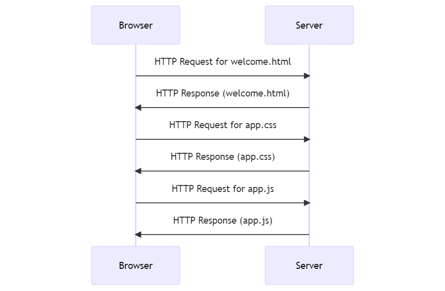
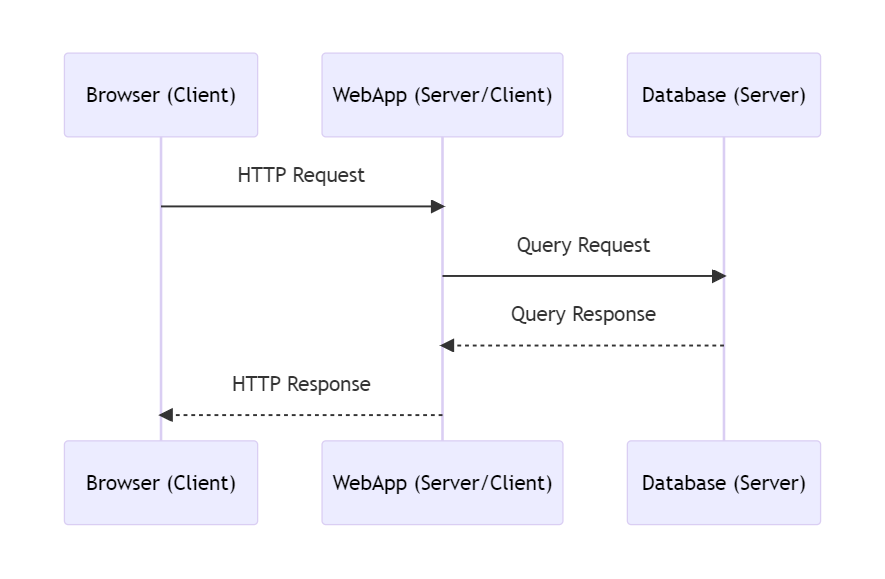

## 4.1: Request-Response Cycle

Web applications work through a series of interactions between the client's **browser** and the application's **server**.

We can abstract a single user interaction as a single **request-response cycle**

Let's study the scenario of the following interaction: a user visits a static web application through the browser.

#### Step 1: User Interaction
The user interacts with the web application through a web browser. This could be by entering a URL or clicking on a link

#### Step 2: Sending a Request
The browser sends an HTTP request to the server. 

#### Step 3: Generating a Response
The server generates an HTTP response. This response typically contains the status code, content type, and the actual content (HTML, JSON, etc.).

#### Step 4: Sending the Response
The server sends the HTTP response back to the client's browser.

#### Step 5: Rendering the Content
The browser receives the response and renders the content on the screen. If the response contains references to additional resources like images, CSS, or JavaScript files, the browser may send additional requests to fetch them.

#### Step 6: User Interaction with the Loaded Page
The user can now interact with the loaded page. Any further interactions will generally follow the same steps.

---

This process is sometimes referred to as the **request-response cycle**. It's the fundamental mechanism that underlies the functioning of web applications.

The following sequence diagram describes the interaction between the browser and the server in case of a user visiting a web application for the first time.



---

### HTTP Anatomy

An HTTP (Hypertext Transfer Protocol) request is a standard way that web browsers and applications communicate with servers. It is based on a client-server model, where the client (usually a web browser) sends a request to the server, which then sends back a response.

A basic structure of an HTTP request looks like the following:

```
[method] [URL] [version]
[headers]

[body]
```

Let's break it down:

1. **Method:** This is the HTTP method, such as GET, POST, PUT, DELETE, etc. The method indicates the desired action to be performed on the resource.
2. **URL:** This is the Uniform Resource Locator (URL) which identifies the resource on which to apply the method.
3. **Version:** This is the HTTP version (for example, HTTP/1.1 or HTTP/2).
4. **Headers:** These are optional and provide additional parameters for the request. They can include fields like Host, User-Agent, Content-Type, etc.
5. **Body:** This is also optional and is used with methods like POST or PUT to send data to the server. The body could contain data like form inputs, JSON data, etc.

Here's an example of an HTTP POST request:

```
POST /test HTTP/1.1
Host: www.example.com
User-Agent: Mozilla/5.0
Content-Type: application/x-www-form-urlencoded
Content-Length: 27

name=John+Doe&age=30&city=NYC
```

In this example, the client is making a POST request to the resource "/test" on the server "www.example.com".

The headers indicate the client's User-Agent and the type of data being sent (in this case, form data).

The body of the request contains the actual data being sent to the server.

### Data inside a HTTP Packet

There are several ways to send information through an HTTP request:

1. **URL Parameters:** These are included directly in the URL, typically after a "?" and separated by "&". They are often used in GET requests to pass additional data to the server.
2. **Path Parameters:** These are included in the path portion of the URL. They are often used to identify a specific resource or a group of resources.
3. **HTTP Headers:** Headers can contain additional information about the request or the client making the request. Examples include the "Content-Type" header (which specifies the media type of the resource), the "Authorization" header (which carries authentication credentials), and the "User-Agent" header (which provides information about the client).
4. **Request Body:** The body of the request is used to send data to the server. This is typically used with POST, PUT, and PATCH requests. The data can be in various formats, such as form data or JSON.
5. **Cookies:** Cookies are used to store user-specific information on the client side, which the server can request to maintain state between different HTTP requests from the same client.
6. **HTTP Methods:** The HTTP method itself (GET, POST, PUT, DELETE, etc.) can convey information to the server about what action to perform.

Here's an example of a POST request that includes URL parameters, path parameters, headers, a request body, and a cookie:

```
POST /users/123/orders?status=completed HTTP/1.1
Host: www.example.com
Content-Type: application/json
Authorization: Bearer abc123
User-Agent: Mozilla/5.0
Cookie: sessionId=xyz789

{
  "orderItems": [
    {
      "productId": "456",
      "quantity": "2"
    },
    {
      "productId": "789",
      "quantity": "1"
    }
  ],
  "shippingAddress": "123 Main St, Anytown, USA"
}
```

In this example:

- The HTTP method is POST, indicating that the client wants to create a new resource on the server.
- The URL includes a path parameter (`123` in `/users/123/orders`) to specify which user the new order belongs to.
- The URL also includes a query parameter (`status=completed`) to indicate that the new order should be marked as completed.
- The headers include a `Content-Type` of `application/json` to specify that the body of the request is in JSON format, an `Authorization` header with a bearer token for authentication, and a `User-Agent` header to provide information about the client.
- A `Cookie` header is included with a session ID, which the server can use to maintain state between requests.
- The body of the request includes a JSON object with details about the new order.



Yes, it is absolutely possible to add custom headers to an HTTP request. Custom headers can be used to pass additional information about the request or about the client itself to the server. They are typically prefixed with `X-` to indicate that they are non-standard.

Here's an example of a request with a custom header:

```
GET /data HTTP/1.1
Host: www.example.com
X-Custom-Header: CustomValue
```

In this example, `X-Custom-Header` is a custom header with a value of `CustomValue`.



### The Request-Response Cycle depends on the HTTP version

The behavior of the Request-Response cycle is controlled by the HTTP version and the headers used in the request.

- **HTTP/1.0:** By default, HTTP/1.0 uses a new connection for each request/response exchange between client and server. After the server sends the response, it closes the TCP connection.


- **HTTP/1.1:** Introduced the concept of "keep-alive", which allows the same connection to be used for multiple request/response exchanges. This reduces the overhead of establishing a new connection for each request. Unless the "Connection: close" directive is included in the request, the connection will be kept open.


- **HTTP/2:** This version of HTTP uses a single, long-lived connection for multiple request/response exchanges, and it can even interleave multiple requests and responses simultaneously on the same connection. This is a feature known as multiplexing.




While HTTP/1.1's "keep-alive" feature and WebSockets both allow for persistent connections, they serve different purposes and have different capabilities.

+ **HTTP/1.1** is still fundamentally a request-response protocol. The client sends a request, the server sends a response, and that's it for that exchange. If the server wants to send additional information later, it can't do so until the client sends another request.

+ **WebSockets**, on the other hand, provide full-duplex communication. Once the WebSocket connection is established, both the client and the server can send data to each other independently, without waiting for a request from the other side.





The structure of an HTTP request is different from the structure of an HTTP response.

An HTTP request from a client to a server includes a method (like GET, POST, PUT, DELETE, etc.) to tell the server what action to perform.

On the other hand, an HTTP response from a server to a client does not include a method because the server is not instructing the client to perform an action. Instead, the server is responding to the client's request.

A basic structure of an HTTP response looks like the following:

```
[version] [status code] [status text]
[headers]

[body]
```

**Status Code and Status Text**: The status code is a three-digit number that indicates the result of the request. The status text is a brief, human-readable description of the status code. For example, "200 OK" means the request was successful, while "404 Not Found" means the requested resource could not be found on the server.

Here's an example of an HTTP response:






* To know if a HTTP Packet is a request or a response we mainly check whether it contains an **HTTP method** (request) or an **HTTP status code** (response)  

* The process that initiates a HTTP request is the (client) and the process that responds with the HTTP response is the (server)





It's important to note that the terms "client" and "server" are roles that a process plays in a particular interaction, and a single process can potentially act as both a client and a server in different interactions or even in the same interaction.

For example, consider a web application that fetches data from a database server and also serves data to a web browser. When it's interacting with the database, it's acting as a client (sending requests and receiving responses). But when it's interacting with the web browser, it's acting as a server (receiving requests and sending responses).



The following is a diagram that illustrates that specific scenario:

