## 4.2 Web Server

Now let's break down what actually happens inside the server. From now on we are going to omit the term server as it is a broad term, and we are going to use more specific terms like: **physical server**, **web server**, **application server** ...

The part that is actually responsible for listening to the incoming HTTP Requests and generating HTTP Responses is the **Web Server**.

A **Web Server** is a computer software that accepts HTTP requests and is able to serve back HTTP responses. So more specifically a **Web Server** is a **Process** that operates on top of an **Operating System**.
The **OS** is installed on a **Physical Server**.

So a **browser** requesting a **web application** is more accurately represented like the following:

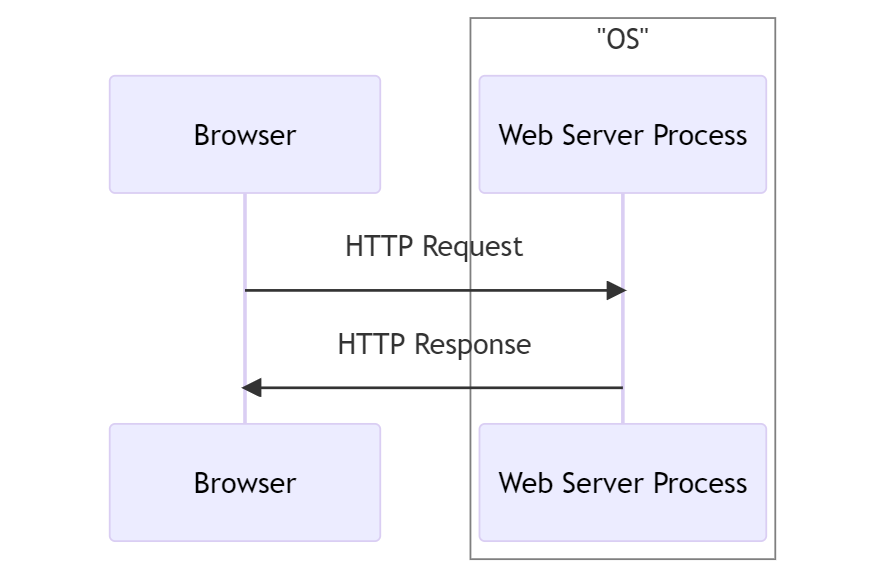
---

**A Web Server's Primary Function**: is to handle HTTP requests and responses. It serves **static** content like HTML, CSS, Javascript and images to the client's browser.

So an even more accurate representation of a **browser** requesting a **Web Server** is the following:

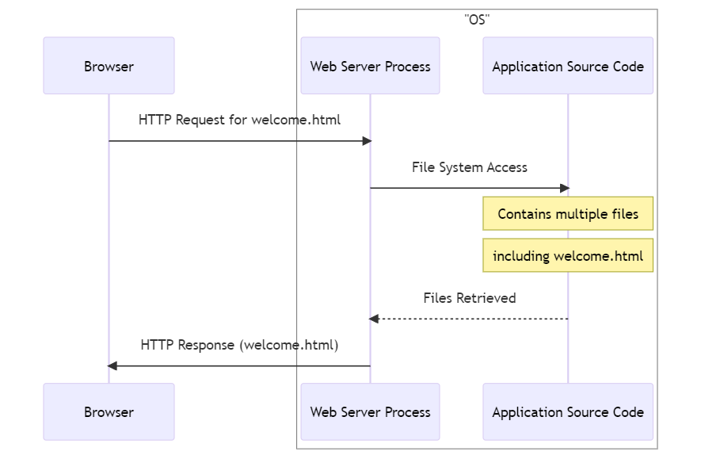

---



Web Servers allow you to specify the location of the **Application Source Code** in their configuration. 

Example:

in **Apache HTTP Server** you specify the location using the `DocumentRoot` directive inside the `httpd.conf` file. 

Like the following example: `DocumentRoot /var/www/html`

It's important to note that Web Servers like Apache require appropriate file system permissions to access the files it serves.







### Web Server Modules


Web Server **modules** are extensions that add functionality to the Web Server. They allow you to customize and extend the capabilities of the server without modifying the core code.





Apache HTTP Server has a modular architecture, which means that features are separated into individual modules that can be loaded or unloaded as needed. This makes Apache highly flexible and adaptable to various use cases.

Apache modules can be classified as the following: **Core Modules**, **Shared Modules**, **MPMs (Multi-Processing Modules)**, **Handler Modules**, **Filter Modules**, **Security Modules**, **Rewrite and Alias Modules**, **Proxy Modules**, **Logging and Monitoring Modules**, **Authentication and Authorization Modules**.

To enable or disable modules, you can use the `a2enmod` and `a2dismod` commands (on Debian-based systems) or edit the Apache configuration files directly.




### MPM Multi-Processing Module

A web application must be able to handle multiple requests simultaneously. Therefore, Apache HTTP Server version 2.0 introduced the **MPM (Multi-Processing Module)**

Prior to Apache 2.0, the Apache server used a single process model called the `mpm_prefork` module.

#### MPMs

There are different MPMs available in Apache, each implementing different strategies for managing concurrency. Some commonly used MPMs include:


* **Prefork MPM**: This MPM follows a non-threaded approach and creates multiple worker processes, each capable of handling a single connection at a time. It provides excellent stability and isolation between processes but can consume more memory due to the overhead of separate processes.


* **Worker MPM**: The Worker MPM is a hybrid model that combines processes and threads. It creates multiple worker processes, each containing multiple threads. Each thread handles an individual connection, allowing for higher concurrency and reduced memory usage compared to the Prefork MPM.


* **Event MPM**: The Event MPM is similar to the Worker MPM but introduces a more efficient event-driven architecture. It utilizes a small number of threads to handle a large number of connections, using event notifications to efficiently manage concurrency and reduce resource usage.

---

The following is a diagram that represents different implementations of the MPM and how they differ.

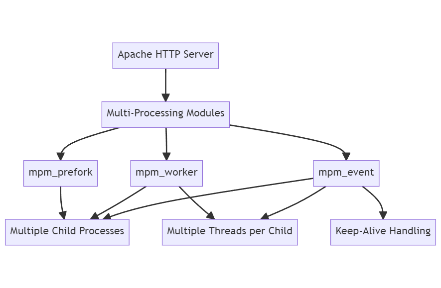

---



For Apache 2.2 and earlier versions, the default MPM is **mpm_prefork**.

Starting from Apache 2.4, the default MPM is **mpm_event**.



---

### mpm_prefork

The following diagram illustrates the flow of HTTP requests and responses in the Apache HTTP Server. It shows that the "httpd Apache Listener" functionality receives HTTP requests from browser clients, forwards them to the "Request Queue", and then the worker processes handle these requests. Once a worker process generates a response, it forwards it back to the "httpd Apache Listener", which then sends the HTTP response back to the browser client.

This diagram visually represents the interaction between browser clients, the Apache HTTP Server, and its components, including the Master Process, Multi-Processing Module (MPM), Request Queue, and Worker Processes. The red links indicate the path of HTTP requests and responses.

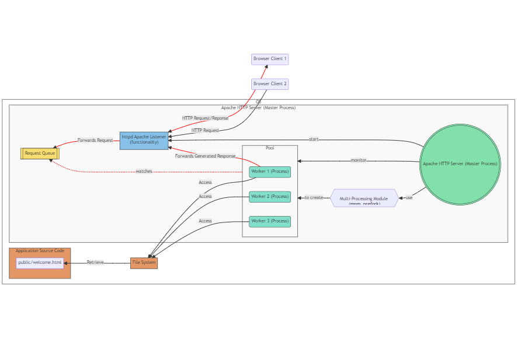

### mpm_worker

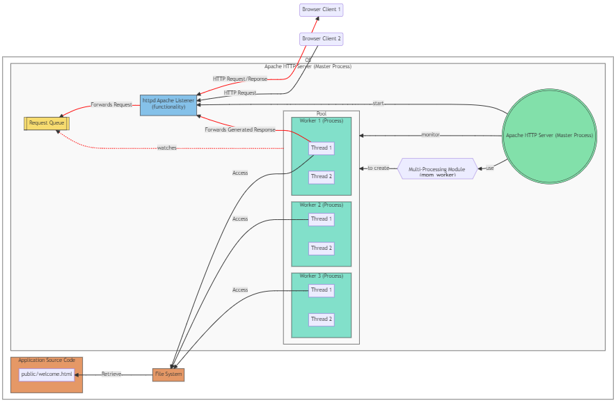

The `mpm_worker` module uses multiple worker processes, each of which can handle many threads, with each thread handling one connection at a time. This model allows the server to handle multiple requests concurrently with fewer resources than a process-based model.

### mpm_event

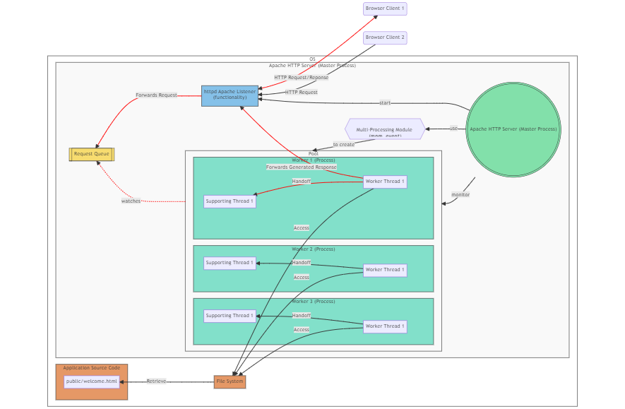

In the context of the `mpm_event` module in Apache HTTP Server, "supporting threads" refers to threads that are used to handle certain parts of the request/response process, freeing up the main threads to handle other requests.


In a typical web server setup, a "normal" thread (or worker thread) would handle the entire lifecycle of a client request, from accepting the connection, processing the request, sending the response, and finally closing the connection. This means that while the thread is waiting for network I/O (such as waiting for the full request to arrive or for the response to be fully sent), it can't do anything else.

The `mpm_event` module improves upon this by using a different approach. When a client connection is first accepted, it's handled by a worker thread just like in `mpm_worker`. However, once the initial request has been processed and the response is being sent (or if the connection is simply being kept open for possible future requests), the connection is handed off to a separate "supporting" thread. This allows the worker thread to move on and handle other incoming requests.

The supporting threads are part of a separate thread pool and are responsible for handling these "keep-alive" connections, waiting for new requests to come in on these connections, and if a new request does come in, the connection is passed back to a worker thread for processing.

This approach allows `mpm_event` to handle a larger number of concurrent connections, as the worker threads are freed up to handle new requests instead of being tied up with long-lived connections. It's particularly beneficial for workloads where many connections are in the keep-alive state, waiting for new requests.

---

<section style="background-color: aliceblue; padding: 20px; border-radius: 10px">

<h3 style="color: grey; font-weight: 700;">Configuration</h3>

</section>

The number of worker processes and threads created by Apache HTTP Server can be configured in the Apache configuration file, typically named `httpd.conf` or `apache2.conf`, depending on your system.

The specific directives you need to modify depend on the Multi-Processing Module (MPM) you are using.

For the `mpm_worker` and `mpm_event` modules, you can use the following directives:

- `ServerLimit`: This directive sets the maximum configured value for `MaxRequestWorkers` for the lifetime of the Apache process.

- `MaxRequestWorkers`: This directive sets the limit on the total number of simultaneous requests to be served. For `mpm_worker` and `mpm_event`, this is the total number of worker threads (i.e., the product of `ServerLimit` and `ThreadsPerChild`).

- `ThreadsPerChild`: This directive sets the number of threads created by each worker process.


Example of an Apache configuration file:


```apache
<IfModule mpm_worker_module>
    ServerLimit          16
    StartServers         4
    MinSpareThreads      25
    MaxSpareThreads      75 
    ThreadsPerChild      25
    MaxRequestWorkers    400
    MaxConnectionsPerChild 10000
</IfModule>
```

In this example: 
  * Apache would start with 4 worker processes (due to `StartServers`), 
  * each with 25 threads (`ThreadsPerChild`). 
  * It would allow up to 16 worker processes (`ServerLimit`).
  * and a maximum of 400 threads (`MaxRequestWorkers`)
  * which means that if needed, Apache could scale up to 16 processes each with 25 threads to handle heavy load.

<section style="background-color: aliceblue; padding: 20px; border-radius: 10px">

These configuration should be adjusted according to the server's hardware capabilities and the nature of your workload. 

</section>



#### Terminating workers (process/threads)

worker processes/threads will be terminated in case if they crash. But they will also be terminated in the following scenarios: 

* Idle Timeout: For the `mpm_worker` and `mpm_event modules`, the `MaxSpareThreads` directive sets an upper limit on the number of idle worker threads. If there are more idle threads than this limit, some of the idle threads will be terminated.

* System Conditions: Worker processes or threads may also be terminated due to system conditions, such as out-of-memory situations, or system shutdown or reboot.





#### creating workers (process/threads)

**MaxConnectionsPerChild** Limit Reached: For the `mpm_prefork`, `mpm_worker`, and `mpm_event` modules, the `MaxConnectionsPerChild` configuration directive sets a limit on the number of requests that a worker process should handle before it is terminated and a new process is created. This can be useful for mitigating memory leaks in third-party modules or in the Apache server itself. When a worker process reaches this limit, it will not accept new connections and will terminate after finishing its current request.





The maximum number of requests that a worker process or thread can handle in Apache HTTP Server is determined by several factors and configurations:


* **Web Server Configuration:**
  * MaxConnectionsPerChild
  * ThreadsPerChild
  * MaxRequestWorkers
  * KeepAlive and MaxKeepAliveRequests
  * LimitRequestLine and LimitRequestFieldSize


* **OS Configuration:**
  * File Descriptors: limit on the total number of file descriptors
  * TCP/IP Stack Settings
  * Network Interface Settings
  * Process Limits
  * Memory Management
  * Security Limits


* **Hardware Resources:** 
  * CPU
  * Memory(RAM)
  * Disk I/O: SSD - HDD
  * Network Bandwidth
  * Hardware Concurrency: number of CPUs and number of CPU cores.





### Dynamic Content

More than often we need our web application to provide content based on the specific user's provided data.

It is impossible to store all possible combinations of all the possible users that may interact with our application as static content since this would result in an infinite amount of static files.

To solve this problem we need to **generate** the file (for example a html page) based on data that the user provided. If this data changes the generated content will change accordingly and hence the name **dynamic content** as opposed to **static content** that never changes.

To perform the **generation** of a **dynamic content** a **script** needs to be executed. This **script** specifies how this content is going to be generated.

As said before the **primary function** of a **Web Server** is to serve **static** assets. But **Web Servers**' functionality can be extended through the use of **modules**.




**Handler Modules**: These modules handle specific types of content. For example, **mod_php** handles **PHP scripts**, `mod_cgi` handles CGI scripts, and `mod_dav` handles `WebDAV` publishing.





**mod_php**: is a module for the Apache HTTP server that enables the server to process PHP scripts. It is one of the ways to run PHP scripts on a web server.






Other than **mod_php** there is also:

**mod_python**: is an Apache HTTP Server module that allows the execution of Python code within the Apache web server process. The **mod_python** is deprecated and now replaced with **mod_wsgi**

**mod_jserv**: also known as Apache JServ Protocol (AJP), is an Apache module designed to enable communication between the Apache HTTP Server and Java applications running in a separate Java Virtual Machine (JVM). However, **mod_jserv** is an older technology and has been largely replaced by the Apache Tomcat Connector (mod_jk) and the Apache Tomcat Native Connector (mod_proxy_ajp) for integrating Apache with Java applications



----

### using mod_php with mpm_prefork

The following diagram illustrates the workflow of an Apache Web Server configured to use **mod_php** to execute PHP scripts and **mpm_prefork** to manage concurrency.

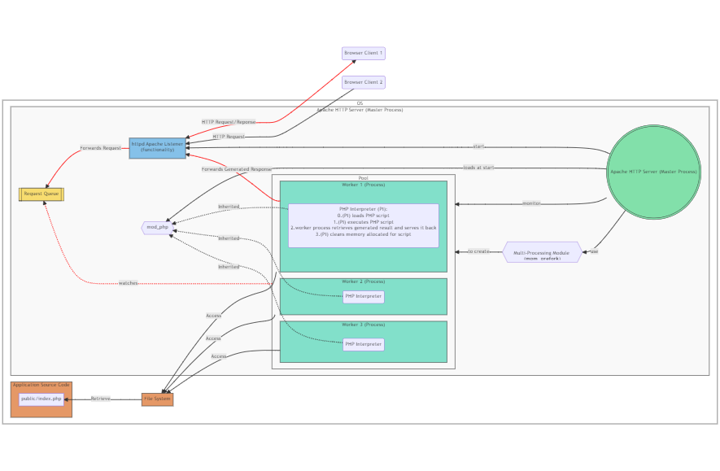

0. When the Apache HTTP Server starts up, it loads all of its configured modules, including `mod_php`. This means that the PHP interpreter becomes part of the Apache server itself.
1. Then, when the Apache master process creates child processes (using the `mpm_prefork` module or any other Multi-Processing Module), each child process inherits all the capabilities of the Apache server, including all its loaded modules. This means that each child process includes an embedded PHP interpreter, because it's part of the Apache server that the child process is a copy of.
2. When the worker process needs to execute a PHP script then:
  0. The PHP Interpreter (PI) loads the PHP script into memory
  1. The PHP Interpreter (PI) executes the PHP script.
  2. The Worker Process retrieves the generated result and serves it back.
  3. The PHP Interpreter (PI) cleans the memory that it already allocated for the PHP script.



### Very Important

Notice how the PHP script is loaded into memory, executed and then **cleaned out**.

The PHP script can be an **entire web application's business logic**.

For every different single HTTP request a new instance of the **web application** will be **loaded into memory**, **executed** and then **cleaned out**.

Maybe the most important thing to take home from this section is that:

Regardless of the Web Server implementation or its configuration: 

A Web application doesn't persist state between HTTP requests.

The HTTP Protocol is a stateless protocol by design. That means there is no way to associate two or more different HTTP requests with each other.

The only way to achieve a persistent state in a Web Application is to use services that are based on the **OS System Calls**.

Some of those services are: Database Service, Session Service, Cache Service ...



---

### don't use mod_php with mpm_worker/mpm_event



**mod_php** is not thread-safe, meaning it can have issues when run in a multi-threaded environment like the one **mpm_worker** or **mpm_event** creates. This is because PHP extensions, which **mod_php** relies on, may not be designed to handle simultaneous threads and can behave unpredictably.

So, if you switch Apache to use **mpm_worker** or **mpm_event**, it's generally recommended not to use **mod_php**. Instead, you would typically use a different method to process PHP scripts, such as **FastCGI** using **mod_fcgid** or **mod_proxy_fcgi** with **PHP-FPM (FastCGI Process Manager)**

We will explain more about **FastCGI** and **PHP-FPM** later.



---

The approach of using the **mod_php Script Execution Module** has its **Pros** and **Cons**. Let us analyse them.

#### Pros:

* **Ease Of Integration**: mod_php integrates tightly with Apache. Once enabled, PHP scripts can be executed without additional setup, making it convenient for developers.


* **Performance**: mod_php is highly optimized for performance because it runs PHP code directly within the Apache server process. This eliminates the need for launching separate PHP processes for each request, resulting in faster execution compared to CGI or FastCGI approaches.

#### Cons:

* **Limited scalability**: mod_php is not ideal for high-traffic websites or applications with a heavy load. As each Apache worker process handles both serving static files and executing PHP scripts, scaling PHP applications may require scaling the entire Apache server, which can be resource-intensive.


* **Lack of process isolation**: Since mod_php runs PHP code within the Apache process, there is no strict process isolation. If a PHP script crashes or consumes excessive resources, it can affect the stability and performance of the entire server.


* **Security risks**: Running PHP within the Apache process raises potential security concerns. If a PHP script has a vulnerability, it could potentially affect the entire server and compromise its security. Careful consideration and security measures are necessary to mitigate these risks.


## mod_cgi

### mod_cgi with mod_prefork

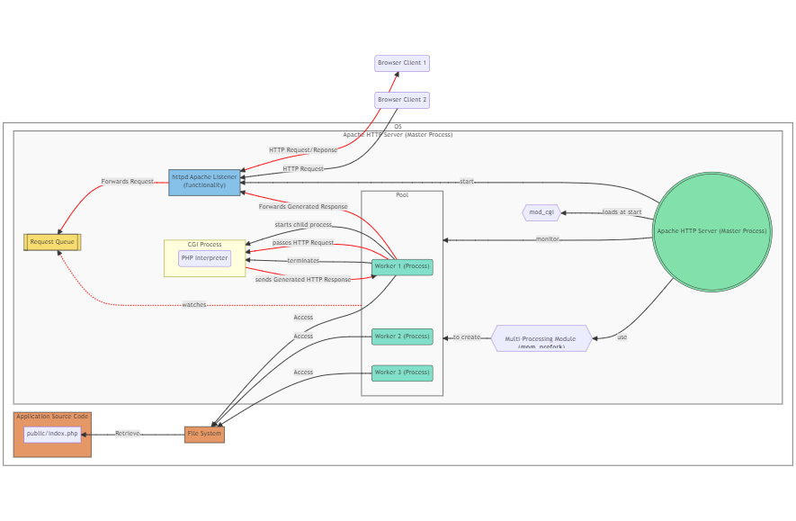

When Apache is configured to use `mod_cgi` and a worker process receives a HTTP request that requires the execution of a PHP script, the worker process will handle the request in the following way:

1. The worker process will start a separate CGI process. This is a completely new process, separate from the worker process.
2. The worker process passes the request information to the CGI process. This information includes the request method, the URL, any query string parameters, headers, and the body of the request, if applicable.
3. The CGI process will then load the PHP interpreter, which will execute the PHP script. The PHP script has access to the request information via predefined variables.
4. The PHP script generates a response, which is sent back to the CGI process. This response typically includes HTTP headers and a body, which is the output of the PHP script.
5. The CGI process sends this response back to the worker process.
6. The worker process then sends the response back to the client.
7. After the response is sent, the CGI process is terminated. This means that for each request that requires the execution of a PHP script, a new CGI process is created and terminated.

---

### mod_cgi with mod_worker/mod_event

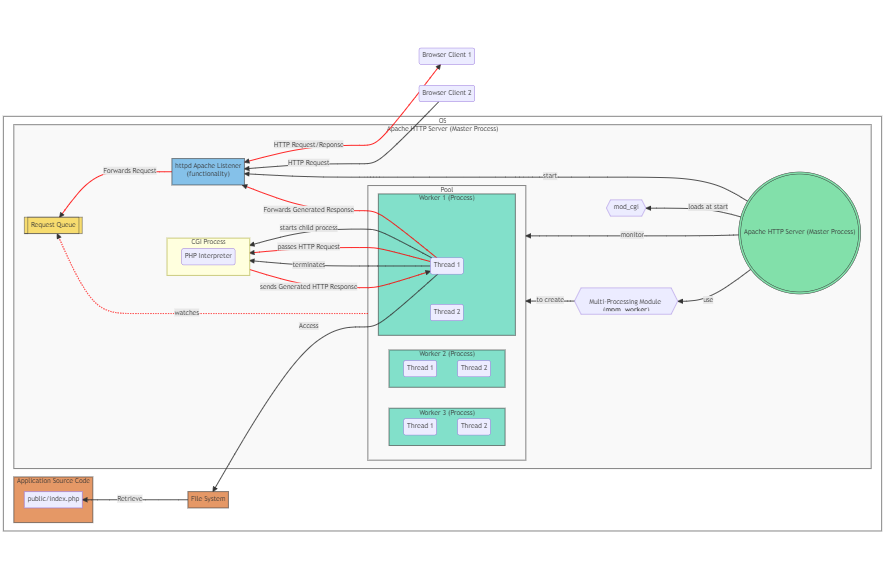

Steps:

1. The Apache master process starts and initializes the `mpm_worker` or `mpm_event` module.
2. The `mpm_worker` or `mpm_event` module creates a fixed number of worker processes. Each of these worker processes can handle many threads, and each thread can handle one connection at a time.
3. When a request comes in that requires the execution of a PHP script (like "public/index.php"), one of the worker threads within a worker process is assigned to handle the request.
4. This worker thread accesses the "public/index.php" file, reads its content, and if Apache is configured to use `mod_cgi`, it will spawn a separate CGI process to execute the PHP script.
5. The CGI process executes the PHP script and generates a response, which is sent back to the worker thread.
6. The worker thread then sends the response back to the client.

---



### mod_cgi caveat

This is part of the reason why `CGI` can be less efficient than other methods like `mod_php` or `mod_fastcgi`. Each new request that requires script execution results in the creation of a new process, which can be resource-intensive. Once the script execution is complete and the response is sent, the CGI process is terminated.



---

### FastCGI

#### Why to use FastCGI over CGI?

`mod_cgi` creates a new process for each request that requires script execution. This can be resource-intensive, especially under heavy load. In contrast, `mod_fastcgi` uses a pool of persistent processes (or threads, depending on the configuration) that can handle multiple requests over their lifetime. This can lead to significant performance improvements, as the overhead of process creation and destruction is avoided for each request.




**Communication Protocol**: `mod_cgi` uses the standard CGI (Common Gateway Interface) protocol to communicate between the Apache server and the CGI process. This involves setting environment variables and using standard input and output. `mod_fastcgi`, on the other hand, uses the FastCGI protocol, which is a binary protocol designed for efficiency. FastCGI processes can also communicate with the server over a network, which is not possible with standard CGI.


Because the FastCGI communication protocol uses sockets, the FastCGI application could be running on the same server or on a different server, depending on the configuration.


**Compatibility**: `mod_cgi` can be used with any scripting language that can read from standard input, write to standard output, and access environment variables. `mod_fastcgi` requires the scripting language to have FastCGI support, which is common but not universal.






Even if the FastCGI service is running on the same server as the Apache web server, they still communicate via sockets.

In the context of web servers and FastCGI, a socket is a method for inter-process communication (IPC). It's a way for different processes to send data back and forth, even if they're running on the same machine.

If the FastCGI service is running on the same machine as the Apache server, they would typically use Unix domain sockets for communication. Unix domain sockets are a feature of Unix-like operating systems that allow for high-performance communication between processes on the same machine.

If the FastCGI service is running on a different machine, they would use network sockets (typically TCP/IP sockets) for communication. Network sockets allow for communication between processes on different machines over a network.

So, regardless of whether the FastCGI service is on the same machine or a different machine, the Apache server and the FastCGI service communicate via sockets. The type of socket (Unix domain socket or network socket) depends on where the FastCGI service is running.




The following diagram illustrates **mod_worker** with **mod_fastcgi**

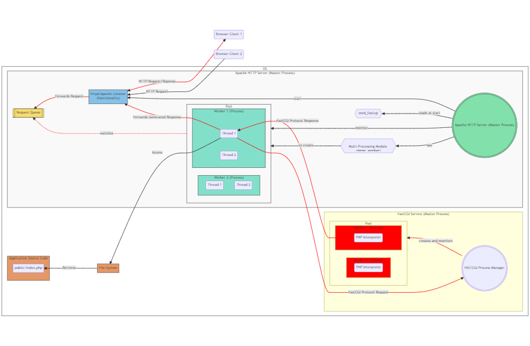

1. The Apache master process spawns worker processes as per the configuration of the `mpm_worker` module.
2. Each of these worker processes can spawn multiple threads to handle incoming requests.
3. When a worker thread receives a request that involves executing a PHP script, it communicates with the FastCGI Process Manager (FPM) using the FastCGI protocol. This communication is facilitated by the `mod_fastcgi` module.
4. The FPM assigns a FastCGI process (which has an embedded PHP interpreter) to handle the request. The PHP script is executed within this FastCGI process, and the result is sent back to the worker thread.
5. The worker thread then sends the result back to the client.




The number of FastCGI processes that are created and how they are managed can be configured in the FPM configuration file. This allows for fine-tuning based on the expected load and available resources of the server.




The following diagram is a simplified version, that illustrates the interaction between the Apache Web Server and the FastCGI Process Manager (FPM):

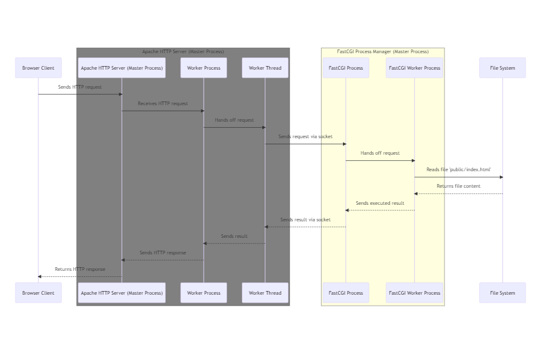

---

### PHP-FPM

PHP-FPM, which stands for "PHP FastCGI Process Manager", is an alternative PHP FastCGI implementation with some additional features useful for sites of any size, especially busier sites. It's designed to handle some of the shortcomings of other FastCGI implementations with respect to PHP.

The following are some key points about PHP-FPM:

1. **Process Management**: PHP-FPM maintains a pool of worker processes ready to serve PHP scripts. This pool can be dynamically managed, meaning PHP-FPM can create or kill worker processes based on demand. This is more efficient than creating a new process for each request, as some other models do.
2. **Adaptive Process Spawning**: PHP-FPM can adjust the number of worker processes it spawns based on the load on the server. This helps optimize resource usage.
3. **Performance**: PHP-FPM is designed to be high performance, and it can serve PHP scripts faster than traditional CGI-based methods.
4. **Compatibility**: PHP-FPM works well with popular web servers like Nginx and Apache.
5. **Emergency Restart**: PHP-FPM can automatically restart if it encounters an unrecoverable error, which can help maintain availability.



When running multiple PHP applications on a single Apache HTTP Server, you have a couple of options with PHP-FPM:

1. **Single PHP-FPM pool**: You can run all your applications through a single PHP-FPM pool. In this case, PHP-FPM manages all the applications. However, all applications would share the same pool of worker processes. This means they would also share the same user and group, and the same performance settings. This could potentially lead to security and resource allocation issues if one application is busier or requires different settings than the others.
2. **Multiple PHP-FPM pools**: You can create a separate PHP-FPM pool for each application. This is the more flexible and secure approach. Each application would have its own pool of worker processes, and you could set different performance settings and run each pool under a different user and group. This isolates the applications from each other, which can be beneficial for security and resource allocation.





Note here how the PHP-FPM as a separate process is responsible for processing business the business logic of the application. Which makes the Apache HTTP Server play the role of a load balancer and reverse proxy and delegates the role of processing the business logic to a separate process. This separation of concerns is what differentiates a Web Server from an Application Server    

