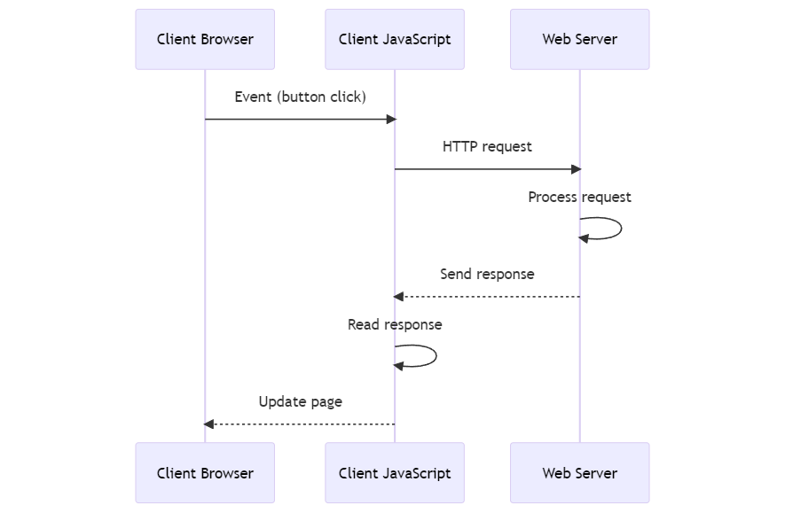
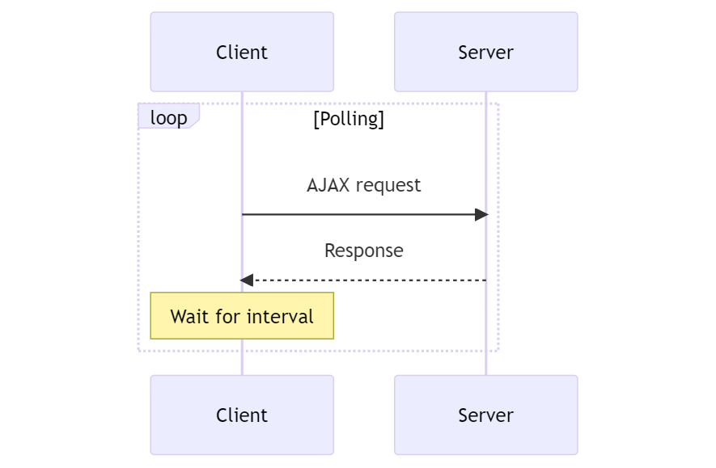

## 6.4 AJAX

**Definition**: AJAX stands for Asynchronous JavaScript and XML.

It is a set of web development techniques using many web technologies on the client-side to create asynchronous web applications.

With AJAX, web applications can send and retrieve data from a server asynchronously (in the background) without interfering with the display and behavior of the existing page.



Please note that while the name includes "XML," modern implementations commonly utilize JSON instead, as it's more flexible and easier to work with. AJAX can work with other formats as well, like HTML or even plain text.

So technically, AJAX is now more like **AJAJ** since JSON is the most common format to communicate data other than HTML between the client and the web server.



### How AJAX Works

Here's a basic overview of how AJAX works:

1. An event occurs in a web page (like a button is clicked).
2. A JavaScript function is triggered which makes an HTTP request. This could be done using `XMLHttpRequest`, `fetch()`, `axios`, or other methods.
3. The server processes the request.
4. The server sends a response back to the web page.
5. The response is read by JavaScript.
6. Proper action (like page update) is performed by JavaScript.

The following is a diagram that shows how an AJAX Request/Response works:





### Examples

There are 3 main ways to initiate and receive an HTTP Request/Response from the client in Javascript:

1. `XMLHTTPRequest` Object
2. `fetch()` API
3. `axios` Module

Both `XMLHTTPRequest` Object and the `fetch()` API come integrated in most Javascript Runtimes, However, the `XMLHTTPRequest` Object method is not officially deprecated, but it's considered somewhat in comparison to the `fetch()` API, which provide more powerful and flexible ways to make HTTP requests.

`axios` on the other hand is a separate library that requires installation. `axios` offer additional features and improvements over the `fetch()` API, such as automatic JSON data transformation and client-side protection against XSRF.



The following example uses the `XMLHttpRequest` object to make an AJAX request:

```javascript
var xhr = new XMLHttpRequest();
xhr.open("GET", 'https://api.example.com/data', true);
xhr.onreadystatechange = function () {
  if (xhr.readyState == 4 && xhr.status == 200)
    console.log(JSON.parse(xhr.responseText));
}
xhr.send();
```

The following example uses the `fetch()` API to make an AJAX request:

```javascript
fetch('https://api.example.com/data', {
  method: 'GET', 
})
.then(response => response.json())
.then(data => console.log(data))
.catch((error) => {
  console.error('Error:', error);
});
```

The following example uses the `axios` module to make an AJAX request:

```javascript
axios.get('https://api.example.com/data')
.then(function (response) {
  console.log(response.data);
})
.catch(function (error) {
  console.log(error);
});
```



In order to use AJAX, the JavaScript runtime environment must support the objects and methods used to create and send HTTP requests. In the browser environment, this is typically done through the `XMLHttpRequest` object or the `fetch()` API, both of which are built into modern browsers.

In a non-browser environment like Node.js, native support for AJAX isn't available because there's no built-in `XMLHttpRequest` object or `fetch()` API. However, you can use modules like `axios` or `node-fetch` to achieve similar functionality.

So, while AJAX as a concept is not tied to a specific environment, the actual implementation does depend on the environment's support for making HTTP requests.





Note how because we can initiate an HTTP request from the browser programmatically and also define programmatically what operations to perform with the respective HTTP response, AJAX provides a better user experience and omits the need of browser page refreshes. 



### AJAX And Polling

**Polling** is a technique where the client sends a request to the server at regular intervals to check for any updates. 

This can be done using AJAX, which allows the client to send these requests and receive responses without reloading the page.

Here's a basic overview of how AJAX and polling can be used together:

1. The client sends an AJAX request to the server.
2. The server processes the request and sends back a response.
3. The client waits for a specified interval.
4. After the interval, the client sends another request.
5. This process repeats, allowing the client to continually check for new data.

The following diagram shows how AJAX Polling works:



This can give the **illusion** of real-time communication by keeping the client's display updated with the latest data from the server. 

However, it's worth noting that **this isn't true real-time communication**, as there's still a delay between when new data is available and when the client checks for it.

The following example implements AJAX polling in JavaScript using the `fetch()` API and `setInterval()`:

```javascript
function poll() {
    fetch('https://api.example.com/data')
        .then(response => response.json())
        .then(data => {
            console.log(data);
        })
        .catch(error => {
            console.error('Error:', error);
        });
}

setInterval(poll, 5000);
```



While AJAX polling can be useful, it's not the most efficient way to achieve real-time communication, as it involves a lot of unnecessary requests when there are no updates.

