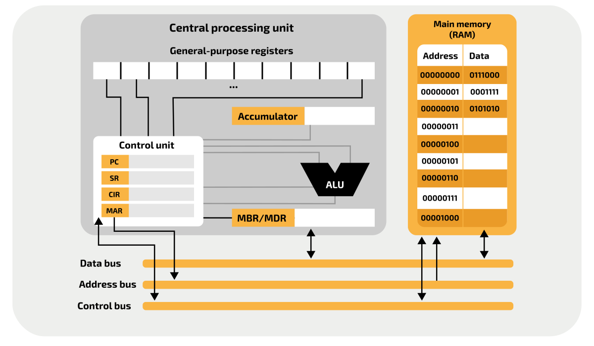
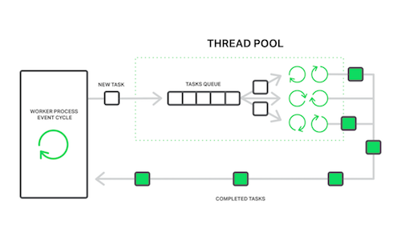
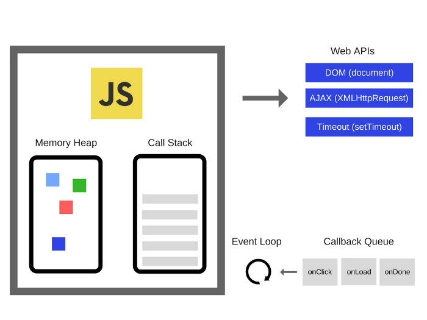

# Chapter 9: Takeaways

## Observations

### The Asynchronous Runtime Pattern

While writing this report I noticed a pattern that repeats itself over and over. I call it the **Asynchronous Runtime Pattern**. If we want to categorize it this pattern would fall under the architectural/behavioural/structural patterns umbrella.



This Pattern can be categorized as **Architectural**, **Behavioural** and **Structural**



The main elements of the Asynchronous Runtime Pattern are:

1. A task stack (exactly 1)
2. An event-loop/watcher
3. A task queue (1 or more)
4. Workers (2 or more)



* The **task stack**: holds the tasks that need to be processed.
* The **event-loop/watcher**: monitors the task stack and moves tasks to the task queue when appropriate.
* The **task queue**: holds tasks that are ready to be processed.
* The **workers**: take tasks from the task queue and process them.



### Instances that implement the Asynchronous Runtime Pattern

The following are some use-case examples that implement the Asynchronous Runtime Pattern on different levels of abstraction.
 
1. Hardware Level:
    - **Processor**:
        1. A task stack => Instruction Set to be executed
        2. An event-loop/watcher => Processor's Control Unit
        3. A task queue => Buffers/Pipelines
        4. Workers => Arithmetic Logic Units (ALUs)
      
2. Software Level:
   - **Web Servers**:
       1. A task stack => Client Requests
       2. An event-loop/watcher => Monitoring Process
       3. A task queue => Request Queue
       4. Workers => Worker threads/processes
   - **The Javascript Runtime**:
       1. A task stack => Callstack
       2. An event-loop/watcher => Event-loop
       3. A task queue => Task-queue + Promises-queue
       4. Workers => Runtime Worker Threads 
   - **Backend Job Processing**:
       1. A task stack => Callstack
       2. An event-loop/watcher => Monitoring process/thread
       3. A task queue => Messaging Queue
       4. Workers => Worker Threads/Processes 

3. Organizational Level:
   - **Help Desk/Call Center**:
       1. A task stack => Incoming Calls
       2. An event-loop/watcher => The Calls Multiplexer
       3. A task queue => Calls On Hold
       4. Workers => Service Agents 
   - **Scrum**:
     1. A task stack => Product Backlog
     2. An event-loop/watcher => Iteration
     3. A task queue => Sprint Backlog
     4. Workers => Autonomous Team Memeber

### Visual Examples of the occurrence of the Asynchronous Runtime Pattern:

You can clearly see the similarities between the following models:

| Processor Model                   | 
|-----------------------------------| 
|    |

| Nginx Web Server Model          | 
|---------------------------------| 
|  |

| JS Runtime Model                          | 
|-------------------------------------------| 
|  |

| Scrum Model                               | 
|-------------------------------------------| 
|  |

### Personal Thoughts 

| Conway's Law                                                                                                                                            | Dhia Eddine Nabli                                                                                                                                                                            |
|---------------------------------------------------------------------------------------------------------------------------------------------------------|----------------------------------------------------------------------------------------------------------------------------------------------------------------------------------------------|
| > Any organization that designs a system (defined broadly) will produce a design whose structure is a copy of the organization's communication structure. | The workflow of an organization designing software should inherit the structure of the runtime of its produced software, which itself mimics the work structure of its underlaying hardware. |
| 1967                                                                                                                                            | 2023                                                                                                                                                                                         |

## Future Insights

### Keep An Eye On

1. **AdonisJS**:

AdonisJS is a Node.js framework that is heavily inspired by Laravel. In my opinion Node.js and its ecosystem are still not ready for production level applications on the server-side as of 2023. However, Node.js on the server side is gaining large adoption and faster growth that lead to the emergence of production level frameworks like AdonisJS that may make the JS fullstack in a production level a reality. So it is worth checking up on that.   

2. **WebAssembly**:

Considering its **Performance** and **Portability** WebAssembly has the potential to significantly impact the future of web development and beyond. Therefore, it's important for developers to keep an eye on this technology.