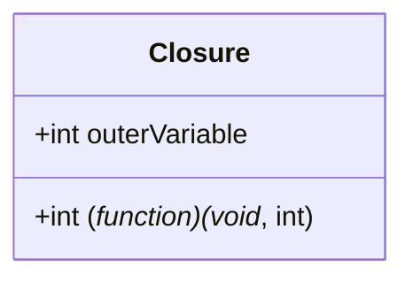

## 2.1 Closures

**Definition:** a closure is a function that has <ins>access</ins> to 
    
1. its **own scope**
2. the **outer function's scope** 
3. and the **global scope**. 

Closures are created <ins>whenever</ins> **a variable** that is defined **outside** the **current scope** is <ins>accessed</ins> from **within some inner scope**. 

They allow a function to access all the variables, as well as other functions, that are in scope <ins>when the function itself is declared</ins>.



When a closure is created, it takes a snapshot of all the variables it is accessing. In other words, the closure freezes in time the variable's values it is accessing, as it encapsulates the actual **value** of those variables and **not their reference**. So changing the values that a closure is accessing after its creation won't affect how the closure has been defined. 



### Closures in Javascript

Javascript supports the use of closures natively, so the following is an example of how to create and use a closure in javascript.

```js
function outerFunction(outerVariable) {
    return function innerFunction(innerVariable) {
        console.log('outerVariable:', outerVariable);
        console.log('innerVariable:', innerVariable);
    }
}

const newFunction = outerFunction('outside');
newFunction('inside'); // logs: outerVariable: outside, innerVariable: inside
```

### Closures in PHP

PHP also supports the use of closures natively, so the following is an example of how to create and use a closure in PHP.

```php
function outerFunction($outerVariable) {
    return function($innerVariable) use ($outerVariable) {
        echo 'outerVariable: ' . $outerVariable;
        echo 'innerVariable: ' . $innerVariable;
    };
}

$newFunction = outerFunction('outside');
$newFunction('inside'); // logs: outerVariable: outside, innerVariable: inside
```



Note how in contrast to javascript, where the use of variables from the parent scopes defines how the closure will be created on runtime.  

in PHP, the `use` keyword is used to import variables from the parent scope into the closure. Otherwise, the closure won't be able to <ins>use</ins> the variable and its value inside the closure will be `undefined`.



### Emulating a closure in C

C doesn't support the use of closures. But we can emulate a closure in C to learn more about how closures work under the hood.

The following example is the same example as the previous two examples of a function returning a function that has a "snapshoted" access to its parent scopes' variables.

```c
#include <stdio.h>
#include <stdlib.h>

typedef struct {
    int (*function)(void*, int);
    int outerVariable;
} Closure;

int innerFunction(void* context, int innerVariable) {
    Closure* c = (Closure*)context;
    printf("outerVariable: %d\n", c->outerVariable);
    printf("innerVariable: %d\n", innerVariable);
    return 0;
}

Closure* outerFunction(int outerVariable) {
    Closure* c = malloc(sizeof(Closure));
    c->function = innerFunction;
    c->outerVariable = outerVariable;
    return c;
}

int main() {
    Closure* c = outerFunction(5);
    c->function(c, 10);  // prints: outerVariable: 5, innerVariable: 10
    free(c);
    return 0;
}
```

#### Observations



1. Note how a closure is defined as a **struct** that <ins>points</ins> to the function but <ins>encapsulates</ins> the **value** of the outerVariable.

2. Note how the closure passes itself as the **context** `c->function(c,10)` for the innerFunction in order for it to be able to access the outerVariables value.

**That passed <span style="color:red">context</span> is how the innerFunction of a closure <span style="color:red">snapshots/captures</span> the variables it is accessing**



The following is a class diagram of how the example Closure struct is composed.

